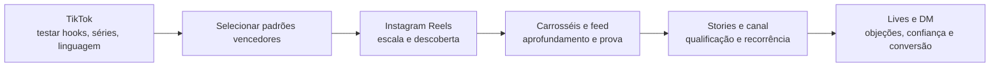
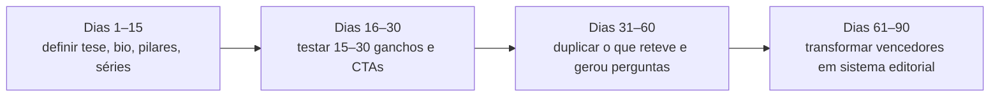

# Algoritmo 2026 para autoridade profissional no Instagram e TikTok

## Resumo executivo

A evidência pública mais sólida disponível até maio de 2026 aponta para um ponto central: **nem o TikTok nem o Instagram tratam “idade da conta” como vantagem estrutural direta para distribuição**. No TikTok, a própria plataforma afirma que **número de seguidores** e **histórico anterior de vídeos de alto desempenho** **não são fatores diretos** do sistema de recomendação; o que pesa são interações, informações do vídeo e, com peso forte, sinais de interesse como **assistir até o fim**, sobretudo em vídeos mais longos. No Instagram, as mudanças de 2024 e 2025 foram anunciadas justamente para dar a criadores menores “chance mais igual” de alcançar novos públicos em recomendações e para melhorar a distribuição de Reels por sinais como **watch time, retenção, compartilhamentos, likes e comentários**. Em outras palavras: **conta nova pode crescer** e **rebrand pode funcionar**, mas ambos vencem por sinais de conteúdo, não por antiguidade. citeturn47view0turn42search1turn15search4turn42search2

Para autoridade profissional, o algoritmo “premia” menos a fama abstrata e mais a combinação entre **retenção**, **clareza de posição**, **originalidade** e **resposta comportamental qualificada**. No TikTok, o eixo é descoberta rápida: o Feed Para Você domina o consumo, a plataforma é fortemente movida por interações e tolera melhor contas novas porque o histórico da conta pesa menos como fator direto. No Instagram, descoberta e reputação andam juntas: Reels seguem sendo o motor de alcance, mas o **perfil**, o **feed/carrossel**, os **Stories**, os **Lives**, os **canais** e a **elegibilidade para recomendação** formam uma pilha reputacional mais robusta. Isso faz do TikTok o melhor laboratório de linguagem e do Instagram o melhor sistema de sedimentação de confiança. citeturn47view0turn39search3turn38search0turn40search1turn7view4

Em nichos sérios — medicina, direito, finanças e educação — a régua é mais alta. Não basta gerar atenção; é preciso preservar **integridade regulatória**, **elegibilidade algorítmica** e **credibilidade epistêmica**. O Instagram declara evitar recomendações de conteúdo sensível ou de baixa qualidade sobre **saúde ou finanças**, incluindo exageros, procedimentos cosméticos e modelos enganosos de enriquecimento rápido. O TikTok, por sua vez, declara que conteúdo como **procedimentos médicos gráficos** pode ser considerado inelegível para recomendação geral, e suas políticas de anúncios restringem promessas exageradas, alegações médicas sem licença e claims financeiros enganosos. No Brasil, isso encontra camadas adicionais de compliance: CFM na medicina, OAB na advocacia, CVM no mercado de capitais e CDC para promessa enganosa em educação e infoprodutos. citeturn46search0turn46search15turn47view0turn44view3turn44view4turn26search0turn26search1turn27search2turn27search14turn26search11

A conclusão operacional do relatório é direta: **autoridade humanizada performa melhor do que autoridade fria**, desde que a humanização aumente **relatabilidade**, **confiabilidade** e **clareza de expertise**, e não derive para ostentação, performance vazia ou excesso de publis. A literatura recente mostra que **credibilidade**, **trustworthiness**, **expertise** e **parasocial interaction** elevam “stickiness” e vínculo; por outro lado, **over-endorsement** reduz percepção de credibilidade. Isso importa ainda mais no Instagram, onde 56% dos usuários brasileiros pesquisados pelo Opinion Box concordaram que a vida mostrada na rede costuma ser falsa. O melhor caminho, portanto, não é “lifestyle de luxo”; é **lifestyle contextual**: bastidores, rotina, valores, processo, falhas, decisões, método e humanidade suficiente para tornar o especialista confiável. citeturn18view1turn18view3turn18view4turn5view4

## Base metodológica e limites

Este relatório prioriza quatro camadas de evidência: **fontes oficiais das plataformas**, **papers originais**, **normas oficiais brasileiras** e **benchmarks de mercado 2025–2026**. Entre as fontes oficiais mais relevantes estão o explicador do Feed Para Você do TikTok, as páginas de ajuda do Instagram sobre insights, recomendação e elegibilidade, os updates do Instagram for Creators sobre alcance e originalidade, as políticas de anúncios do TikTok e as normas do CFM, OAB e CVM. Entre os estudos acadêmicos, foram usados trabalhos recentes sobre **self-disclosure**, **credibilidade**, **parasocialidade**, **autenticidade** e **misinformação em saúde**. citeturn47view0turn38search0turn39search3turn43search0turn44view3turn26search0turn26search1turn27search2turn18view0turn18view1turn18view3turn19search2

Há, porém, três limites importantes. O primeiro é que **as plataformas não divulgam pesos exatos do algoritmo**; divulgam listas de sinais e princípios de elegibilidade. O segundo é que **benchmarks de mercado variam conforme a metodologia**, então devem ser lidos como direção estratégica, não como lei universal. O terceiro é que pesquisas como “Instagram no Brasil” e “TikTok no Brasil” do Opinion Box **têm amostras separadas por plataforma**, o que as torna ótimas para entender hábitos internos de cada rede, mas não ideais para comparar preferências cross-platform como se fossem um painel único. citeturn47view0turn38search2turn39search3turn20search5turn20search15turn5view4turn5view5

Por isso, quando o relatório disser que o TikTok é “plataforma de teste” e o Instagram é “plataforma de reputação”, isso deve ser lido como **síntese analítica de alta confiança**, não como frase literal de uma plataforma. A síntese decorre da combinação entre: menor dependência direta de histórico de conta no TikTok, centralidade do Feed Para Você, predominância de consumo em “Para Você”, presença mais forte de busca e feedback rápido; versus, no Instagram, maior importância da pilha de perfil, feed, carrosséis, Stories, Lives, canais, originalidade e elegibilidade para recomendação. citeturn47view0turn7view1turn41search6turn38search0turn40search1turn40search2turn39search3turn43search3

## O que os algoritmos realmente priorizam hoje

No TikTok, o documento público mais importante continua sendo a explicação oficial do Feed Para Você. A plataforma diz que recomenda vídeos por uma combinação de fatores como **likes/compartilhamentos**, **contas seguidas**, **comentários postados**, **conteúdo criado**, além de **captions, sons e hashtags**. O texto também explicita dois pontos decisivos para este relatório: **watch completion** em vídeos longos é um sinal forte, e **follower count não é fator direto** do sistema, ainda que contas maiores tenham vantagem indireta por já possuírem base. Além disso, o TikTok declara que não recomenda **conteúdo duplicado**, conteúdo já visto, spam e certos conteúdos sensíveis para audiência geral. citeturn47view0

No Instagram, as fontes públicas recentes convergem para outra ideia-chave: **alcance de recomendação depende de performance do conteúdo e elegibilidade da conta**, não apenas do tamanho da base. O update de 2024 fala explicitamente em dar aos criadores menores uma chance mais igual de “breaking through”, e o de 2025 diz que os sinais usados para Reels incluem **watch time, retenção, compartilhamentos, likes e comentários**. Em paralelo, o Instagram continua endurecendo a prioridade para **conteúdo original**: as orientações oficiais pedem conteúdo autoral, e em 2026 a plataforma ampliou a lógica anti-aggregator para fotos e carrosséis, ligando novamente alcance à originalidade. citeturn42search1turn15search4turn43search0turn43search3turn43search5turn43search1

Isso muda o modo de interpretar métricas. **Watch time e retenção** são sinais de primeira camada. **Compartilhamentos** indicam valor social do conteúdo. **Saves**, embora menos centrais nas comunicações públicas do TikTok, seguem estratégicos no Instagram para conteúdo educacional e de consulta. **Comentários** importam nas duas plataformas, mas o ponto mais maduro em 2026 não é o volume bruto: é a **qualidade do comentário**. O próprio benchmark cross-platform da Socialinsider indica queda no comentário médio por post em TikTok e Instagram, enquanto as plataformas continuam valorizando sinais mais densos de interesse e utilidade. Isso torna comentários “rasos” menos relevantes do que perguntas, objeções, relatos de contexto e sinais de intenção. citeturn38search0turn40search5turn20search5turn15search4turn47view0

A melhor forma de traduzir isso para operação profissional é separar **sinais confirmados publicamente** de **proxies internos de saúde da conta**:

| Camada | TikTok | Instagram | Leitura estratégica |
|---|---|---|---|
| Sinais públicos de descoberta | Interações, captions/sons/hashtags, completion, feedback explícito. citeturn47view0 | Watch time, retenção, compartilhamentos, likes, comentários; alcance por recomendação sujeito à elegibilidade. citeturn15search4turn39search3 | Discovery depende mais de comportamento do público do que “status” da conta. |
| Sinais públicos de integridade | Conteúdo duplicado, spam e alguns conteúdos sensíveis podem ser inelegíveis. citeturn47view0 | Conteúdo não original, agregador recorrente e conteúdo sensível/low-quality em saúde/finanças podem perder recomendação. citeturn43search3turn46search0turn39search3 | Autoridade sem originalidade ou com claims sensacionalistas perde distribuição. |
| Métricas operacionais que valem acompanhar | Repetição de formato vencedor, comentários com perguntas, novos seguidores por vídeo, busca, Lives, FYP share. citeturn41search3turn41search6turn47view0 | Saves, shares, novos seguidores, profile activity, respostas em Stories, pico simultâneo em Live, canais. citeturn39search24turn40search1turn40search5turn7view4 | Nem tudo é fator de ranking confirmado; muita coisa funciona como proxy de reputação e aderência. |

Duas consequências práticas emergem daqui. A primeira: **sessões** e **retorno de seguidores** são métricas gerenciais úteis, mas não aparecem nas listas públicas como ranking factors principais; o melhor uso é tratá-las como termômetro de hábito e retenção de audiência. A segunda: em autoridade profissional, o KPI mais importante não é “views” isoladas, mas **views que geram profundidade** — ou seja, compartilhamento, salvamento, comentário contextualizado, visita ao perfil, follow e retorno recorrente. citeturn47view0turn39search24turn41search5

## Perfis novos, perfis rebrandados e autoridade humanizada

Para **contas novas**, o melhor cenário relativo hoje está no TikTok. A razão é simples: a própria plataforma diz que **seguidores e histórico de hits não são fatores diretos**, e o hábito de consumo é fortemente puxado pelo “Para Você”; no Brasil, 54% dos usuários pesquisados pelo Opinion Box disseram assistir mais conteúdos no For You do que na aba “Seguindo”, e 52% afirmaram usar mais o TikTok do que há 12 meses. Isso cria uma janela real para contas sem legado. Em benchmark de mercado, o estudo TikTok 2026 da Metricool reporta que 44% das contas abaixo de 100 mil seguidores cresceram entre 2025 e 2026 e que o For You gera 7 em cada 10 views. citeturn47view0turn7view1turn7view0turn20search15

No **Instagram**, conta nova também pode romper, mas normalmente precisa de mais nitidez estrutural. Em 2024 o Instagram anunciou mudanças para dar maior chance aos criadores menores, e em 2025 reiterou ajustes de recomendação dos Reels; ao mesmo tempo, o Instagram continua sendo uma rede em que o perfil, a bio, os pinos, os destaques, a consistência visual e a elegibilidade da conta pesam muito para que alcance vire reputação. Como a própria ajuda do Instagram mostra, o ambiente de insights inclui **views, interactions, new followers**, enquanto Reels, Stories e Lives oferecem métricas específicas como watch time, replies/exits e pico simultâneo. Isso favorece contas novas com posicionamento extremamente claro, mesmo sem base antiga. citeturn42search1turn42search2turn39search24turn38search0turn40search1turn40search2

Para **perfis pessoais rebrandados**, a lógica muda. Aqui, a grande variável não é idade da conta, mas **compatibilidade entre a audiência herdada e a nova tese editorial**. Essa é uma inferência forte a partir das próprias plataformas: se recomendação depende de watch time, retenção, compartilhamento, comentários e feedback do usuário, uma base antiga que não se interessa pelo novo tema tende a enviar sinais piores nos primeiros ciclos. Em TikTok, esse ruído pode ser amortecido porque a distribuição não depende diretamente do histórico da conta; em Instagram, o ruído pesa mais porque Feed, Stories e memória de relacionamento com seguidores existentes importam mais para a camada de reputação. Rebrand, portanto, costuma ser menos arriscado no TikTok e mais delicado no Instagram. citeturn47view0turn15search4turn24search1

A categoria de maior maturidade estratégica em 2026 é a **autoridade humanizada**. O melhor da literatura recente mostra que **parasocial interaction** e **source credibility** aumentam stickiness, e que dimensões como **expertise, trustworthiness, homophily e social attractiveness** ajudam a construir relação duradoura com o seguidor. Outro estudo de 2026, comparando Instagram e TikTok, encontrou que o Instagram teve **maior influência geral** nos mecanismos de persuasão, embora as relações parasociais e a credibilidade de marca fossem importantes em ambas as plataformas. Em paralelo, um estudo longitudinal com mais de um milhão de posts em quatro países — incluindo Brasil — mostrou que posts patrocinados tendem a ter engajamento menor, mas que **fazer disclosure correto não reduz engajamento ainda mais**; ou seja, transparência não é o vilão, e sim a percepção de agenda comercial excessiva. citeturn18view1turn18view4turn18view0

O limite da humanização aparece quando ela corrói a competência percebida. Um paper de 2024 mostrou que o **over-endorsement** não derruba diretamente a intenção de compra, mas corrói a **credibilidade**, que é o elo realmente decisivo. Isso conversa diretamente com o dado brasileiro do Opinion Box segundo o qual 56% concordam que a vida mostrada no Instagram costuma ser falsa. Para perfis profissionais, isso significa que lifestyle funciona, sim — mas **lifestyle como narrativa de processo**, não como vitrine de superioridade. A autoridade que mais cresce hoje parece combinar três camadas: **prova de competência**, **legibilidade humana** e **distância ética de promessas fáceis**. citeturn18view3turn5view4turn35search0

A comparação prática entre tipos de perfil fica mais clara nesta matriz:

| Tipo de perfil | Vantagem principal | Risco principal | Melhor uso do TikTok | Melhor uso do Instagram |
|---|---|---|---|---|
| Novo | Sem “confusão de legado”; pode aprender rápido com sinais de retenção | Falta de prova social e baixo repertório inicial | Testar 15–30 hooks, séries e ângulos de dor/solução em volume curto. citeturn47view0turn20search15 | Construir perfil-SEO, pinos, Reels de prova, carrosséis de profundidade e Stories já com rotina mínima. citeturn39search24turn38search0turn40search2 |
| Rebrand | Já tem ativos: seguidores, histórico, nome, DMs, prova social | Audiência antiga pode “esfriar” watch time e shares do novo tema | Reposicionar linguagem antes de mudar toda a estética; usar o feed Para Você para medir aderência real fora da base antiga. citeturn47view0 | Fazer transição editorial explícita, com conteúdo-ponte e limpeza de arquitetura de perfil; checar elegibilidade/recommendation status. citeturn39search3turn39search1 |
| Autoridade humanizada | Mais trust, recall e stickiness | Virar entretenimento aspiracional, excesso de publis ou exposição supérflua | Humanizar pelo contexto, pela fala e pelo bastidor; não pelo espetáculo. citeturn18view1turn18view3 | Humanizar sem perder lastro: feed prova, Stories proximidade, Live validação, canal recorrência. citeturn7view4turn40search1turn40search2 |

Exemplos reais ajudam a materializar essa tese. O **Portal Drauzio Varella** explicita em sua página oficial seus perfis de Instagram e TikTok e mantém uma linha editorial fortemente orientada a saúde pública, prevenção de fake news e recusa de propaganda de remédios, o que o torna um bom exemplo de autoridade séria com alto cuidado reputacional. **Nath Finanças** se apresenta no Instagram como “Finanças REAIS para pessoas REAIS”, enquanto sua própria plataforma Nath Play promete educação financeira acessível “sem promessas milagrosas ou receitas de bolo”, um modelo forte de autoridade próxima, popular e anti-sensacionalista. **Professor Noslen** é um bom caso de educação humanizada: seu site declara o uso de músicas, paródias e conteúdo divertido para tornar o aprendizado acessível, e o próprio perfil no Instagram resume a proposta como “Português simples, vida leve”; o site também lista TikTok entre as redes oficiais. Já **Nelson Wilians**, no direito, é um caso de hibridização entre advocacia, empreendedorismo e lifestyle, com bio no Instagram marcada por “Advogado Empreendedor” e menção ao TikTok — útil como exemplo de autoridade/lifestyle, mas sob uma régua regulatória mais sensível da OAB. citeturn28search4turn28search6turn29search0turn29search12turn32search0turn32search4turn32search7turn33search0

## Autoridade em nichos sérios e riscos de moderação

Em nichos sérios, o problema não é apenas “ser derrubado”; é também **deixar de ser recomendado**. No Instagram, as diretrizes públicas para recomendação dizem evitar conteúdo sensível ou de baixa qualidade sobre **saúde ou finanças**, incluindo promoção ou exibição de procedimentos cosméticos, alegações exageradas de saúde e modelos enganosos de enriquecimento rápido. No TikTok, o Feed Para Você pode tornar **inelegível para recomendação** conteúdo como procedimentos médicos gráficos ou certos conteúdos regulados para audiência geral, e as políticas de anúncios barram claims médicos sem licença, promessas exageradas e exemplos de finanças como “Get money in 10 seconds”. Em 2026, o TikTok também passou a reportar volume de enforcement em **comentários**, o que sinaliza endurecimento do olhar sobre a camada conversacional. citeturn46search0turn47view0turn44view3turn44view4turn13view4

Isso é particularmente relevante porque as redes vêm se consolidando como fontes de informação em áreas sensíveis. No TikTok Brasil, 42% dos entrevistados disseram usar a plataforma para se informar, e temas como saúde/fitness, notícias, finanças, educação e empreendedorismo aparecem entre os assuntos relevantes dos perfis seguidos. Em saúde, o risco é duplo: há demanda alta e, ao mesmo tempo, ampla circulação de desinformação. Pesquisas originais de 2024 e 2025 mostram confiança relevante de jovens em informação de saúde vista no TikTok e persistência de misinformação em conteúdos de saúde mental e saúde em geral, o que eleva a responsabilidade editorial de perfis de autoridade. citeturn7view0turn34view3turn19search2turn19search13turn19search5

No Brasil, os guardrails regulatórios são claros:

| Nicho | Risco regulatório principal | O que a regulação/plataforma sinaliza | Implicação editorial |
|---|---|---|---|
| Medicina | Promessa de resultado, before/after, medical claim sem base, uso indevido de imagem clínica | O CFM atualizou a publicidade médica e passou a permitir mais uso de redes e certos recursos educativos, mas o ambiente segue regulado; Instagram evita recomendar conteúdo sensível de saúde e TikTok exige licença/certificação para medical claims em anúncios. citeturn26search8turn26search0turn46search0turn44view3 | Foco em educação, prevenção, explicação e contextualização; nada de “cura”, “resultado garantido” ou gatilhos sensacionalistas. |
| Direito | Mercantilização, captação indevida de clientela, promessa de êxito, sensacionalismo | O Provimento 205/2021 permite redes sociais, publicidade ativa/passiva e impulsionamento, desde que sem mercantilização/captação indevida. citeturn26search1turn26search9 | Conteúdo jurídico deve ser educativo e interpretativo; CTA deve convidar à conversa ou consulta ética, não a promessa de vitória. |
| Finanças | Recomendação irregular, conflito de interesse, “get rich quick”, omissão de vínculo comercial | A CVM reconhece o peso dos influenciadores, os riscos das mídias sociais e dos golpes; a consulta pública de 2023/2024 tratou o tema como perímetro regulatório independentemente do canal, e a BSM propôs reforço de qualificação/disclaimers. Instagram e TikTok endurecem contra claims financeiros enganosos. citeturn27search2turn27search10turn27search14turn27search20turn44view4turn46search0 | Nunca operar na linguagem de “atalho”; explicitar escopo, risco, conflito, vínculo comercial e limites do conteúdo educacional. |
| Educação | Publicidade enganosa, promessa de resultado, certificação/acreditação confusa, uso impróprio de menores e de material protegido | O CDC veda publicidade enganosa ou abusiva; plataformas também restringem conteúdo enganoso e sensível. citeturn26search11turn26search3turn44view4 | Trocar “garantia de aprovação” por “método + evidência + processo”; clarificar o que é curso livre, mentoria, preparação, extensão, pós etc. |

A consequência estratégica é simples, mas decisiva: **autoridade séria exige fricção ética visível**. Isto é, o perfil precisa parecer responsável antes de parecer viral. Em medicina e finanças, essa fricção deve aparecer em linguagem, disclaimers, recusa de atalhos, menção de limites e separação entre informação geral e orientação individual. Em direito, deve aparecer no anti-sensacionalismo e na recusa da mercantilização. Em educação, na precisão sobre escopo e resultados. Perfis que parecem “bons demais” podem até ter picos de atenção, mas acumulam risco de moderação, de denúncia e de erosão de confiança. citeturn35search0turn44view4turn46search0turn26search11

## Arquitetura recomendada para TikTok e Instagram

A forma mais eficiente de operar autoridade profissional hoje é usar as plataformas em **papéis diferentes, porém integrados**. O TikTok deve funcionar como **motor de pesquisa linguística**: testar ganchos, metáforas, ritmo, enquadramento de dor, contrastes, formatos de opinião e microprovas. O Instagram deve funcionar como **sistema de reputação**, em que cada surface cumpre uma função: Reels para descoberta, carrossel para profundidade, Stories para relação, Live para validação e perfil para síntese de posicionamento. Essa leitura é consistente com a mecânica pública das plataformas e com os hábitos brasileiros de uso intenso e recorrente em ambas. citeturn47view0turn7view0turn7view3turn38search0turn40search1turn40search2



No TikTok, esse papel de laboratório é reforçado pelos dados brasileiros. O uso é altamente recorrente; 41% entram várias vezes ao dia e 16% deixam o app aberto o dia todo. A aba “Para Você” domina o consumo para a maioria relativa. Há também sinais úteis para nichos de autoridade: 25% dizem comentar e interagir em publicações, 14% participar de discussões e 66% já assistiram Lives. Para marcas e criadores profissionais, isso significa rapidez de feedback qualitativo. O TikTok Trend Report 2025 acrescenta um dado especialmente relevante: 68% dos usuários concordam que marcas devem usar os comentários para entender melhor sua audiência. citeturn7view0turn7view1turn34view2turn34view3turn2view4

No Instagram, a construção de reputação é mais larga e mais cumulativa. No Brasil, 90% acessam o app ao menos uma vez ao dia; 84% compartilham conteúdos e 77% salvam posts para ver depois. Os Reels têm alto consumo — 64% assistem ao menos uma vez ao dia — e o Instagram oferece métricas claras para acompanhar watch time em Reels, taps e exits em Stories, pico simultâneo em Lives e visão consolidada de views, interactions e new followers na conta. Além disso, 49% dos usuários pesquisados pelo Opinion Box dizem participar de pelo menos um canal no Instagram, com liderança de criadores e marcas, o que mostra o valor da recorrência privada/semiprivada na manutenção de autoridade. citeturn5view4turn7view4turn38search0turn40search1turn39search24turn7view4

Uma arquitetura recomendada de métricas fica assim:

| Surface | Função principal | KPI prioritário | KPI secundário | Observação |
|---|---|---|---|---|
| TikTok FYP | Teste de hook e aderência de linguagem | Watch time médio e retenção/completion. citeturn47view0 | Share rate, pergunta por comentário, follow por vídeo. citeturn47view0turn41search5 | Melhor terreno para descobrir qual “embalagem” torna sua expertise legível. |
| TikTok Search | Validar intenção e perguntas recorrentes | Performance em search analytics. citeturn41search6 | Comentários de dúvida, perfil visits | Bom para temas conceituais, dúvidas frequentes e conteúdo evergreen. |
| TikTok Live | Objeção, prova e proximidade | Total views e new followers na Live. citeturn41search3 | Volume de perguntas, tempo médio de permanência | Bom para fechar lacunas geradas pelos vídeos curtos. |
| Instagram Profile | SEO reputacional | Profile visits → follows; clareza de bio/nome/links. citeturn21search3turn39search24 | Clique em link, replies em Stories | O perfil precisa dizer claramente quem você ajuda, em que tema e com qual abordagem. |
| Instagram Reels | Descoberta e entrada de não seguidores | Watch time, non-follower reach, shares. citeturn38search0turn42search0 | Comments, follows | Reels são a porta; não podem ser a casa inteira. |
| Instagram Carrossel/Feed | Profundidade e consulta | Saves e shares. citeturn40search5 | Profile activity | Conteúdo de autoridade madura geralmente salva melhor do que performa em “like”. |
| Instagram Stories | Relação diária e qualificação | Replies, exits, taps. citeturn40search2turn40search0 | DM qualificada, cliques de sticker | Stories sustentam retorno e leitura de microinteresse. |
| Instagram Live | Validação pública | Peak concurrent viewers. citeturn40search1 | Comentários, replays, follow pós-live | Ideal para Q&A, aula aberta, análise de caso, mesa com convidado. |
| Instagram Canal | Retenção e recorrência | Entrada e permanência no canal | Replies/clicks | Útil para “seguidor que volta”, principalmente em autoridade séria. citeturn7view4 |

Como recomendação de formato, a melhor leitura disponível para Instagram em 2026 é manter o feed majoritariamente em **Reels**, com presença estratégica de **carrosséis** e uma faixa menor de posts estáticos/humanizadores. O benchmark 2026 da Socialinsider fala em algo próximo de **60–70% Reels**, **20–30% carrosséis** e o restante em conteúdos de imagem/cultura. No TikTok, o benchmark 2026 da Metricool reforça a centralidade do vídeo: vídeos geram 5 vezes mais views e 6 vezes mais interações que imagens/carrosséis, e o FYP responde pela maior parte das visualizações. citeturn20search2turn20search15

O detalhe mais importante não é a porcentagem exata; é a lógica: **TikTok para experimentar “o que chama atenção”** e **Instagram para consolidar “o que merece confiança”**. Se o TikTok responde à pergunta “qual formulação minha faz o mercado parar para ouvir?”, o Instagram responde “qual estrutura minha faz o mercado decidir me levar a sério?”. Essa é a separação mais útil para autoridade profissional em 2026. citeturn47view0turn38search0turn39search3

## Plano de 90 dias e checklists

A melhor forma de reduzir risco e aumentar aprendizado é tratar os primeiros 90 dias como um ciclo deliberado de **posicionamento → experimentação → consolidação**. O cronograma abaixo serve para os três tipos de perfil; o que muda, em seguida, são os ajustes específicos para conta nova, rebrand e autoridade humanizada. citeturn47view0turn15search4turn39search24



### Checklist para perfil novo

O objetivo do perfil novo não é “parecer grande”; é **achatar curva de aprendizado**. Como o TikTok oferece boas condições de descoberta para contas sem legado e o Instagram oferece boa visibilidade para contas pequenas quando o conteúdo encaixa, a prioridade é aprender rápido o que prende atenção e o que converte curiosidade em follow. citeturn47view0turn42search1turn42search2

- [ ] Definir uma promessa editorial em uma frase: **quem você ajuda + em qual problema + qual tipo de transformação/clareza você entrega**.
- [ ] Montar o perfil do Instagram com **nome pesquisável**, **bio direta**, **prova mínima** e **link único**; lembrar que nome, username, bio e links são campos visíveis do perfil e parte evidente do SEO do ativo. citeturn21search3turn21search9
- [ ] Criar **três séries recorrentes**: uma de erro comum, uma de explicação curta, uma de caso/princípio.
- [ ] No TikTok, publicar versões curtas e variáveis dessas séries para testar **hook**, **ângulo**, **tom** e **CTA de comentário**.
- [ ] No Instagram, publicar **Reels espelhando os vencedores** e **carrosséis aprofundando os temas que geraram saves/perguntas**. citeturn38search0turn40search5
- [ ] Só incluir lifestyle quando já houver tese clara. Nos primeiros 30 dias, lifestyle em conta nova deve ser **lastro humano**, não categoria principal.
- [ ] A cada 10 posts, revisar apenas quatro coisas: retenção, shares, saves, comentários qualificados. Não revisar “likes” como métrica principal. citeturn47view0turn15search4turn40search5
- [ ] Entre dias 45 e 90, realizar a primeira Live temática com FAQ real coletado dos comentários. citeturn41search3turn40search1

### Checklist para perfil rebrandado

No rebrand, a prioridade não é volume; é **transição sem colapso de sinal**. O erro clássico é mudar assunto, tom, estética e CTA ao mesmo tempo. Como watch time, retenção e compartilhamento são centrais, a audiência antiga precisa entender a nova narrativa antes de ser exposta a uma mudança total. citeturn47view0turn15search4

- [ ] Auditar os últimos 50 conteúdos e separar em três grupos: **preservar**, **arquivar** e **recontextualizar**.
- [ ] Fixar um Reel ou vídeo-manifesto explicando a transição: o que mudou, o que permanece e por que essa nova fase é mais útil ao público.
- [ ] Manter por 30 a 45 dias uma faixa de **conteúdo-ponte** entre o tema antigo e o novo, para reduzir choque de relevância.
- [ ] Limpar a arquitetura do Instagram: foto, nome, bio, destaques, pins, link e capas devem apontar para a mesma tese.
- [ ] Checar **Account Status** e **recommendation eligibility** antes da fase de aceleração; não adianta rebrandar com conta inelegível. citeturn39search3turn39search1turn39search4
- [ ] No TikTok, usar a nova fase para testar mensagens fora da base herdada, aproveitando a menor dependência direta do histórico da conta. citeturn47view0
- [ ] Nos Stories, abrir enquete e caixa de perguntas sobre a transição; no rebrand, Stories são radar reputacional, não só bastidor. citeturn40search2
- [ ] Só abandonar totalmente o tema antigo quando os novos conteúdos passarem a ganhar em retenção, share e comentário qualificado por duas a três semanas seguidas.

### Checklist para autoridade humanizada

A autoridade humanizada exige disciplina editorial. O objetivo não é “ser íntimo”; é **ser memorável e confiável**. A literatura favorece humanização que aumenta parasocialidade e confiança, mas penaliza excesso de endosso e qualquer sensação de performance comercial contínua. citeturn18view1turn18view3turn18view4

- [ ] Operar com três trilhas fixas: **expertise**, **bastidor/processo**, **visão de mundo / valores**.
- [ ] Manter a maior parte do calendário centrada em expertise; humanização entra para **contextualizar**, não para substituir.
- [ ] Transformar bastidor em prova: rotina de estudo, preparação de aula, leitura de caso, tomadas de decisão, revisão metodológica.
- [ ] Em lifestyle, evitar ostentação como eixo. O dado de que 56% veem a vida mostrada no Instagram como “falsa” recomenda parcimônia estética e sinceridade narrativa. citeturn5view4
- [ ] Em publis e parcerias, fazer disclosure e selecionar ofertas coerentes; a evidência mostra que o problema maior é excesso de endosso e erosão de credibilidade, não transparência em si. citeturn18view0turn18view3
- [ ] Usar comentários como instrumento de qualificação, não só de engajamento: identificar perguntas, objeções, contexto profissional e sinais de intenção.
- [ ] Organizar os comentários em quatro níveis internos: reação, dúvida, contexto, intenção. Priorizar respostas públicas aos níveis 2–4.
- [ ] Fazer Live mensal com tema denso e corte posterior em microepisódios para Reels/TikTok.

Se eu condensasse os primeiros 90 dias em uma regra única, seria esta: **não escale o que só gerou view; escale o que gerou retenção + share/save + comentário com contexto + follow coerente**. Esse composto é a forma mais madura de medir “autoridade algorítmica” em 2026. citeturn47view0turn15search4turn40search5turn39search24

## Limitações e URLs essenciais

A principal limitação aberta é que **as plataformas não publicam pesos exatos** nem fórmulas completas de ranking; o que existe publicamente é uma combinação de sinais, elegibilidade e boas práticas. Também não há confirmação pública forte de que **sessões** ou **retorno de seguidores** sejam fatores diretos de ranking; neste relatório, eles foram tratados como **proxies operacionais**, não como variáveis confirmadas do algoritmo. Por fim, alguns materiais oficiais do Instagram for Creators estavam acessíveis por snippets públicos, mas não integralmente no momento da coleta; por isso, as conclusões sobre o Instagram foram ancoradas principalmente nas páginas de ajuda, nos updates indexados publicamente e nas páginas oficiais de creators que estavam acessíveis. citeturn47view0turn39search3turn38search0turn43search0turn42search1turn42search2

As URLs abaixo foram as fontes essenciais mais úteis para este relatório, em linha com seu pedido de citar URLs. As citações ao longo do texto também apontam para essas páginas e para outras fontes complementares.

```text
https://newsroom.tiktok.com/how-tiktok-recommends-videos-for-you?lang=en
https://newsroom.tiktok.com/digital-services-act-our-sixth-transparency-report-on-content-moderation-in-europe?lang=en-150
https://ads.tiktok.com/help/article/tiktok-ads-policy-healthcare-pharmaceuticals
https://ads.tiktok.com/help/article/tiktok-ads-policy-misleading-and-false-content
https://support.tiktok.com/en/using-tiktok/growing-your-audience/creator-search-insights
https://help.instagram.com/202865988324236/
https://help.instagram.com/313829416281232
https://help.instagram.com/653964212890722/
https://creators.instagram.com/blog/recommendations-and-originality
https://creators.instagram.com/blog/helping-creators-of-all-sizes-break-through
https://creators.instagram.com/original-content-guidelines
https://blog.opinionbox.com/pesquisa-instagram/
https://blog.opinionbox.com/pesquisa-tiktok-no-brasil/
https://content.app-us1.com/JY8yY/2026/02/03/b40ec978-57db-4b97-adda-641834e0edc1.pdf
https://content.app-us1.com/JY8yY/2026/03/02/80c8ddfb-d24a-4e2f-91d0-fbbc0d66a729.pdf
https://metricool.com/tiktok-study/
https://www.socialinsider.io/social-media-benchmarks
https://www.socialinsider.io/social-media-benchmarks/instagram
https://www.unesco.org/en/articles/2/3-digital-content-creators-do-not-check-their-facts-sharing-want-learn-how-do-so-unesco-survey
https://www.unesco.org/en/digital-content-creators
https://www.cfm.org.br/
https://sistemas.cfm.org.br/normas/arquivos/resolucoes/BR/2023/2336_2023.pdf
https://www.oab.org.br/leisnormas/legislacao/provimentos/205-2021
https://www.gov.br/cvm/pt-br/assuntos/noticias/2023/cvm-divulga-estudo-sobre-possivel-regulamentacao-envolvendo-influenciadores-digitais-e-o-mercado-de-capitais
https://www.gov.br/cvm/pt-br/assuntos/noticias/2023/cvm-propoe-consulta-sobre-repercussoes-da-atuacao-dos-influenciadores-digitais-no-mercado-de-capitais
https://www.consumidor.gov.br/pages/conteudo/publico/102
https://doi.org/10.1016/j.osnem.2024.100298
https://doi.org/10.1177/14413582241306130
https://doi.org/10.1016/j.jretconser.2024.103831
https://doi.org/10.3390/jtaer21040112
https://pmc.ncbi.nlm.nih.gov/articles/PMC11150891/
```

