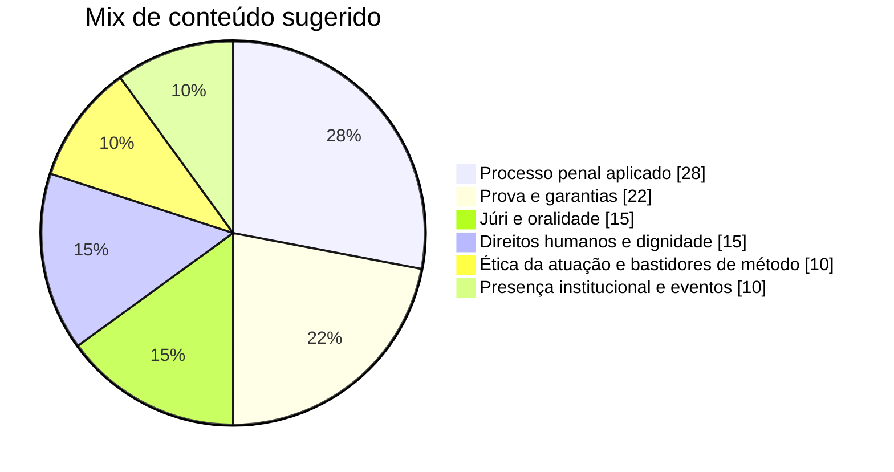
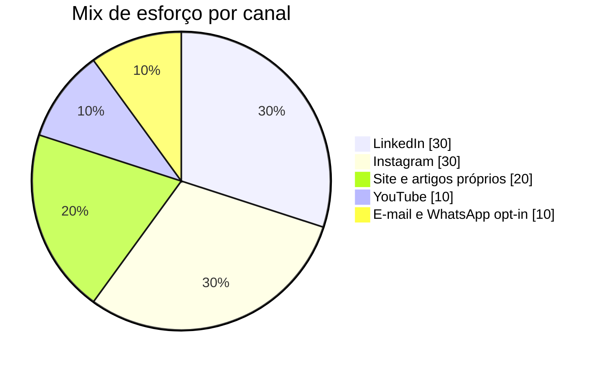
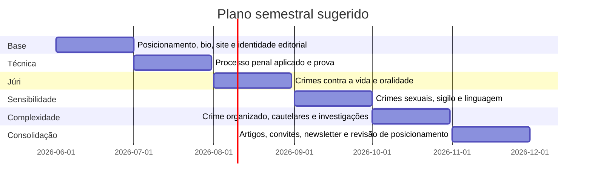

# Branding pessoal estratégico para advogada criminal recém-formada no Brasil

## Resumo executivo

Para uma advogada criminal recém-formada no Brasil, a construção de autoridade, confiança e presença humana **não deve partir de “marketing agressivo”**, mas de uma combinação disciplinada entre **densidade técnica visível, pertencimento institucional, linguagem sóbria e previsibilidade ética**. O núcleo normativo é claro: a publicidade da advocacia pode existir, inclusive em ambiente digital e com anúncios pagos em meios permitidos, mas **deve ser meramente informativa, objetiva, verdadeira, discreta e sóbria**, sem captação de clientela, mercantilização da profissão, promessa de resultados, autopromoção em casos concretos, ostentação ou indução ao litígio. O Estatuto da Advocacia tipifica como infração disciplinar **angariar ou captar causas**, e o Provimento 205/2021 detalha os limites contemporâneos dessa vedação. citeturn5search1turn12view0turn13view0turn15view0turn47search1

Isso significa que a marca pessoal mais forte, especialmente em advocacia criminal e ainda mais em áreas de alta gravidade simbólica como **homicídio, crimes sexuais e crime organizado**, não é a que “vende urgência”, e sim a que **transmite método, serenidade, repertório e responsabilidade**. Na prática, a autoridade deve ser construída por sinais públicos como: bio curricular bem estruturada, produção autoral tecnicamente delimitada, participação em comissões e eventos, repertório de artigos e falas, consistência visual, postura pública não sensacionalista e uma linha editorial que educa sem “consultoria de balcão” nas redes. Essa lógica é coerente com o Código de Ética, que proíbe a resposta habitual a consultas jurídicas nos meios de comunicação, veda listas de clientes e demandas, e exige que manifestações públicas tenham objetivo ilustrativo, educacional e instrutivo, sem promoção pessoal ou debate sensacionalista. citeturn13view4turn13view5

A pesquisa também mostra que **o risco disciplinar e reputacional é real**. Há decisões ementadas em diários da OAB sancionando publicidade em sites e redes sociais com intenção de angariar clientes, circulação de material publicitário, oferecimento de serviços em rede social, exposição de resultados processuais, repost de depoimentos comparativos e respostas a casos concretos em comentários ou caixinhas de perguntas. Em paralelo, há decisões reconhecendo que nem toda menção a atuação profissional é ilícita, desde que não haja autopromoção, identificação indevida de clientes nem finalidade de captação. citeturn18view1turn19search5turn19search15turn20search5turn32view0turn32view2

Para uma mulher na advocacia criminal, existe ainda uma camada adicional: a OAB reconhece expressamente o direito de exercer a profissão **sem assédio, sem preconceito e sem restrições por distinção de gênero**, além do direito de se vestir livremente sem impedimento de acesso a fóruns, tribunais, delegacias e presídios por causa da vestimenta. Ao mesmo tempo, associações e veículos jurídicos registram que a advocacia criminal ainda é percebida como ambiente historicamente masculino, com episódios públicos de machismo inclusive em plenário do júri. Isso recomenda uma marca pessoal que não tente “masculinizar-se” para ser levada a sério, mas que tampouco escorregue para a autoencenação; o melhor eixo é **firmeza calma, humanidade sem sentimentalismo e elegância sem ostentação**. citeturn36view0turn36view1turn37view1turn34search1turn34search3turn35search14

Em termos de canais, o cenário brasileiro favorece o uso combinado de **site próprio, LinkedIn, Instagram e, se houver fôlego editorial real, YouTube**. Em janeiro de 2025, o Brasil tinha 144 milhões de identidades usuárias de redes sociais; no mesmo período, as ferramentas de anúncios indicavam cerca de **144 milhões de usuários de YouTube**, **141 milhões no Instagram** e **81 milhões de membros no LinkedIn** no Brasil, ressalvado que esses números são métricas de alcance publicitário e não equivalem exatamente a usuários ativos mensais. Isso sustenta uma estratégia em que o **site** é a casa da credibilidade, o **LinkedIn** é a praça da autoridade profissional, o **Instagram** é o canal de presença e lembrança, e o **YouTube** é a biblioteca de profundidade. citeturn21search0turn21search5turn22view0turn22view1turn22view2

A conclusão prática é simples e rigorosa: **uma advogada criminal recém-formada não deve buscar parecer “grande” — deve parecer confiável, preparada e eticamente estável**. No curto prazo, isso vale mais do que qualquer pico de audiência.

## Limites éticos e regulatórios que moldam a marca

O ponto de partida obrigatório é o trio **Estatuto da Advocacia + Código de Ética + Provimento 205/2021**. O Estatuto considera infração disciplinar tanto **valer-se de agenciador de causas** quanto **angariar ou captar causas, com ou sem intervenção de terceiros**. As sanções disciplinares previstas em lei incluem censura, suspensão, exclusão e multa; a censura é aplicável, entre outros casos, a infrações compreendidas em parte relevante do art. 34. citeturn5search1turn47search1turn47search3

O Código de Ética determina que a publicidade profissional do advogado tenha **caráter meramente informativo** e prime pela **discrição e sobriedade**, vedando captação de clientela e mercantilização. Também veda rádio, cinema e televisão como meios de publicidade profissional, outdoors e painéis luminosos, inscrições em muros, paredes, veículos e espaços públicos, mala direta com intuito de captação, resposta habitual a consultas jurídicas nos meios de comunicação, divulgação de listas de clientes e demandas, e manifestações públicas com promoção pessoal ou debate sensacionalista. citeturn13view0turn13view1turn13view4turn13view5turn15view0

O Provimento 205/2021 atualiza esse regime para o ambiente digital. Ele define “captação de clientela” como o uso de mecanismos de marketing que, de forma ativa, se destinam a angariar clientes pela indução à contratação ou estímulo do litígio; afirma que a publicidade profissional deve ser informativa, sóbria e discreta; proíbe menção a honorários, gratuidade e descontos; proíbe expressões persuasivas, autoengrandecimento e comparação; proíbe distribuição indiscriminada de material publicitário; veda promoção pessoal, promessa de resultados, uso de casos concretos para oferta de atuação, e ostentação de bens, viagens, hospedagens e consumo de luxo. Além disso, proíbe o uso de símbolos e logotipos da OAB e veda pagar para aparecer em rankings, prêmios ou honrarias que visem destacar profissionais. citeturn12view0

A cartilha do Comitê Regulador do Marketing Jurídico da OAB, de 2024, ajuda a traduzir a norma em situações cotidianas: **caixinha de perguntas** é possível para propagação de conteúdo jurídico, mas não para oferecer consultoria gratuita como forma de captar clientes; o link **“saiba mais”** ou semelhante é permitido se redirecionar ao site ou contato autorizado, desde que sem chamada à contratação; **impulsionamento** de temas é permitido se informativo e sem oferta de serviços; o botão de contato pode existir, mas não com frases como “me contrate”, “foi lesado? posso lhe ajudar” ou equivalentes; e **Google Ads** é admitido para palavras consonantes com os ditames éticos, sendo proibidos anúncios ostensivos em plataformas de vídeo. citeturn10view0turn11view1turn11view2

A jurisprudência ética recente confirma a leitura restritiva. Em decisão publicada em diário da OAB/GO, ficou assentado que publicidade em sites e redes sociais com intenção de angariar clientes, somada à circulação de material publicitário, extrapola o limite permitido e caracteriza infração disciplinar, porque a advocacia deve sempre manter “descrição e sobriedade” e não estimular litígio nem comercializar a profissão. Em consulta do TED/OAB-RS, a utilização indiscriminada de aplicativos ou redes sociais para responder consultas jurídicas a não clientes foi considerada vedada, assim como a resposta, em comentários ou caixas de perguntas, a **casos concretos**. Em outros acórdãos ementados, redes sociais com oferecimento de serviços, marcação de horários de atendimento, repost de depoimentos comparativos, exposição de faturamento e divulgação de resultados processuais foram tratados como publicidade irregular e captação indevida. citeturn18view1turn19search15turn20search5turn32view0turn32view2

### O que cabe, o que exige cuidado e o que deve ser evitado

| Situação | Leitura segura |
|---|---|
| Site com nome, número da OAB, bio, áreas de atuação, artigos, QR code, e-mail, logotipo e meios de contato | **Cabe**, desde que informativo e sóbrio. O CED e o Provimento admitem endereço, site, página eletrônica, QR code, logotipo e dados de contato. citeturn15view0turn12view0 |
| Redes sociais, lives, vídeos, YouTube e debates | **Cabem**, se o conteúdo for ilustrativo, educacional e instrutivo, sem casos concretos, resultados ou promoção pessoal. citeturn12view0turn13view5 |
| Impulsionamento e Google Ads | **Cabem com cuidado**: somente conteúdo informativo, sem oferta direta de serviços, e sem anúncios ostensivos em vídeo. citeturn11view1turn11view2turn12view0 |
| Caixinhas de perguntas e comentários | **Alto cuidado**: podem ser usadas para difusão de conteúdo jurídico, mas não para consulta gratuita, captação, indução à contratação nem respostas a casos concretos. citeturn10view0turn32view0turn32view2 |
| Mostrar participação profissional em audiência ou sustentação | **Cabe com forte cautela**: possível em processos sem segredo de justiça e com preservação do sigilo, da dignidade e sem menção a decisões ou resultados. citeturn11view1turn12view0 |
| Títulos, qualificações e especialidades | **Cabem se verdadeiros e comprováveis**; anunciar especialidade sem lastro é vedado. citeturn12view0turn15view0 |
| Honorários, consulta gratuita, desconto, parcelamento promocional | **Evitar sempre**: vedação expressa. citeturn12view0 |
| “Ganhei”, “absolvi”, prints de decisões favoráveis, estudos de caso com autos reais | **Evitar sempre**: o Provimento e a cartilha vedam autopromoção por casos concretos e divulgação de resultados. citeturn11view1turn12view0turn33search11 |
| Depoimentos de clientes, comparações com outros advogados, prêmios pagos ou rankings comprados | **Evitar sempre**: alto risco de comparação, autoengrandecimento e mercantilização. citeturn12view0turn20search5 |
| Ostentação de bens, viagens, hotéis, carros, luxo, “sucesso” visual | **Evitar sempre**: vedação expressa à ostentação em qualquer publicidade. citeturn12view0turn33search1 |
| Logotipos da OAB ou vinculação promocional com outras atividades | **Evitar sempre**: uso de símbolos da OAB é vedado; também não se pode divulgar advocacia junto com outras atividades, salvo magistério. citeturn11view2turn12view0 |

A consequência estratégica dessa moldura é decisiva: **marca pessoal na advocacia criminal não se constrói por gatilhos de conversão; constrói-se por sinais públicos de seriedade**.

## Arquitetura da marca pessoal

A marca pessoal mais robusta para uma jovem criminalista pode ser descrita em uma frase:

> **“Advocacia criminal técnica, firme e humana, orientada por devido processo, dignidade e rigor analítico.”**

Essa frase funciona porque respeita simultaneamente três exigências do campo:

A primeira é a **autoridade**. Em criminal, autoridade não nasce de postura performática; nasce de repertório verificável. O próprio Provimento exige que informações sejam objetivas, verdadeiras e passíveis de comprovação. Portanto, autoridade pública deve ser construída por: trajetória acadêmica real, grupos de estudo, monitoria ou pesquisa, participação em comissões, artigos curtos, notas técnicas, resenhas de jurisprudência, cursos frequentados, palestras, grupos institucionais e um arquivo público de pensamento. citeturn12view0

A segunda é a **confiabilidade**. A clientela — e, sobretudo, os encaminhadores de clientela legítimos, como colegas, professores, jornalistas e ex-clientes satisfeitos — tende a confiar mais em quem transmite **previsibilidade de conduta** do que em quem transmite “força” vazia. Linguagem precisa, ausência de grandiloquência, moderação visual e consistência de posicionamento são ativos reputacionais. O Código de Ética e o Provimento convergem justamente para esse ideal de sobriedade e discrição. citeturn13view0turn12view0

A terceira é a **presença humana**. Em advocacia criminal, “humano” não significa emocionalismo, exposição de dor alheia ou autopiedade institucional. Significa comunicar que se lida com liberdade, sofrimento, reputação, família, medo, investigação e prova com **gravidade ética**. O conteúdo que mais humaniza, sem vulgarizar, é o que mostra: por que garantias importam, por que o processo penal não pode ser guiado por espetáculo, por que vítima e acusado merecem tratamento juridicamente sério, e por que linguagem responsável é parte da justiça. Isso dialoga com o espírito do CED, que exige finalidade educacional e veda sensacionalismo. citeturn13view5

### O erro mais comum a evitar

O erro mais comum de uma recém-formada é tentar provar competência por dois atalhos ruins: **conteúdo genérico de massa** ou **imitação de dureza performática**.

Conteúdo genérico de massa é aquele intercambiável, que poderia ter sido publicado por qualquer perfil jurídico: “você sabia que tem direitos?”, “3 dicas se você for preso”, “todo mundo erra no processo”. Em branding, isso gera alcance eventual, mas pouco capital simbólico. Já a dureza performática — voz excessivamente imperativa, estética policialesca, legendas agressivas, pose de “guerreira incansável” — até pode gerar impressão imediata, mas tem alto risco de vulgarização, baixa aderência à sobriedade exigida pela profissão e pode ser especialmente contraproducente para uma mulher em área onde ainda há forte viés de gênero. A própria OAB reconhece a incidência de assédio e violência de gênero no exercício da advocacia, e veículos jurídicos registram episódios públicos de machismo no júri e em espaços forenses. citeturn36view0turn37view1turn34search1turn34search3turn35search14

### Como sair do genérico sem cair no proibido

A saída é criar um **repertório proprietário**. Em vez de “conteúdo jurídico para todo mundo”, a recomendação é trabalhar com uma grade fixa de temas que revele **como você pensa**, não apenas “o que a lei diz”.

Esse repertório pode ser organizado em cinco trilhos editoriais:

| Trilho | Pergunta que orienta o conteúdo | Exemplo de pauta segura |
|---|---|---|
| Processo penal aplicado | “Como este instituto funciona de verdade?” | “Audiência de custódia não decide culpa; decide outra coisa” |
| Prova e garantias | “Que tipo de erro processual muda o jogo?” | “Cadeia de custódia não é formalismo” |
| Júri e oralidade | “O que exige sobriedade quando tudo convida ao espetáculo?” | “Firmeza em plenário não é teatralidade” |
| Direitos humanos e dignidade | “O que o processo penal revela sobre civilização institucional?” | “Prisões cautelares não podem virar pena antecipada” |
| Ética da atuação | “Como a advocacia criminal deve aparecer em público?” | “Nem toda visibilidade fortalece reputação” |

O ganho é duplo: o conteúdo deixa de ser banal e, ao mesmo tempo, continua **informativo**, sem call to action litigante, sem estudo de caso real, sem consultoria gratuita.

### Estratégia para áreas de alta gravidade simbólica

A comunicação em **homicídio, crimes sexuais e crime organizado** precisa ser percebida como **mais contida** do que a comunicação em áreas penais de baixa carga emocional. Nesses campos, o tom é parte da competência.

| Área | Ângulo público recomendável | O que deve ser evitado |
|---|---|---|
| Homicídio e Tribunal do Júri | Foco em prova, contraditório, quesitação, cadeia de custódia, limites da retórica e ética da sustentação | Fotos ou linguagem que explorem tragédias, comentários sobre caso do momento, estética de “show de júri”, heroificação da própria figura |
| Crimes sexuais | Foco em standard probatório, segredo, linguagem respeitosa, não revitimização, distinção entre escuta séria e presunção automática | Polarização ideológica, ironias, antagonização de vítimas, comentários de casos em andamento, exposição de peças ou teses de autos reais |
| Crime organizado | Foco em prisão preventiva, colaboração premiada, interceptações, medidas assecuratórias, cooperação internacional e garantias | Glamourização do submundo criminal, gírias ou insinuações de “acesso”, performance de risco, iconografia policialesca ou luxo ostensivo |

Essa recomendação decorre, por inferência, da soma de regras que vedam sensacionalismo, resultados, casos concretos, promoção pessoal, ostentação e estímulo ao litígio. citeturn12view0turn13view4turn13view5

### Humanidade, firmeza e sobriedade

O melhor equilíbrio tonal pode ser descrito como **acolhimento sem coloquialisms, firmeza sem agressividade, sobriedade sem frieza**.

Um bom modelo de frase pública é:

> “No processo penal, a gravidade do fato nunca dispensa a gravidade do método.”

Ela é humana porque reconhece a densidade do tema; firme porque afirma um princípio; e sóbria porque não vende, não dramatiza e não se autoengrandec.

Frases públicas úteis para esse eixo:

- “Direito de defesa não é prêmio; é condição de justiça.”
- “Processo penal sério exige prova séria.”
- “Em temas penais, linguagem prudente também é técnica.”
- “A atuação criminal com dignidade começa antes do plenário: começa no modo de estudar, falar e publicar.”

### Orientação visual para imagem feminina na advocacia criminal

A OAB afirma expressamente que a advogada tem direito de se vestir livremente, sem sofrer restrições ao exercício da advocacia por causa da vestimenta, inclusive em fóruns, tribunais, delegacias e presídios, ressalvadas vestes talares quando a lei as exigir em audiência ou sustentação. Esse dado importa por uma razão estratégica: **marca pessoal não deve ser construída para pedir autorização simbólica ao campo**. citeturn36view1turn37view1

Mas liberdade jurídica não elimina escolha estratégica. Para advocacia criminal, especialmente feminina, a diretriz visual mais eficaz tende a ser:

- **estrutura** em vez de exuberância;
- **textura e presença** em vez de luxo percebido;
- **expressão serena** em vez de semblante duro artificial;
- **neutralidade sofisticada** em vez de glamourização;
- **contextos institucionais reais** em vez de cenários fake de poder.

Na prática, isso sugere:

| Elemento visual | Diretriz recomendada |
|---|---|
| Roupas | Alfaiataria leve, peças estruturadas, cores sóbrias ou profundas, pouca informação visual por look |
| Fotografia | Planos médios, olhar direto ou ligeiramente lateral, luz natural ou limpa, escritório, biblioteca, sala de reunião, evento jurídico |
| Cabelo e maquiagem | Acabamento limpo e estável; o critério é coerência visual, não apagamento de feminilidade |
| Cenários | Tribunal, auditório, mesa de trabalho, livros, computador, microfone de evento, notas manuscritas |
| Evitar | Viaturas, algemas, sirenes, prédios carcerários como fetiche visual, bolsas/carro/viagem de luxo, poses de celebrização |

A vedação à ostentação no Provimento reforça esse desenho. E, no caso de mulheres, a cartilha de prerrogativas sugere um princípio central: **não se trata de “parecer menos mulher”; trata-se de parecer mais profissional do seu próprio modo**. citeturn12view0turn37view1

## Canais digitais, formatos seguros e indicadores

Os canais devem ser escolhidos por **função reputacional**, não por modismo.

No Brasil, o tamanho relativo de YouTube, Instagram e LinkedIn já justifica uma arquitetura simples e muito eficiente. As estimativas publicitárias indicavam, no início de 2025, cerca de **144 milhões de usuários de YouTube**, **141 milhões de usuários de Instagram** e **81 milhões de membros do LinkedIn** no país, num contexto em que o Brasil tinha 183 milhões de usuários de internet e 144 milhões de identidades de usuários de redes sociais em janeiro de 2025; no fim de 2025, o DataReportal estimava 150 milhões de identidades usuárias de redes sociais. Como o próprio relatório ressalta, esses números são métricas de ferramentas de anúncios e nem sempre equivalem a usuários ativos mensais; ainda assim, são úteis para desenho estratégico de canais. citeturn21search0turn21search5turn22view0turn22view1turn22view2turn22view3

### Arquitetura de canais recomendada

| Canal | Função principal | Uso recomendado |
|---|---|---|
| Site próprio | Credibilidade central | Página inicial clara; bio com OAB, formação, áreas, publicações, eventos, contato e artigos |
| LinkedIn | Autoridade profissional e referrals | Artigos curtos, notas de jurisprudência, bastidores de estudo, eventos, posicionamentos institucionais |
| Instagram | Presença, lembrança e calor humano controlado | Carrosséis, vídeos curtos, stories de rotina profissional, bastidores de eventos, jamais caso concreto |
| YouTube | Profundidade e biblioteca | Vídeos de 6–12 minutos sobre temas específicos de processo penal, júri, prova, cautelares |
| E-mail newsletter | Relação qualificada | Apenas opt-in; resumo quinzenal de artigos, eventos e leituras |
| WhatsApp | Continuidade relacional | Apenas contato passivo, listas autorizadas ou grupos determinados; sem mala direta indiscriminada |
| Google Ads | Captura de intenção de busca | Palavras-chave éticas e responsivas à busca do usuário; sem tom ostensivo nem vídeo agressivo |

Essa matriz é compatível com o Provimento 205/2021, que admite presença em redes sociais, lives, YouTube, Google Ads responsivo, chatbot e dados de contato digitais, desde que tudo permaneça informativo e sem captação. citeturn12view0turn11view2

### Formatos seguros de conteúdo

Os formatos mais seguros, para uma criminalista em início de carreira, são os que **explicam um instituto, desmistificam uma confusão pública ou organizam uma leitura técnica**. Os mais frágeis são os que flertam com caso concreto, consulta em massa, autopromoção factual ou teatralização de bastidor.

| Formato | Nível de segurança reputacional | Observação |
|---|---|---|
| Carrossel conceitual com um tema específico | Alto | Excelente para Instagram e LinkedIn |
| Vídeo curto com um argumento técnico | Alto | Melhor se partir de tese, não de notícia policial |
| Artigo no site ou LinkedIn | Alto | Forte para autoridade e SEO reputacional |
| Live com outro advogado, professor ou pesquisador | Médio-alto | Desde que informativa e sem casos concretos |
| Stories de rotina em evento, estudo, audiência não sigilosa | Médio | Exigem filtro visual e verbal de dignidade |
| Caixinha de perguntas | Médio-baixo | Só para perguntas abstratas; nunca caso concreto |
| Comentário sobre caso midiático em andamento | Baixo | Só quando houver real valor público e absoluto controle tonal |
| Repost de feedback de cliente | Muito baixo | Alto risco ético |
| “Vitórias”, “absolvições”, prints de decisões | Vedado de fato | Não usar |

### Dois gráficos de distribuição sugerida

### KPIs que realmente importam

Em advocacia criminal, **seguidores são métrica secundária**. O que importa é autoridade percebida, confiança e qualidade do inbound.

| Dimensão | KPI recomendado | Bom sinal | Mau sinal |
|---|---|---|---|
| Autoridade | Convites para palestras, aulas, podcasts, bancas e eventos | Crescimento trimestral e origem institucional | Reach alto sem convites qualificados |
| Autoridade | Publicações autorais por mês | 2–4 peças densas/mês | Muito volume e baixa consistência |
| Confiança | Taxa de resposta privada qualificada | Mais mensagens de colegas, jornalistas e encaminhadores | Muitas DMs oportunistas, poucas conversas sérias |
| Confiança | Origem das consultas | Aumento de referrals de colegas/professores/ex-clientes | Dependência de tráfego frio e impulsionamento |
| Presença humana | Salvamentos, compartilhamentos e tempo médio de vídeo | Indicam utilidade real | Comentários apenas emocionais ou polarizados |
| Reputação | Busca pelo nome próprio + sobrenome no Google/Search Console | Aumento de buscas de marca | Crescimento sem branded search |
| Negócio | Taxa de reuniões convertidas a partir de referral | Alta conversão | Muito contato e pouca contratação |
| Compliance | Incidentes, notificações, exclusões de post, dúvidas éticas internas | Zero ou residual | Postagens removidas ou autopoliciamento tardio |

Uma boa meta para os seis primeiros meses não é “viralizar”; é alcançar **três resultados silenciosos**: ser lembrada por colegas, ser percebida como confiável por famílias e investigados, e ser encontrável por quem já a procura pelo nome.

### Uma analogia útil sobre perfis públicos e confiança

Como analogia secundária — e não como fonte normativa para advocacia — vale observar que plataformas técnicas como a Apify e a OpenRouter tratam confiança pública por meio de **clareza de perfil, documentação e histórico visível**, não por excesso de autopromoção. A Apify recomenda descrição clara, README abrangente e bio pública com informações de contato e métricas relevantes antes da publicação; a OpenRouter redesenhou páginas pessoais de perfil para destacar uma visualização mais legível da atividade. Para a advogada criminal, o paralelo é direto: **bio clara, currículo verificável, arquivo público de conteúdo, histórico de eventos e linha editorial consistente geram mais confiança do que slogans**. citeturn25search1turn25search2turn25search3turn23search0

## Referências públicas e estudos de caso

A tabela abaixo não serve para “copiar personas”, mas para identificar **padrões públicos de legitimidade**. Ela combina criminalistas brasileiras e estrangeiras com documentação pública robusta, observando especialmente: densidade curricular, presença institucional, tom público, relação com mídia e simbolismo visual.

| Exemplo real | Sinais públicos observáveis | Lição de branding para uma jovem criminalista | Base pública |
|---|---|---|---|
| **Dora Cavalcanti** | Combina prática penal de alta complexidade, liderança institucional, Innocence Project Brasil, presença em congressos e defesa pública de pautas garantistas | **Autoridade por instituição + causa + consistência técnica**. Excelente modelo de gravidade serena e posicionamento sem vulgarização | Site do escritório e perfil de imprensa. citeturn44view0turn44view1 |
| **Flávia Rahal** | Professora da FGV, mestre em Processo Penal, dirigente do Innocence Project Brasil e IDDD, perfil fortemente acadêmico-institucional | **Autoridade por docência, governança e escrita**. Boa referência para comunicação de densidade, não de performance | Perfil do escritório. citeturn44view2 |
| **Patrícia Vanzolini** | Advogada criminalista, professora, autora, primeira mulher presidente da OAB-SP, presença forte em ensino e em debates sobre júri e habeas corpus | **Integração entre técnica, docência e liderança institucional**. Mostra como capital acadêmico pode irradiar reputação pública sólida | JOTA e OAB-SP. citeturn44view5turn43search3turn43search9turn43search11 |
| **Maíra Fernandes** | Escritório se apresenta com “experiência e sensibilidade”, atuação em direitos humanos, ABRACRIM Mulher, IBCCRIM e produção autoral em temas penais | **Humanidade com densidade**. Forte exemplo de linguagem que une excelência e sensibilidade sem banalizar o penal | LinkedIn do escritório e perfil autoral. citeturn44view4turn46view0 |
| **Judy Clarke** | Advogada reconhecida nacionalmente, currículo fortíssimo, atuação em casos gravíssimos, postura deliberadamente discreta e avessa à publicidade | **O anti-influencer premium**. Em áreas de altíssima gravidade, a discrição radical pode ser um ativo de autoridade | Perfil profissional e cobertura analítica. citeturn31search7turn31search8turn31news30 |
| **Nancy Hollander** | Criminal defense lawyer internacionalmente reconhecida, associada a causas de direitos humanos e defesa em casos de enorme peso simbólico | **Seriedade moral e profundidade temática**. Mostra como a presença humana pode ser construída por compromisso jurídico, não por emotividade vulgar | Perfis oficiais e entrevista. citeturn39search1turn39search3turn39search13 |
| **Karen Friedman Agnifilo** | Ex-líder do Manhattan DA, hoje advogada e comentarista frequente, co-host de podcast jurídico, forte presença pública baseada em repertório institucional | **Mídia com lastro**. Ensina que exposição pública só funciona bem quando há enorme consistência curricular e capacidade analítica real | Perfil do escritório, CNN e cobertura de imprensa. citeturn39search8turn39search11turn39news32 |
| **Anne Bremner** | Trial attorney e analista jurídica de TV, prática em criminal law e civil rights, visibilidade sustentada por reputação profissional anterior | **Comentário público como extensão da prática, não substituição dela**. Boa referência para aparições públicas de tom didático | ABA Journal / podcast e perfis profissionais. citeturn31search9turn38search12turn38search6 |

Duas observações são importantes. A primeira é que **as referências mais reputadas não dependem de promessa, urgência ou teatralidade**; dependem de histórico, método e enquadramento público. A segunda é que, no Brasil, exemplos nativos de criminalistas mulheres ainda convivem com um campo profissional menos acolhedor do que parece à distância: ABRACRIM e Migalhas registram dificuldades específicas de gênero na advocacia criminal, inclusive pelo trabalho de campo em delegacias, presídios e plenários. Isso reforça a tese de que a marca pessoal feminina deve ser **protetiva da própria dignidade**, e não refém da lógica de provar força o tempo todo. citeturn35search14turn34search1turn34search3

## Plano semestral de conteúdo

O plano abaixo foi desenhado para **seis meses de consolidação sofisticada**, não para crescimento acelerado a qualquer custo. A lógica é formar repertório, densidade e confiança.

### Cadência editorial mínima

A cadência mais sustentável para o início é:

- **2 publicações de feed por semana**  
- **1 vídeo curto por semana**  
- **stories diários leves**, sem ansiedade de postagem  
- **1 artigo longo a cada 15 dias**  
- **1 ação institucional por semana**: evento, estudo, aula, grupo, comissão, aula aberta, leitura comentada ou networking legítimo  

Essa cadência é suficiente para gerar lembrança e arquivo sem empurrar a advogada para o risco da banalização.

### Linha do tempo sugerida

### Estratégia semanal com vinte e quatro temas

| Semana | Tema central | Formato âncora | Objetivo |
|---|---|---|---|
| 1 | Manifesto de posicionamento profissional | Artigo curto + carrossel | Declarar eixo técnico-humano da marca |
| 2 | O que faz uma advogada criminal e o que ela não promete | Vídeo curto + post escrito | Delimitar expectativas com sobriedade |
| 3 | Audiência de custódia: função real | Carrossel | Mostrar precisão técnica útil |
| 4 | Sigilo, dignidade e limites da exposição pública | Artigo + stories | Inaugurar o padrão ético do perfil |
| 5 | Prisão preventiva não é antecipação de pena | Reel + LinkedIn post | Marcar visão processual garantista |
| 6 | Cadeia de custódia sem juridiquês | Carrossel | Dar profundidade sem genericidade |
| 7 | Busca e apreensão: o que a forma protege | Artigo curto | Reforçar valor do método |
| 8 | O direito ao silêncio e seus equívocos públicos | Vídeo curto | Humanizar sem coloquializar |
| 9 | Tribunal do júri: firmeza não é espetáculo | Carrossel + foto de evento | Associar júri a sobriedade |
| 10 | Prova pericial em crimes contra a vida | Artigo | Sinalizar alta gravidade simbólica |
| 11 | Memoriais, oralidade e preparação séria | LinkedIn post | Mostrar método de trabalho |
| 12 | Como estudar jurisprudência penal sem superficialidade | Vídeo + lista de leitura | Construir autoridade entre pares |
| 13 | Crimes sexuais e o dever de linguagem responsável | Artigo | Mostrar maturidade em tema sensível |
| 14 | Não revitimização e devido processo podem coexistir | Carrossel | Despolarizar o debate |
| 15 | Sigilo, imprensa e reputação em casos sensíveis | Post escrito | Ensinar prudência pública |
| 16 | O que a defesa técnica não é em crimes sexuais | Vídeo curto | Blindar a marca contra caricaturas |
| 17 | Colaboração premiada: o que o público costuma confundir | Artigo | Introduzir crime organizado com gravidade |
| 18 | Interceptações e prova digital | Carrossel | Atualizar repertório técnico |
| 19 | Medidas assecuratórias e patrimônio | LinkedIn post | Sofisticar a percepção da prática |
| 20 | Prisões cautelares em investigações complexas | Vídeo curto | Consolidar eixo de complexidade |
| 21 | Resenha de livro ou capítulo de processo penal | Artigo autoral | Associar marca a leitura séria |
| 22 | Bastidores éticos do estudo de um caso sem expor o caso | Stories + post | Humanizar a rotina com sobriedade |
| 23 | Perguntas frequentes abstratas sobre atuação criminal | Carrossel | Educar sem consultar em massa |
| 24 | Síntese dos seis meses e agenda futura de conteúdo | Artigo + vídeo | Fechar o ciclo e abrir newsletter/série |

### Template de calendário semanal

| Peça | Segunda | Quarta | Sexta | Apoio |
|---|---|---|---|---|
| Feed | Tese ou conceito | Jurisprudência / prova | Humanidade / ética / evento | Stories diários |
| Vídeo | — | Vídeo curto | — | Corte para stories |
| Long-form | A cada 15 dias | — | — | Reaproveitar em LinkedIn |
| Networking | Evento / café / grupo / aula | — | — | Registro sóbrio |

### Modelos de posts seguros

#### Template sobre audiência de custódia

**Texto sugerido**

> **Audiência de custódia não decide culpa.**  
>  
> Ela existe para controlar a legalidade da prisão, verificar eventual violência no ato prisional e avaliar se a custódia deve ser mantida, substituída ou relaxada.  
>  
> Quando o debate público trata esse momento como “prêmio” ou “punição”, perde-se precisão jurídica. E, em processo penal, precisão importa.  
>  
> Conteúdo informativo geral. Cada caso exige análise individual.

**Brief visual**

Carrossel de 5 cards; fundo neutro; tipografia limpa; sem cela, viatura ou algemas; um frame final apenas com nome, OAB, site e tema da série.

#### Template sobre cadeia de custódia

**Texto sugerido**

> **Cadeia de custódia não é formalismo ornamental.**  
>  
> Ela serve para documentar o caminho da prova e reduzir ruído, contaminação e dúvida sobre a integridade do elemento probatório.  
>  
> Em advocacia criminal séria, discutir forma é discutir confiabilidade.  
>  
> Informação jurídica em tese.

**Brief visual**

Vídeo curto de 45–60 segundos, plano médio, mesa com anotações e livro, fala direta, sem cortes frenéticos, sem música dramática.

#### Template sobre júri

**Texto sugerido**

> **No Tribunal do Júri, firmeza não é espetáculo.**  
>  
> A sustentação eficaz não depende de performar indignação a qualquer custo. Depende de coerência narrativa, domínio da prova e respeito à inteligência dos jurados.  
>  
> Boa oratória, em matéria penal, é técnica com medida.  
>  
> Conteúdo informativo.

**Brief visual**

Foto ou vídeo em auditório, biblioteca ou evento jurídico; nunca usar imagem de plenário real com processo identificável; paleta sóbria; legenda densa.

#### Template sobre crimes sexuais

**Texto sugerido**

> **Em crimes sexuais, linguagem responsável é parte da técnica.**  
>  
> Nem a seriedade da palavra da vítima autoriza simplificações probatórias, nem o exercício da defesa técnica autoriza hostilidade ou espetáculo.  
>  
> O que se exige é método: escuta séria, prova séria e linguagem séria.  
>  
> Informação geral, sem referência a caso concreto.

**Brief visual**

Artigo ou post de LinkedIn com imagem estática minimalista; nada de manchete policial, fita amarela, sirene ou rostos de terceiros.

## Checklist de riscos e mitigação

O ambiente normativo e reputacional recomenda que toda publicação passe por um **filtro prévio padronizado**. Isso é especialmente importante em advocacia criminal, em que o custo de um deslize é simultaneamente disciplinar e simbólico.

### Checklist prático antes de publicar

| Pergunta de controle | Se a resposta for “sim” | Medida |
|---|---|---|
| Estou mencionando caso concreto, mesmo sem identificar nomes? | Alto risco | Não publicar; transformar em hipótese abstrata |
| Existe referência a resultado, vitória, absolvição, tese vencedora, despacho favorável ou clip de caso meu? | Risco vedado | Excluir |
| O texto sugere contratação, urgência ou medo? | Risco de captação | Retirar verbos de ação comercial |
| Há comparação comigo ou com outros profissionais? | Risco ético | Reescrever |
| Há depoimento de cliente, elogio comparativo ou print de conversa? | Alto risco | Não publicar |
| Há insinuação de consulta gratuita nas DMs ou comentários? | Risco alto | Substituir por aviso de conteúdo geral |
| O visual sugere ostentação, luxo, espetáculo ou glamourização do crime? | Risco alto | Trocar arte/foto |
| O assunto exige sigilo, proteção de vítima ou tratamento mediático ultra-sensível? | Risco crítico | Submeter a dupla revisão ou não publicar |

### Matriz de risco e contenção

| Risco | Como aparece | Mitigação |
|---|---|---|
| Captação indevida | CTA, promessas, medo, marcação de atendimento, terceiros captadores | Biblioteca de frases permitidas; revisão antes de publicar; contato sempre passivo citeturn5search1turn10view0turn19search15 |
| Publicidade de resultado | “Absolvido”, “revoguei a prisão”, prints e comemorações | Política interna de zero postagem de resultados citeturn11view1turn33search11 |
| Consulta em massa nas redes | Responder casos concretos em comentários e caixinhas | Usar respostas-padrão abstratas; convidar a leitura do artigo geral, não a contratação automática citeturn32view0turn32view2 |
| Ostentação | Carro, hotel, bolsa, relógio, viagens, escritório “luxuoso” | Padrão visual limpo e institucional; auditoria semestral de imagem citeturn12view0turn33search1 |
| Sensacionalismo | Falar do “caso da semana” com tom de entretenimento | Regra de quarentena de 24h para fatos quentes + validação por segundo leitor citeturn13view5 |
| Machismo e ataque de gênero | Comentários, redução da imagem da advogada no júri e nas redes | Protocolo de reação: registro, nota objetiva, acionamento de prerrogativas, evitar debate caótico citeturn36view0turn37view1turn34search1turn34search13 |
| Reputação pessoal contaminando a profissional | Perfil pessoal com conteúdo incompatível com prestígio da classe | Política editorial também para perfil pessoal, pois o Provimento alcança conteúdos extrajurídicos que afetem a reputação da advocacia citeturn12view0 |

### Frases seguras para substituir CTAs ruins

Em vez de “foi preso? fale comigo agora”, usar:

- “Conteúdo informativo sobre processo penal.”
- “Tema desta semana no site.”
- “Leitura em tese.”
- “Cada caso exige análise individual.”
- “Série sobre garantias processuais.”
- “Artigo completo disponível na página profissional.”

Em vez de “sou especialista em tudo”, usar:

- “Atuação focal em advocacia criminal.”
- “Pesquisa e estudo contínuo em processo penal / júri / prova / cautelares.”
- “Produção sobre [tema delimitado].”

Em vez de “resultado incrível”, usar:

- “Reflexão sobre o instituto.”
- “Comentário técnico sobre jurisprudência.”
- “Análise em perspectiva profissional.”

## Questões abertas e limites da pesquisa

A base normativa desta análise é robusta e majoritariamente oficial, mas há três limites metodológicos que merecem registro.

O primeiro é que parte da jurisprudência ética recente da OAB aparece em **ementas de diários eletrônicos e snippets de publicação**, nem sempre com acesso textual completo ao inteiro teor dos votos; por isso, o relatório usa esses precedentes como **indicadores de orientação prática**, e não como exegese exaustiva de cada tribunal. citeturn18view1turn20search5turn32view0

O segundo é que a comparação de exemplos públicos depende, em alguns casos, de **perfis institucionais, páginas de escritórios, páginas de autor e perfis públicos em redes**, que mostram sinais reputacionais claros, mas não revelam toda a estratégia privada de captação legítima, networking e referrals desses profissionais. A leitura, portanto, é de marca pública observável, não de operação comercial interna. citeturn44view0turn44view2turn44view4turn31search7turn39search1turn39search8

O terceiro é que os dados de plataformas digitais usados para recomendar canais derivam de **ferramentas de alcance publicitário**, e o próprio DataReportal ressalva que tais métricas não equivalem exatamente a usuários ativos mensais. Elas são úteis para priorização relativa de canais, mas não devem ser tratadas como medida perfeita de engajamento orgânico. citeturn22view0turn22view1turn22view2turn22view3

Mesmo com essas limitações, o quadro geral é suficientemente claro: **a personal branding de maior valor para uma jovem advogada criminal brasileira é a que troca volume por densidade, autopromoção por método, espetáculo por sobriedade e ansiedade por presença institucional consistente**. Essa é a rota mais ética e, no médio prazo, também a mais forte.