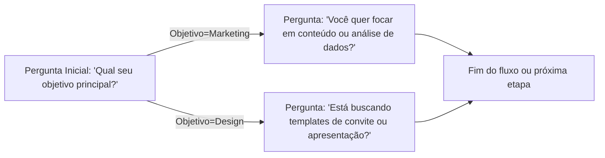
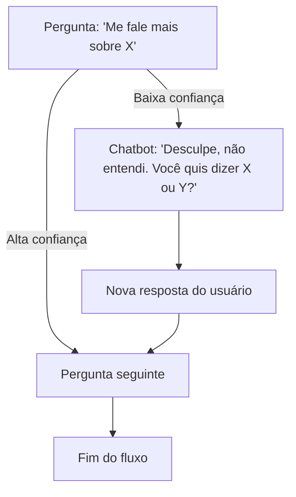
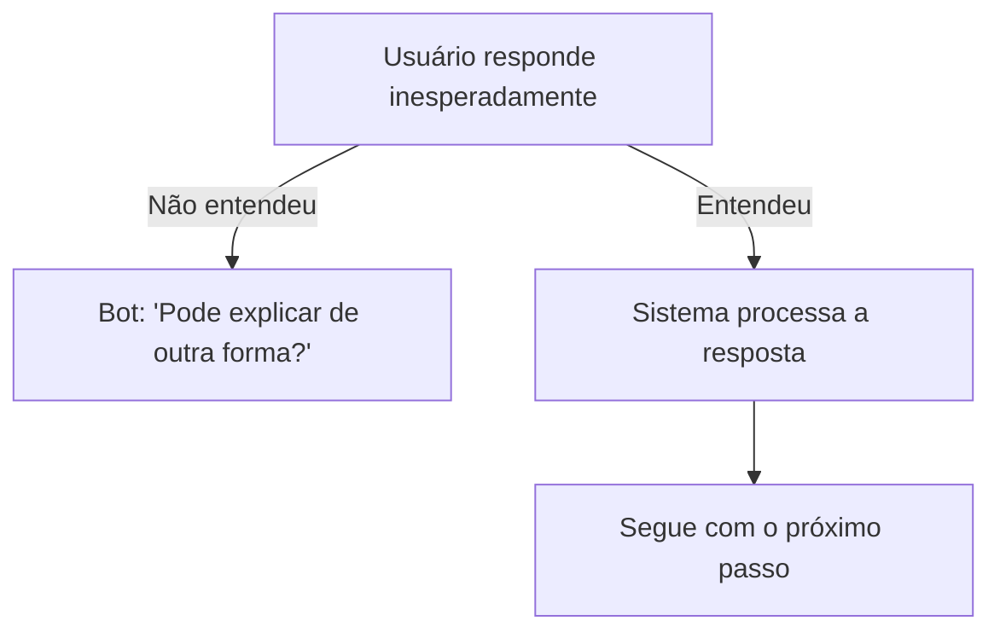
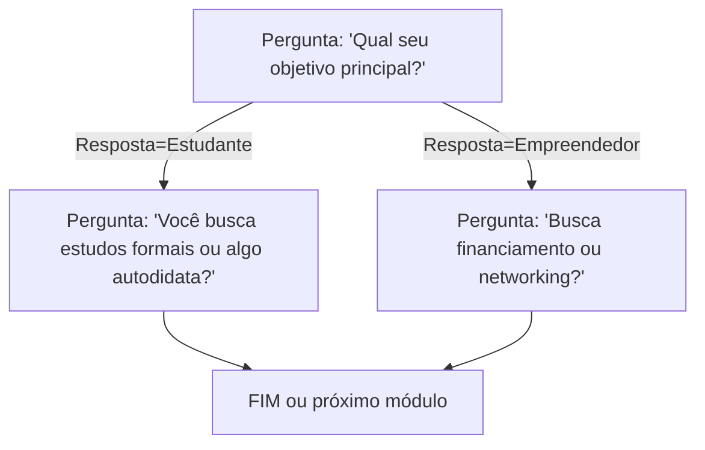
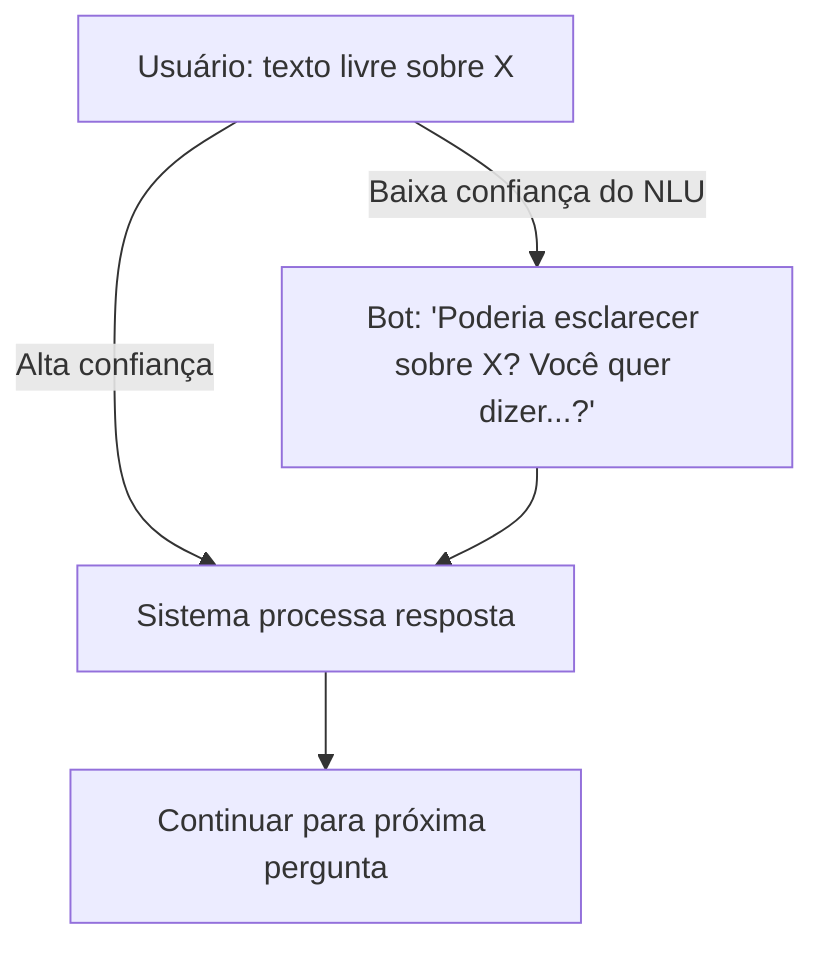

# Resumo Executivo

A adoção de **questionários conversacionais inteligentes** no onboarding de produtos IA-first permite transformar longos formulários em diálogos dinâmicos que alinham cada pergunta ao maior valor informacional e menor fricção possível. Perguntas bem desenhadas devem reduzir a **incerteza epistemológica** sobre o usuário (informações que ainda faltam e podem ser obtidas) e evitar reforçar a **incerteza aleatória** (ruído inerente que não se elimina perguntando mais). Para isso, emprega-se o cálculo do **valor esperado de informação** (EVIG) e limiares de confiança: pergunta-se somente quando o ganho esperado de informação supera o custo (tempo e carga cognitiva) da pergunta, caso contrário assume-se a resposta mais provável. Heurísticas UX (p. ex. *apenas perguntas essenciais*, linguagem clara, agrupamento lógico) e princípios de usabilidade (como transparência e clareza) minimizam o esforço mental do usuário. 

Paralelamente, é vital mapear cada pergunta para as saídas do sistema (*slots*, agentes ou skills correspondentes) e aos KPIs que impacta. Por exemplo, uma pergunta sobre “segmento de indústria” alimenta o slot *industry* e um modelo de personalização de conteúdo, afetando diretamente a taxa de ativação e conversão. A rastreabilidade permite quantificar o ROI de cada campo. Além disso, técnicas como *progressive disclosure* e *progressive profiling* coletam informações em etapas (inicialmente só o essencial) para evitar formulários longos, aumentando conversão. Perguntas de seguimento devem usar **lógica condicional** e *active learning*: se a resposta for incerta, o sistema reformula ou esclarece; se clara, segue adiante; se além do escopo, aciona fallback. Métricas de eficiência incluem tempo médio por pergunta, redução de incerteza (porcentual de erro do modelo), taxas de conversão e retenção, NPS pós-onboarding, e custo por decisão correta.  

Em aplicação ao *CKOS Smart Questions Engine*, propõe-se um motor de diálogo guiado por metadados: cada pergunta tem atributos como intenção, slot, tipo de resposta, limiares de confiança e custo previsto. A engine expõe APIs para obter a “próxima pergunta” com base no contexto acumulado, e para registrar respostas. A lógica em tempo real pode usar modelos de linguagem para estimar EVIG e decidir o próximo passo (perguntar, assumir ou concluir). 

Finalmente, recomenda-se um MVP focado em poucas perguntas de alto impacto: por exemplo, objetivo principal do usuário, setor de atuação e nível de urgência. Instrumenta-se cada interação (tempo, respostas, êxito) e realiza-se um teste A/B comparando o fluxo conversacional com um fluxo estático. Os critérios de sucesso incluem aumento da conversão (meta: +10–20%), redução da desistência na etapa de cadastro e melhoria em métricas como satisfação e NPS.  

Nos tópicos seguintes apresentamos detalhadamente as dimensões de projeto, exemplos práticos, diagramas de fluxo (Mermaid) e um painel de métricas sugerido, sempre apoiando-nos em fontes recentes (2018–2026) e em evidências acadêmicas/industriais de ponta. As recomendações são concretas e projetadas para implementação imediata.

## Redução de Incerteza no Projeto de Perguntas

Ao formular perguntas ao usuário, o objetivo é **maximizar a redução da incerteza epistemológica** – ou seja, a informação desconhecida que pode ser resolvida perguntando – ao mesmo tempo em que se minimiza o esforço requerido. Em termos de teoria da informação, usa-se entropia e valor esperado de informação: uma pergunta deve ser feita se sua resposta esperada oferecer ganho substancial de certeza no modelo do usuário. Em contraste, a incerteza **aleatória** (ruído ou variabilidade inerente) não se resolve perguntando de novo e deve ser ignorada. 

Além disso, cada pergunta impõe **carga cognitiva** ao usuário. Segundo Nielsen/NNG, “cada campo de um formulário exige que o usuário interprete a pergunta, recupere da memória as informações e as forneça num formato adequado… Quando essa carga fica muito alta, usuários cometem erros, ficam sobrecarregados ou abandonam o formulário”. Portanto, perguntas devem ser estruturadas com *transparência* e *clareza*, evitando ambiguidade e agrupando tópicos relacionados.

Em resumo, o design eficaz considera três dimensões:

- **Valor Informacional (EVIG)**: estima-se quanta incerteza será removida se perguntarmos (ex.: redução de entropia sobre respostas futuras). Perguntas com baixo valor esperado (ex.: informações redundantes ou muito óbvias) devem ser evitadas.
- **Custo de Perguntar**: tempo de resposta esperado, dificuldade de entendimento, entrada de dados (texto livre vs múltipla escolha) e risco de abandono. Perguntas com alto custo (ex.: texto longo) só valem a pena se a informação for crucial.
- **Carga Cognitiva**: manter linguagem simples, opções claras, evitar jargões e obrigatoriedade irrelevante. A heurística prática é: *Seja conciso – pergunte apenas o que realmente muda algo*. Cada pergunta extra em um formulário tradicional reduz drasticamente a participação; no modelo conversacional, o usuário responde apenas o que faz sentido “no momento”, seguindo o ritmo da conversa.  

Em termos psicológicos, formulários longos sofrem de “ausência de valor percebido” e “sobrecarga de segurança” (usuário não vê motivo ou teme dar muitos dados). O design de pergunta deve, portanto, motivar o usuário explicando (diretamente ou indiretamente) o benefício de cada dado coletado, reduzindo assim a incerteza do usuário sobre a utilidade do processo.

## Regras de Decisão: Quando Perguntar e Quando Supor

Definir **pontos de decisão** claros é essencial para evitar perguntas desnecessárias. Em termos práticos, aplica-se uma heurística do tipo “ask vs assume vs skip”:

- **Perguntar quando o ganho de informação esperado justifica**. Calcule-se o *EVIG* ou similar, estimando o quão melhor ficará a personalização ou a decisão do modelo se tivermos essa resposta. Por exemplo, métodos de *active learning* geram um valor esperado de informação sobre cada possível pergunta. Se o EVIG for baixo (ex.: a resposta é previsível pelo perfil atual ou pouco relevante), pode-se **assumir** a resposta mais provável ou pular para a próxima.
- **Thresholds de confiança**: use modelos preditivos (ex.: classificação de texto) para avaliar a confiança de entendimento. Se a resposta do usuário não ultrapassa um limiar de clareza (p. ex., modelo NLU com baixa pontuação), deve-se **reformular** a pergunta ou oferecer opções mais guiadas. Caso contrarie, proceda normalmente.
- **Ordem adaptativa**: faça perguntas mais informativas primeiro, de modo a reduzir muito da incerteza inicial (follow up de maior ganho de informação). Estudos de survey dinâmico mostram que ordenar perguntas por valor esperado – ou por redução de entropia condicional – maximiza qualidade dos dados enquanto minimiza carga. Por exemplo, sempre pergunte primeiro o dado que, segundo o modelo, melhor segmenta ou enriquece a previsão do perfil do usuário. Perguntas menos críticas podem ser deixadas para depois ou ignoradas caso o usuário cancele.
- **Parar no momento certo**: assim que a incerteza epistemológica estiver dentro de limites aceitáveis (por exemplo, alcançada confiança necessária no output final), o sistema encerra o questionário. Este conceito é análogo ao de “capacidade de fase” (phase capacity) em design adaptativo, onde perguntar mais não melhora significativamente a estimativa.  

Essas regras combinam cálculo probabilístico com heurísticas UX: pergunte apenas se *não perguntar* deixaria um buraco crítico no entendimento do usuário. Essa abordagem garante que cada pergunta contribua efetivamente para reduzir a incerteza do modelo ou para definir corretamente o fluxo de onboarding.

## Mapeamento Pergunta–Campo–Métricas (Traceability)

Para cada pergunta, mantenha uma **matriz de rastreabilidade** que relacione: (1) o **slot/campo de saída** que ela preenche, (2) a **função ou skill** do sistema que a utilizará (por exemplo, roteamento interno, modelo de recomendação, agente específico), (3) os **KPI’s** ou métricas de negócio impactadas (ex.: conversão, nível de engajamento) e (4) o **ROI** estimado da informação. Isso permite priorizar perguntas de maior retorno e demonstrar valor à liderança.  

*Exemplo prático*:

| Pergunta                            | Slot (Campo)   | Skill/Serviço                | Métrica Impactada          | ROI Estimado           |
|-------------------------------------|----------------|------------------------------|----------------------------|------------------------|
| “Qual é o seu setor de atuação?”    | **industry**   | Customização de IA/Voz       | Taxa de ativação, Conversão | Alto (personalização)  |
| “Para que vai usar o produto?”      | **intent**     | Fluxo inicial (Magic Design) | Conversão, Tempo p/índice   | Muito Alto (guiar UX)  |
| “Prefere layout claro ou escuro?”   | **preference** | UI personalizado             | Engajamento diário          | Médio                  |
| “Informe seu número de clientes.”   | **size_segment**| Segmentação de conteúdo      | Acurácia da recomendação    | Baixo (determinístico) |

Nesse exemplo fictício, a primeira pergunta define o setor e alimenta um módulo de personalização de conteúdo (skill de personalização), aumentando significativamente a relevância da experiência para o usuário — logo, alto ROI. A pergunta de intenção (“Para que vai usar...”) orienta diretamente o ponto de partida da interface (como no Magic Design do Canva), impactando imediatamente a conversão. Em contrapartida, uma pergunta de preferência visual pode ter ROI menor no fluxo inicial.

Criar essa correlação explícita permite analisar quantas perguntas de “alto valor” foram feitas/obtidas, e mensurar quanto elas influenciaram métricas finais (p. ex., comparar conversão entre usuários que responderam tal pergunta versus não). Essa rastreabilidade de perguntas também suporta testes A/B e ajustes iterativos focados no que realmente move indicadores de negócio.

## Técnicas para Evitar Onboarding Longo

Formulários extensos são conhecidos por gerar **abandono**: em um estudo, 86% dos usuários dizem que *“formulários muito longos”* os fazem desistir, e reduzir o número de campos de 11 para 4 aumentou conversão em **+120%**. Para evitar essa fricção inicial no onboarding, algumas abordagens essenciais:

- **Progressive Disclosure / Profiling**: colete dados gradualmente em diferentes toques. A técnica de *progressive profiling* sugere dividir as informações em blocos obrigatórios e opcionais, conforme o usuário usa mais o produto. Primeiro colete apenas dados cruciais (e.g. email, nome básico), deixando perguntas adicionais (empresa, segmento, etc.) para um segundo momento, quando o usuário já estiver usando o serviço. Assim, o usuário “vê valor antes de responder perguntas longas”. Em essência, constrói-se o perfil do cliente **ao longo do tempo**. 

- **Perguntas essenciais com padrões**: preencha automaticamente campos simples quando possível. Por exemplo, endereço pode vir do geolocalizador ou conta social, fuso-horário pelo IP, etc. Minimizará perguntas desnecessárias. O usuário só responde o que *é estritamente necessário* naquele ponto, reduzindo abandono.

- **Defaults e Lazy Elicitation**: ofereça valores padrão razoáveis com opção de alteração. Por exemplo, já sugerir setor baseado em dados públicos ou usar o último valor registrado para este usuário (lazy elicitation). Isso economiza uma pergunta se o usuário estiver de acordo.

- **Micro-surveys e step-by-step**: prefira sequências de perguntas curtas em vez de tudo de uma vez. Em vez de um formulário de 10 campos, crie 3 diálogos rápidos no final do onboarding ou depois de uma ação relevante (ex.: depois do primeiro login). Cada micro-questionário personalizado tem poucas perguntas e contexto claro – isso tende a aumentar a taxa de resposta e diminuir a evasão.

- **Não há prêmios**: pergunte apenas se houver um ganho de longo prazo (como melhor experiência ou economia de tempo futuro). Dados coletados devem servir a uma ação imediata ou estratégia de longo prazo (personalização, segmentação). Essa filosofia “zero prêmios por suposição” se alinha à ética de valor do usuário e reduz carga.  

Todas essas técnicas têm um princípio comum: *“construa valor primeiro, depois colete dados”*. Como observado pela Auth0, “perfis de clientes podem ser construídos gradualmente, mantendo questionários curtos e focados”. Isso permite ao usuário usar rapidamente o produto (ver o “valor” por si mesmo) antes de compartilhar informações adicionais. O diálogo substitui o formulário pesado – cada nova pergunta acontece quando o usuário já está engajado e confiante de ter um propósito. De fato, o caso do Itaú no WhatsApp mostrou que conversas encurtam o ritmo: em vez de 30 campos demorados, o usuário responde apenas “o que faz sentido naquele momento”, reduzindo substancialmente o abandono.  

 *Figura: Exemplo de enriquecimento progressivo de perfil – diferentes dados coletados em etapas distintas (ilustração genérica).* 

## Design de Lógica de Seguimento Inteligente

A lógica de sequência de perguntas deve ser condicional e orientada por aprendizado ativo, criando um diálogo fluido:

- **Branching condicional**: cada resposta orienta a próxima pergunta. Ex.: se o usuário respondeu *“mercado financeiro”* ao setor, o fluxo segue por perguntas específicas desse domínio; caso contrário, segue outra trilha. Em códigos da engine, isso equivale a regras “se slot X contém valor Y, vá para pergunta A, caso contrário para B”. Diagramas **Mermaid** podem ilustrar essa lógica (veja exemplos abaixo). Essas ramificações capturam variações de necessidades sem acionar passos irrelevantes.  

- **Perguntas de esclarecimento/ativa**: se a resposta do usuário é vaga ou o modelo tem baixa confiança, o sistema pede esclarecimento antes de prosseguir. Por exemplo: usuário diz “marketing” para função; o chatbot pode perguntar “Marketing em qual contexto? Digital ou tradicional?” para reduzir ambiguidade. Este loop de clarificação incorpora *active learning*: o sistema busca mais informação quando necessário para não cometer erro crítico.  

- **Multi-turn e retroalimentação**: o chatbot monitora o estado da conversa. Se notificar incongruências, pode reformular a pergunta de outra forma (p. ex., “perguntar de forma simplificada”) ou usar reformulações automáticas via LLM. Além disso, ao final de cada pergunta, resume-se a resposta do usuário para confirmar (ex.: “Entendi que seu objetivo é **X**. Está correto?”). Isso evita leituras erradas antes de seguir.  

- **Fallback e escalonamento**: planes de contingência devem ser definidos. Se o usuário fornecer uma resposta fora de contexto ou o sistema não entender repetidamente, não se deve encerrar em silêncio. Em vez disso, aplicam-se estratégias de fallback: oferecer ajuda genérica, sugerir opções (e.g. “Se preferir, posso fornecer um formulário simplificado” ou “posso conectar você a um especialista humano”). Boa prática é, após *n* falhas de entendimento, escalar a um canal de suporte ou menu alternativo em vez de emperrar o fluxo. 

A literatura recomenda políticas baseadas em simulações: por exemplo, algoritmos gananciosos (greedy) escolhem a pergunta com maior ganho imediato de informação, enquanto abordagens de busca (como MCTS) planejam cadeias de perguntas de múltiplos passos. Na prática, uma política gananciosa costuma ser eficaz (garantindo boa redução de entropia sem explosão combinatória), e combina-se com regras simples: “se confiança da resposta ≥ 90%, não perguntar novamente”, “se EVIG < limiar, pule”.  

Em suma, a lógica de seguimento deve fazer a conversa *fluir naturalmente*, adaptando-se às respostas e sempre convergindo ao objetivo. Isso significa prever turnos de diálogo, gerenciar interrupções (user muda de assunto), e permitir que o sistema tome iniciativa para manter o foco. Em linhas gerais, cada fluxo é como uma árvore de decisão intuitiva, que pode ser documentada graficamente e codificada via scripts ou workflows na engine.







## Medindo a Eficiência das Perguntas (Métricas)

Um conjunto bem definido de métricas e indicadores-chave (KPIs) permite avaliar o impacto das perguntas inteligentes e compará-las com abordagens convencionais. Sugerimos incluir:

- **Tempo Médio de Conclusão**: mede o tempo desde o início até o fim do fluxo de perguntas. Fórmula: *(soma dos tempos totais de onboarding de cada usuário) / (número de usuários)*. Meta: quanto menor, melhor. Fontes de dados: logs de eventos de UI/API. Visualizar como linha temporal ou histograma.
- **Tempo por Pergunta**: tempo médio gasto em cada pergunta (útil para identificar perguntas problemáticas). Ferramenta: análise de eventos de click/hora em ferramentas de analytics.
- **Taxa de Conversão**: porcentagem de usuários que completam o onboarding e alcançam o valor esperado (e.g. primeira ação na plataforma). Fórmula: *(usuários convertidos / iniciaram onboarding)×100*. Meta: superar benchmark atual (ex.: aumentar em X%). Fonte: sistema de CRM ou produto.
- **Taxa de Abandono (Dropout)** durante perguntas: proporção que sai antes de terminar. Fórmula: *((usuários que saíram) / (iniciaram)×100)*. Fundamental monitorar e correlacionar cada pergunta ao dropout.
- **Redução de Erro/ Incerteza do Modelo**: para sistemas que usam classificação/perfil, medir a incerteza inicial vs final (ex.: entropia das previsões) ou erro de previsão de dados omitidos. Por exemplo, em estudos de questionário dinâmico, descobriu-se que é possível obter alta precisão gastando apenas 21% do “custo” de perguntar tudo. Pode-se definir “informação recuperada (%)” como métrica: quanta informação do perfil foi satisfeita comparado ao formulário completo.
- **Conversão de Personalização**: número de usuários que utilizam recursos avançados (indicando que perguntas acertaram o perfil) comparado a controle.
- **Taxa de Retenção a Longo Prazo**: analisa se usuários on-boarded conversacionalmente ficam mais tempo ativos. Fórmulas de retenção padrão: *Retention = (Usuários ao final / usuários no início)×100*. Espera-se que onboarding eficaz aumente retenção.
- **Net Promoter Score (NPS) pós-onboarding**: levantado por pesquisa (ex.: “De 0 a 10, qual a chance de você recomendar o produto?”) e calculado como *% Promotores – % Detratores*. Uma melhor experiência de onboarding deve refletir em NPS mais alto.
- **Número de Tickets de Suporte Iniciais**: monitorar quantos tickets/contatos de suporte os usuários geram nas primeiras semanas; idealmente deve cair se o onboarding for mais claro.
- **Custo por Decisão Correta**: especialmente em sistemas de recomendação ou perfil, pode-se atribuir um custo a cada pergunta (tempo de usuário, custo computacional) e calcular *Custo total de coleta / número de decisões corretas alcançadas*. Alternativamente, medir ganho de receita por pergunta-chave.

No painel de controle, cada métrica deve ter sua fórmula clara, fonte de dados (por ex. logs do servidor, analytics, pesquisa NPS) e meta-alvo. Exemplos de visualizações: gráfico de funil de conclusão (cada etapa de pergunta), séries temporais de conversão, heatmap de abandono por pergunta, gráfico de barras de uso de recursos pelos segmentos definidos. Monitorar essas métricas em tempo real e em testes A/B permitirá iterar rapidamente nas perguntas e nas regras de decisão.

## Taxonomia de Tipos de Perguntas

As perguntas podem ser classificadas segundo forma de resposta e propósito. A tabela a seguir resume tipos comuns:

| Tipo de Pergunta           | Definição                                                                                   | Exemplo em Onboarding Conversacional               |
|----------------------------|---------------------------------------------------------------------------------------------|----------------------------------------------------|
| **Aberta (texto livre)**   | Resposta dissertativa ou descrição livre; coleta nuances e preferências não estruturadas.   | “O que você espera alcançar hoje?”                 |
| **Fechada: Sim/Não**       | Resposta binária; uso rápido, alto controle, baixo insight aprofundado.                    | “Você já possui conta ativa conosco? (Sim/Não)”    |
| **Escolha única**          | Seleção de uma opção entre várias listadas (dropdown ou botões).                           | “Em qual indústria sua empresa se enquadra?”       |
| **Múltipla escolha**       | Seleção de múltiplas opções simultaneamente.                                               | “Quais dos seguintes recursos você usa?”           |
| **Avaliação / Escala**     | Resposta em escala numérica (Likert ou estrelas); usada para medir satisfação ou intensidade.| “De 1 a 5, quão familiar você está com [tema]?”    |
| **Ordenação/Ranking**      | Usuário ordena opções por preferência.                                                     | “Classifique de 1 a 3 seus canais de marketing.”   |
| **Data/Hora**              | Entrada de data ou horário específico.                                                     | “Quando deseja iniciar o projeto? (calendário)”    |
| **Numérica/Peso**          | Resposta com número ou quantia (valor monetário, tamanho, contagem).                       | “Quantos funcionários sua empresa possui?”         |
| **Filtro/intervalo**       | Escolha num intervalo ou faixa de valores.                                                | “Escolha a faixa de faturamento anual.”            |
| **Imagem/Avatar**          | Seleção via imagens ou desenhos; pode criar engajamento visual.                           | “Selecione o ícone que melhor representa seu setor.”|
| **Pergunta polarização**   | Direcionada a confirmar suposições (ex.: “é verdade que…”).                               | “É da área de saúde? (Sim/Não)”                    |
| **Polaridade/Repetida**    | Variante de sim/não para reforçar confiança (perguntar de outra forma se dúvida).         | “Você menciona X; isso é correto?”                 |

Essa classificação ajuda a escolher o formato ideal conforme o dado desejado. Por exemplo, perguntas de intenção inicial funcionam bem como texto livre para capturar o contexto amplo (“cadastre um prompt em linguagem natural”), enquanto dados estruturados (e.g. faixa de empresa) usam múltipla escolha ou intervalo para evitar erros de digitação e padronizar respostas. Cada tipo tem trade-offs: abertos geram insights ricos porém exigem NLP mais complexo; fechados são rápidos porém limitados. A combinação inteligente de tipos (hibridização progressiva) pode maximizar respostas úteis.

## Esquema de Metadados para Cada Pergunta

Cada pergunta deve ter um registro de metadados detalhado, por exemplo no formato JSON ou tabela, contendo pelo menos os campos:

| Campo                 | Descrição                                                                                                          |
|-----------------------|--------------------------------------------------------------------------------------------------------------------|
| **id**                | Identificador único da pergunta (p. ex. `"q_primary_goal"`).                                                       |
| **intenção**          | Intenção principal da pergunta (finalidade de negócio ou UX).                                                     |
| **slot**              | Nome do slot ou atributo que será preenchido (ex.: `"industry"`, `"objective"`).                                   |
| **tipo**              | Formato de resposta (ver taxonomia acima: aberta, múltipla, sim/não etc).                                         |
| **confiança_min**     | Limite mínimo de confiança (ML/NLU) para aceitar resposta automática; abaixo, ativa clarificação ou fallback.       |
| **custo_estimado**    | Estimativa de “custo” de perguntar (ex.: tempo médio em segundos; peso heurístico).                               |
| **dependências**      | Lista de pré-requisitos ou condições para perguntar (ex.: depende do slot `role` já preenchido).                  |
| **validação**         | Regras de validação (tipo de dado, regex, intervalo) para checar resposta; indica se pede validação explicita.   |
| **privacidade**       | Tag de sensibilidade (ex.: `"PII"`, `"Financeiro"`, `"Marketing"`) para controlar armazenamento e uso de dados.   |
| **ROI_mapping**       | Referência às métricas/KPI que a resposta alimenta (por ex.: `{“Conversão”:0.2, “Adesão”:0.1}` sugerindo peso).    |
| **contexto_prompt**   | Texto ou prompt a ser exibido, possivelmente com placeholders ou instruções complementares.                       |

*Exemplo simplificado*:

| Campo             | Exemplo                                              |
|-------------------|------------------------------------------------------|
| id                | `"q_industry"`                                       |
| intenção          | “identificar setor de atuação”                      |
| slot              | `"industry"`                                         |
| tipo              | `"single_choice"` (dropdown de setores)             |
| confiança_min     | `0.8` (se o NLU entender o texto em aberto abaixo de 80%) |
| custo_estimado    | `2 segundos`                                        |
| dependências      | `["q_primary_goal"]` (depende da intenção já definida) |
| validação         | `{"tipo":"enumerado","opções":[...setores...]}`    |
| privacidade       | `"Profissional"`                                    |
| ROI_mapping       | `{ "Conversão": 0.3, "Personalização": 0.5 }`      |
| contexto_prompt   | `"Em qual setor sua empresa atua?"`                 |

Esse esquema permite configurar o fluxo dinamicamente e alimentar tanto o front-end de conversa quanto algoritmos de decisão nos bastidores. Por exemplo, o campo `confiança_min` guiará se deve pedir confirmação; `dependências` controla branchings lógicos; e `ROI_mapping` ajuda a priorizar perguntas em análises de negócio. Em um sistema como o CKOS Smart Questions Engine, esses metadados seriam consultados pela API de runtime para determinar o próximo passo em cada sessão.

## Exemplos de Perguntas por Estágio de Onboarding

A seguir, ilustramos perguntas típicas em cada fase do onboarding, com seus alvos e lógica de seguimento:

- **Primeiro Contato (First-Touch)**: estabelecer contexto e captar interesse principal.  
  *Exemplo:* “Oi! Para te ajudar melhor, pode me dizer **para que você quer usar este produto?**”  
  *Tipo:* texto livre (intenção).  
  *Saída Esperada:* ocupação ou objetivo de negócio.  
  *Seguimento:*  
    - Se identificar “marketing”: perguntar sobre prioridades (ex.: “Você está mais focado em redes sociais ou criação de conteúdo?”).  
    - Se “design”: perguntar estilo desejado (“Prefere cores vibrantes ou sóbrias?”).  
    - Em geral, direciona ao skill/fluxo adequado sem menus rígidos.

- **Configuração Inicial (Setup)**: coletar dados básicos institucionais.  
  *Exemplo:* “Em qual **setor de mercado** sua empresa atua?”  
  *Tipo:* múltipla escolha (lista de setores).  
  *Saída:* slot `industry`.  
  *Seguimento:* dependendo do setor: p. ex. para “saúde”, seguir com “Seu foco é hospitais ou clínicas?”, para “educação”, seguir “Ensino básico ou superior?”.  
  Essas ramificações refinam modelos de recomendação ou presets do produto para aquele segmento.

- **Personalização de Preferências**: definir como o usuário gosta de ser atendido.  
  *Exemplo:* “Você prefere um **layout claro ou escuro** para a interface?”  
  *Tipo:* escolha binária.  
  *Saída:* slot `theme_preference`.  
  *Seguimento:* ajusta o tema da UI imediatamente.  
  Pode haver outras: “Recebe notificações por email ou só no app?” – define canal de comunicação.

- **Funcionalidades Avançadas**: perguntas só para quem avançar além do básico.  
  *Exemplo:* “Gostaria de configurar relatórios automatizados agora?”  
  *Tipo:* sim/não.  
  *Saída:* ativa skill de relatórios ou pula esse fluxo.  
  *Seguimento:*  
    - Se “Sim”: iniciar sequência de configuração (ex.: “Com que frequência deseja relatórios?”).  
    - Se “Não”: ir direto ao produto principal, economizando tempo.  
  Lembrar de pontuar ao usuário que é uma opção opcional, reforçando o controle (“Vou perguntar algumas coisas avançadas, mas você pode pular, tudo bem?”).

Em cada pergunta, o bot resume ou confirma a resposta recebida (fallback automático em caso de dúvida) antes de seguir. Espera-se que cada saída preencha um campo interno e possivelmente dê início imediato a uma ação de personalização (como filtrar templates ou ajustar níveis de acesso), reforçando ao usuário que seu input teve efeito direto.

## Padrões de Lógica de Seguimento (Mermaid)

Para facilitar a implementação e visualização, seguem padrões de fluxo em pseudo-gramática Mermaid:





```mermaid
flowchart LR
    Start["Pergunta inicial"]
    Start -->|Usuário sai (dropout)| End1["Fluxo interrompido"]
    Start -->|Usuário responde| NextQ["Bot: 'Entendi, próximo passo...'"]
    NextQ --> End2["Perguntas seguintes"]
```

Esses diagramas exemplificam decisões baseadas em resposta (ramificação condicional), loops de clarificação (when confidence is low), e caminhos alternativos (usuário desiste vs continua). Cada bloco representa uma pergunta ou ação do bot; as setas condicionais (texto entre barras verticais) indicam possíveis respostas do usuário que determinam o fluxo.

## Painel de Métricas (KPIs e Formulas)

Abaixo, sugerimos um modelo de painel de métricas para monitorar a eficácia do Smart Questions Engine. Cada métrica deve ser acompanhada em dashboards visuais (gráficos de linha, funil ou barras). Exemplos de itens:

| Métrica                          | Fórmula / Cálculo                                         | Fonte de Dados              | Alvo / Benchmark               | Visualização sugerida    |
|----------------------------------|-----------------------------------------------------------|-----------------------------|-------------------------------|--------------------------|
| **Tempo Médio de Onboarding**    | (Σ tempo de onboarding de cada usuário) / N usuários      | Logs do sistema (timestamps de início/fim) | < 2 minutos (depende do produto)  | Gráfico de tendência      |
| **Tempo por Pergunta**           | (Σ tempo em cada pergunta) / (N respostas dadas)          | Analytics de UI (eventos de scroll/click) | Identificar top-3 mais longas | Heatmap (por pergunta)    |
| **Taxa de Conversão Final**      | (N usuários ativados / N usuários que completaram onboarding)×100 | CRM ou banco de dados de usuários | >90% ou meta definida       | Funil de conversão       |
| **Taxa de Conclusão**           | (N que completaram todas perguntas / N que iniciaram)×100  | Logs de sessão            | Aumentar em relação ao baseline estático | Gráfico de funil        |
| **Redução de Incerteza (IA)**    | Medida de entropia inicial vs entropia pós-onboarding     | Logs de modelo (pontuação de incerteza) | Redução ≥ X%                | Gráfico de barras/comparação |
| **Precisão do Modelo (APIs)**    | (Acurácia/erro do modelo antes vs depois do questionário) | Métrica interna ML        | Comparar versão A vs B       | Tabela comparativa       |
| **Tempo para Primeira Saída Correta** | Log do tempo até o usuário ver um conteúdo relevante (first correct output) | Eventos de produto | Diminuir (benchmark interno) | Box plot ou histograma   |
| **NPS pós-Onboarding**          | %Promotores – %Detratores (0 a 100)        | Pesquisa direta ao usuário após 30 dias | > +30 (bom para SaaS)      | Gráfico de barras        |
| **Churn Inicial**                | (N que abandonaram no 1º mês / N total do onboarding)×100 | Sistema de métricas de retenção | < 5% para SaaS B2B         | Linha temporal           |
| **Tickets de Suporte (0-30d)**   | Contagem de tickets dos usuários novos em 30 dias        | Sistema de suporte         | Meta interna               | Gráfico de barras        |
| **Custo por Decisão Correta**    | (Tempo médio/gasto comput. por usuário) / (N decisões corretas) | Logs de operação         | Reduzir X% comparado ao fixo | Gráfico de comparação    |

Cada métrica deve ter um **target** definido (por exemplo, reduzir tempo médio de onboarding em 20%, aumentar taxa de conclusão em 10%). Use períodos de histórico para estabelecer benchmarks e detectar tendências anômalas. Ferramentas de BI (PowerBI, Looker etc.) ou painéis do produto podem exibir esses indicadores em tempo real. Adicionalmente, índices compostos como *Customer Effort Score* (CES) podem ser medidos via pesquisa de satisfação de onboarding para avaliar o esforço percebido pelo usuário em cada etapa.

## Recomendações de MVP e Teste A/B

Para um MVP do CKOS Smart Questions Engine, propõe-se um conjunto **mínimo de perguntas** focadas em alto impacto, p. ex.: 

1. **Objetivo principal** (texto livre) – define fluxo inicial e persona.  
2. **Setor de atuação** (escolha única) – segmenta conteúdo e modelos.  
3. **Uso pretendido** (escolha múltipla) – orienta recomendações de features.  
4. **Nível de experiência** (escala Likert) – adapta o nível de complexidade do fluxo.  

Esse conjunto de ~4 perguntas estratégicas deve permitir personalização significativa sem sobrecarregar o usuário. Cada pergunta é vinculada a regras de decisão claras (como nos metadados anteriores). Por exemplo, se o usuário for iniciante, o onboarding pode ser resumido; se for avançado, explorar funcionalidades extra.

A instrumentação mínima inclui: *eventos de exibição e resposta* para cada pergunta, *timestamps* para calcular tempos, *logs de confiança* de NLP, e *tracking* de conversão/atualizações de perfil. Além disso, registre feedback explícito (e.g. “essa pergunta foi útil?”) para refinamento qualitativo.

O rollout deve usar um **teste A/B**:

- **Grupo A (controle)**: onboarding tradicional ou formulário estático equivalente em escopo.  
- **Grupo B (variante)**: fluxo conversacional com as perguntas do MVP.  

Monitore em paralelo ambos os grupos por um período (ex.: 4–6 semanas ou estatisticamente significativo), comparando as métricas definidas acima (conversão, tempo, NPS, churn, etc.). Critérios de sucesso podem ser, por exemplo, elevação estatisticamente significativa na taxa de ativação (+X%) e na retenção, sem aumento do tempo médio ou queda de satisfação. É crucial assegurar segmentos balanceados (mesmos perfis demográficos/segmentos nos dois grupos). Se possível, implemente divisão em múltiplas variáveis (teste multivariado): p. ex., comparar diferentes estilos de primeira pergunta (“texto livre” vs “menu”), ou testar o acréscimo de uma pergunta extra no fluxo.

Finalmente, documente aprendizados de forma iterativa: quais perguntas geraram mais valor informacional, quais causaram mais desistência, e ajuste os metadados/fluxos conforme. Assim, o MVP servirá de base sólida para enriquecer o Smart Questions Engine em fases futuras, sempre seguindo a métrica de redução de incerteza e melhora da experiência do usuário.