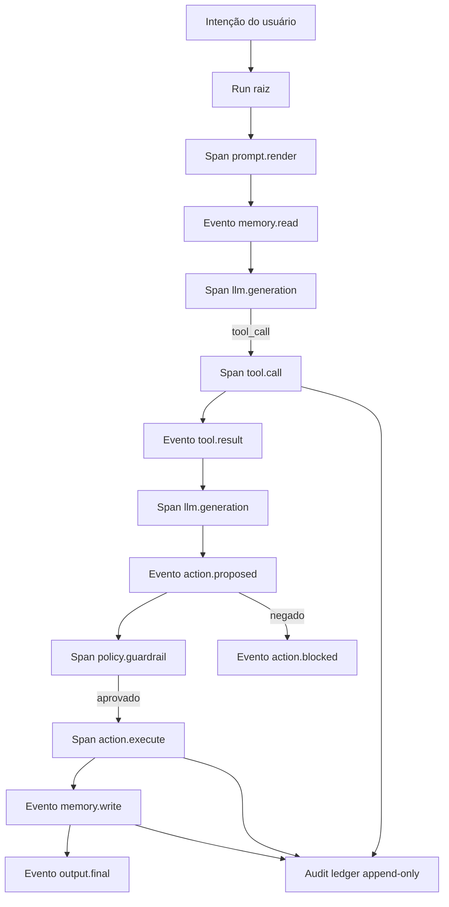
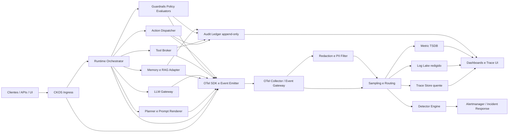

# Observabilidade, tracing e telemetria para agentes de IA

## Resumo executivo

Sistemas agentic exigem uma camada de observabilidade mais rica do que aplicações web convencionais porque a unidade operacional relevante não é apenas a requisição HTTP, mas o **run** do agente: uma cadeia causal que conecta intenção, planejamento, renderização de prompt, leituras de memória, geração do modelo, chamadas de ferramenta, decisões de policy, ações externas e persistência de memória. Em padrões modernos, isso pede a combinação de **traces** para causalidade distribuída, **logs/eventos estruturados** para granularidade semântica, **métricas** para agregação operacional e **trilha de auditoria** imutável para efeitos colaterais e conformidade. OpenTelemetry formaliza spans, eventos, links, contexto propagado e logs correlacionados; o ecossistema de agentes já instrumenta explicitamente gerações, tools, handoffs e guardrails. citeturn44view0turn43view0turn44view1turn46view0turn11view0turn11view2

A recomendação central deste relatório é modelar cada execução de agente como um **Agent Run** com: um `trace_id` interoperável no formato W3C Trace Context; um `run_id` de aplicação, ordenável no tempo; um inventário tipado de eventos; e um grafo causal persistido por relações `parent_of`, `linked_to`, `derived_from`, `reads_from`, `writes_to`, `approved_by` e `executed_as`. Para interoperabilidade entre serviços, `trace_id` deve seguir o `traceparent` do W3C; para indexação operacional, `run_id` deve ser UUIDv7; para deduplicação de side effects, use `idempotency_key` determinístico derivado de payload canônico e HMAC; e para auditoria, use armazenamento append-only com hash encadeado e assinatura criptográfica. citeturn28view1turn28view2turn28view0turn41view1turn41view2turn41view3turn40search0turn40search1turn40search2turn29search0

Em produção, o conjunto mínimo de métricas deve cobrir cinco domínios: **confiabilidade** do run, **latência** do agente e de ferramentas, **consumo** de tokens e custo, **qualidade** da resposta/ação e **segurança** operacional. Para alerta, um bom ponto de partida é combinar SLOs com burn rate em múltiplas janelas, e adicionar detectores específicos para loops, hallucinations, prompt injection, tool misuse e estouro de orçamento. A base técnica vem de métricas GenAI já padronizadas para duração, time-to-first-chunk e uso de tokens, combinadas com práticas SRE de burn rate. citeturn38view1turn39view1turn39view2turn39view4turn38view0

A observabilidade de agentes só é sustentável se for **privacy-aware por padrão**. A LGPD impõe finalidade, necessidade, segurança, prevenção e responsabilização; materiais governamentais brasileiros reforçam minimização, retenção limitada, transparência e privacidade desde a concepção. Em termos práticos, isso significa: separar metadados de artefatos sensíveis, usar pseudonimização e redaction antes do export, criptografar em trânsito e em repouso, aplicar controles finos de acesso, desabilitar captura de payload bruto por padrão em produção e tratar anonimização como um processo contínuo e baseado em risco de reidentificação — não como estado binário. citeturn19search0turn15search1turn15search6turn34view0turn34view1turn36view0turn36view1turn33search0

Para o **CKOS Runtime F1**, assumo um runtime modular com ingress, orchestrator, planner/prompt renderer, adaptadores de LLM, broker de tools, camada de memória/RAG, policy engine, evaluator/detectors e um pipeline de telemetria baseado em OpenTelemetry. Onde a nomenclatura interna do CKOS divergir, os pontos de instrumentação e contratos recomendados abaixo continuam válidos como arquitetura de referência. Esta parte do relatório é, portanto, uma **inferência de desenho** baseada em padrões de OpenTelemetry, SDKs de agentes e frameworks de grafos/loops agentic. citeturn44view0turn44view1turn44view2turn46view0turn26view0turn26view3

## Fundamentos e estrutura de Agent Run

OpenTelemetry define spans como unidades de trabalho com `trace_id`, `span_id`, timestamps de início/fim, atributos, eventos, links e status; logs podem carregar `TraceId` e `SpanId`; e o contexto propagado permite reconstruir causalidade entre serviços e filas. Em aplicações agentic, isso deve ser elevado de “request tracing” para “workflow tracing”: um run é o agregado lógico sobre múltiplas spans, múltiplas ferramentas, múltiplos turnos internos e, às vezes, múltiplos processos assíncronos. O OpenAI Agents SDK, por exemplo, já modela por padrão o workflow inteiro, spans de agent, generation, function/tool, handoff e guardrail. citeturn44view0turn44view1turn46view0

A estrutura mínima de um Agent Run deve separar **identidade do run**, **contexto de negócio**, **orçamento**, **estado** e **artefatos causais**. O objetivo não é só depuração: é permitir replay controlado, análise de falhas, reconciliação de custo, investigação forense, explicabilidade operacional e governança de ações. NIST recomenda que logs suportem armazenamento por período apropriado, auditoria, forense, review rotineiro e investigação; em agentes, isso inclui o caminho completo até qualquer side effect externo. citeturn31view0turn32view0turn16view3



A figura acima representa o grafo causal recomendado: a run raiz contém spans síncronas por relação pai-filho; leituras de memória, resultados de retrieval, outputs intermediários e mensagens assíncronas usam links adicionais; e toda ação com efeito observável é espelhada em trilha de auditoria append-only. Essa separação entre trace operacional e audit trail é essencial porque nem todo dado de observabilidade precisa ser imutável, mas todo side effect relevante para compliance precisa ser verificável. citeturn44view2turn12search2turn29search0turn16view3

### Estrutura recomendada de Agent Run

| Campo | Obrigatório | Descrição | Formato recomendado | Observações |
|---|---|---|---|---|
| `trace_id` | Sim | Identificador distribuído da execução de ponta a ponta | 32 hex minúsculo W3C | Interoperável entre serviços e filas; deve ser globalmente único e aleatório. citeturn28view1turn28view2turn28view0 |
| `run_id` | Sim | Identificador funcional do run no domínio da aplicação | UUIDv7 | Melhor para ordenação temporal e índices de banco. citeturn41view1turn41view3turn41view4 |
| `parent_run_id` | Não | Run do qual este run deriva | UUIDv7 | Use em retries, handoffs, subagentes ou workflows compostos. Recomendação de desenho baseada em spans/links. citeturn44view2turn46view0 |
| `group_id` | Não | Agrupador conversacional ou de caso | string curta estável | Útil para chat thread, ticket, order ID; conceito análogo ao `group_id` do OpenAI Agents SDK. citeturn46view0 |
| `session_id` | Não | Sessão lógica do usuário | UUIDv7/ULID | `session.id` já aparece em convenções de tracing para IA. citeturn11view1turn11view4 |
| `intention_id` | Sim | Identificador do objetivo interpretado pelo runtime | UUIDv7 | Âncora causal entre intenção, prompt e ação. Recomendação de desenho. |
| `attempt_no` | Sim | Tentativa do run | inteiro | Incrementar em retries automáticos ou replay controlado. Recomendação de desenho. |
| `status` | Sim | Estado final | `queued|running|completed|failed|blocked|aborted|expired` | Mapear para span status e evento final. citeturn44view0turn43view0 |
| `budget` | Sim | Orçamento operacional | objeto `{max_tokens,max_cost,max_steps,max_tool_calls,deadline_ms}` | Necessário para prevenção de loops e over-cost. Recomendação baseada em práticas de limites de iteração e custo. citeturn26view0turn26view3turn25search5 |
| `started_at`,`ended_at` | Sim | Instantes do run | ISO 8601 UTC | Consistente com spans e logs. citeturn44view0turn43view0 |
| `root_span_id` | Sim | Span raiz da run | 16 hex | Reflete a árvore principal do trace. citeturn44view0turn28view1 |
| `links[]` | Não | Referências a spans/runs/documentos correlatos | array | Use para memória, filas, fan-in/fan-out, subtraces. citeturn44view2turn12search2 |
| `artifact_refs[]` | Sim | Referências imutáveis a prompt, output, tool args/result, docs | URI/IDs internos + hash | Manter payload bruto fora do evento principal reduz risco e custo. Recomendação de desenho. |
| `final_output_ref` | Não | Referência ao output final | ID/hash | Pode apontar para objeto redigido e/ou payload criptografado. Recomendação de desenho. |
| `approval_refs[]` | Não | Aprovações humanas ou políticas | array | Obrigatório para side effects de alto risco. Recomendação alinhada a guardrails e accountability. citeturn21view6turn46view0 |
| `audit_chain_head` | Não | Último hash/entry ID da auditoria | string | Necessário quando houve side effects, mutações de memória ou bloqueios relevantes. citeturn29search0turn29search4 |

## Modelo de eventos e telemetria

A base do modelo deve ser um **envelope universal** de evento alinhado ao Logs Data Model do OpenTelemetry: `Timestamp`, `ObservedTimestamp`, `TraceId`, `SpanId`, `SeverityText`, `SeverityNumber`, `Body`, `Resource`, `InstrumentationScope` e `Attributes`. Em agentes, esse envelope precisa ser estendido com `run_id`, `intention_id`, `attempt_no`, `actor`, `provenance`, `policy_version`, `prompt_template_version`, `artifact_ref` e `content_hash`. Além disso, o evento deve ser emitido sempre com contexto ativo para que logs e traces permaneçam correlacionados. citeturn43view0turn43view1turn44view1

**Envelope recomendado** para todos os eventos:

```json
{
  "event_name": "tool.call.completed",
  "event_version": "1.0",
  "event_time": "2026-06-04T15:29:41.382Z",
  "observed_time": "2026-06-04T15:29:41.401Z",
  "trace_id": "4bf92f3577b34da6a3ce929d0e0e4736",
  "span_id": "00f067aa0ba902b7",
  "parent_span_id": "5f2d6c01a31be8d4",
  "run_id": "01973c2b-7f1f-7aa7-9de2-0c9e8c0b2f7d",
  "intention_id": "01973c2a-ff10-79be-afe5-01c9e0d91db1",
  "attempt_no": 1,
  "severity_text": "INFO",
  "actor": { "type": "tool", "id": "crm.lookup" },
  "resource": {
    "service.name": "ckos-tool-broker",
    "service.instance.id": "tool-broker-7c89d",
    "deployment.environment": "prod"
  },
  "instrumentation_scope": {
    "name": "ckos.runtime.observability",
    "version": "1.4.0"
  },
  "provenance": {
    "origin_type": "tool",
    "source_ref": "tool://crm.lookup",
    "model_provider": null,
    "policy_version": "policy-2026-05-18"
  },
  "attributes": {},
  "payload": {}
}
```

A coluna “proveniência mínima” na tabela a seguir não deve ser tratada como decoração: ela é o que diferencia um log útil de um log auditável. Proveniência precisa responder, para qualquer fato operacional: **quem produziu**, **com qual versão**, **a partir de qual insumo**, **sob qual política**, **com quais evidências** e **com qual nível de confiança**. OpenTelemetry fornece `Resource` e `InstrumentationScope`; convenções para IA acrescentam `tool.name`, `tool_call.id`, `session.id`, `llm.model_name`, `llm.provider`, `prompt_template.version` e metadados de mensagens. citeturn43view0turn11view1turn11view3turn11view4

### Tabela de eventos e schemas recomendados

| Tipo de evento | Emitir quando | Payload específico obrigatório | Opcionais críticos | Severidade | Proveniência mínima | Base |
|---|---|---|---|---|---|---|
| `run.started` | Início da execução | `workflow_name`, `trigger_type`, `budget`, `input_ref` | `session_id`, `group_id`, `tenant_id` | `INFO` | ingress service, auth principal pseudonimizado, versão de routing | OTel spans/logs; OpenAI traces de workflow. citeturn44view0turn43view0turn46view0 |
| `intention.created` | Objetivo/intent interpretado | `intention_text_ref`, `confidence`, `classification` | `risk_tier`, `policy_route`, `language` | `INFO` ou `WARN` | planner/intent classifier, model/version, prompt version | Recomendação de desenho apoiada por tracing de agentes e convenções de prompt. citeturn46view0turn11view3 |
| `prompt.rendered` | Template + contexto viram prompt executável | `prompt_ref`, `template_id`, `template_version`, `input_refs[]` | `system_ref`, `fewshot_refs[]`, `compression_ratio` | `DEBUG`/`INFO` | prompt renderer, vendor/template version, hashes dos artefatos | OpenInference explicita `llm.prompt_template.*`; spans devem registrar atributos cedo para sampling. citeturn11view3turn44view2 |
| `memory.read` | Leitura de memória curta/longa | `memory_store`, `query_ref`, `result_refs[]` | `scores[]`, `filters`, `latency_ms` | `DEBUG` | memória/retriever, IDs de documentos/chunks, ranking source | OpenInference define spans de `RETRIEVER` e documentos recuperados. citeturn11view2turn11view1 |
| `retrieval.result` | Resultado consolidado de RAG | `document_refs[]`, `top_k`, `query_ref` | `rerank_model`, `coverage_ratio` | `INFO` | store, index version, chunk version | OpenInference cobre `retrieval.documents`, reranker e query. citeturn11view1turn11view2 |
| `llm.requested` | Chamada ao modelo | `provider`, `model`, `operation_name`, `request_ref` | `temperature`, `tool_schemas_ref`, `max_tokens`, `request_hash` | `INFO` | LLM client, provider/model, invocation params, policy version | OTel GenAI + OpenInference definem operação, modelo, provider, invocation parameters. citeturn38view1turn11view3 |
| `llm.stream.chunk` | Streaming incremental | `chunk_index`, `chunk_ref` | `delta_tokens`, `finish_reason_partial` | `DEBUG` | LLM stream adapter, request id do provider | OTel padroniza time-to-first-chunk/time-per-output-chunk para chamadas streaming. citeturn39view2 |
| `llm.completed` | Resposta final do modelo | `response_ref`, `finish_reason`, `token_usage` | `reasoning_tokens`, `cost_estimate`, `tool_calls[]`, `confidence_proxy` | `INFO`/`WARN` | provider/model, usage source, output hash | OpenInference traz `llm.output_messages`, `finish_reason`, `token_count.*`, `cost.*`; OTel traz token usage. citeturn11view3turn38view1 |
| `tool.call.requested` | Modelo ou planner seleciona ferramenta | `tool_name`, `tool_call_id`, `args_ref`, `schema_version` | `selection_rationale_ref`, `allowlist_decision` | `INFO` | tool broker, schema hash, requesting span | OpenInference define `tool.name`, `tool_call.id`, `tool_call.function.arguments`. citeturn11view1 |
| `tool.call.completed` | Tool retorna sucesso/falha | `tool_name`, `tool_call_id`, `status`, `result_ref`, `latency_ms` | `http_status`, `retry_count`, `sandbox_id`, `egress_bytes` | `INFO`/`ERROR` | executor, environment, endpoint/version | Ferramentas são spans `TOOL`; tool use em agentes é loop explícito. citeturn11view0turn26view1 |
| `action.proposed` | Resposta sugere side effect | `action_type`, `target_ref`, `payload_ref`, `risk_score` | `required_approvals[]`, `idempotency_key` | `WARN` | policy engine + proposing span | NIST AI RMF pede gestão explícita de riscos e controles antes de uso/ação. citeturn22view4turn21view6 |
| `policy.decision` | Guardrail/aprovação decide | `decision`, `policy_id`, `policy_version`, `reason_codes[]` | `detector_scores`, `reviewer_ref` | `INFO`/`WARN`/`ERROR` | guardrail/detector/humano, limiar aplicado | OpenAI instrumenta `guardrail_span`; Microsoft Prompt Shields retorna `detected`/`filtered`. citeturn46view0turn21view0 |
| `action.executed` | Side effect efetivamente ocorreu | `action_type`, `target_ref`, `execution_status`, `idempotency_key` | `external_txn_id`, `rollback_ref`, `egress_signature` | `INFO`/`ERROR` | executor, actor, endpoint, approval refs | Evento crítico para auditoria; NIST enfatiza logs para auditoria, forense e investigação. citeturn31view0turn32view0 |
| `memory.write` | Atualização de memória/facts | `memory_store`, `write_ref`, `write_type`, `source_refs[]` | `ttl`, `consistency_level`, `staleness_hint` | `INFO`/`WARN` | memory writer, document lineage, policy route | Deve manter lineage entre leitura, output e gravação; recomendação de desenho sobre spans/links. citeturn44view2turn11view2 |
| `evaluator.result` | Avaliação automática/humana | `evaluator_id`, `metric_name`, `score`, `label` | `threshold`, `judge_model`, `human_ref` | `INFO`/`WARN` | evaluator model/version, rubric/version, evidence refs | OpenInference inclui `EVALUATOR`; NIST pede avaliar métricas e incorporar feedback. citeturn11view0turn22view3 |
| `anomaly.detected` | Detector encontra loop, injection, misuse etc. | `anomaly_type`, `score`, `threshold`, `evidence_refs[]` | `window`, `baseline_id`, `recommended_action` | `WARN`/`ERROR` | detector id/model/version, baseline, rule hash | NIST e OWASP tratam confabulação, prompt injection e riscos de segurança operacional. citeturn22view1turn21view4turn21view6 |
| `run.completed` | Encerramento normal | `status`, `final_output_ref`, `duration_ms`, `aggregate_usage` | `quality_summary`, `user_visible_refs[]` | `INFO` | root trace, run aggregator, usage source | OpenAI SDK serializa uso agregado em metadados de span; OTel padroniza duração. citeturn27search11turn39view1 |
| `run.failed` | Falha terminal | `error.type`, `error.message_ref`, `failed_stage` | `stack_ref`, `retryable`, `retry_policy` | `ERROR`/`FATAL` | failing component, exception class, span status | OTel logs/traces e OpenInference trazem exceções e status. citeturn43view1turn44view0turn11view3 |
| `audit.appended` | Registro imutável materializado | `audit_entry_id`, `entry_hash`, `prev_hash`, `signed_at` | `signature`, `key_id`, `witness_ref` | `INFO`/`FATAL` | audit service, signer key id, canonicalization version | RFC 5848, JCS e JWS/HMAC sustentam integridade e autenticidade do registro. citeturn29search0turn40search0turn40search1turn40search2 |

**Regra prática de severidade**: eventos normais de pipeline ficam em `INFO`; operações volumosas e sem risco imediato, como streaming chunks e memory reads, em `DEBUG`; qualquer situação que degrade confiabilidade sem ser falha terminal — retry, aproximação de budget, guardrail soft-block, baixa confiança, detector acima de limiar mas ainda contido — em `WARN`; falha efetiva de modelo/tool/ação em `ERROR`; e perda de integridade, lacuna de auditoria ou side effect não aprovado em `FATAL`. Isso é uma recomendação de desenho que se encaixa naturalmente na dupla `SeverityText/SeverityNumber` do OpenTelemetry. citeturn43view0turn43view1

## Rastreabilidade causal, identificadores e trilha de auditoria

A causalidade entre **intenção → prompt → agente → tool → output → ação → memória** não deve depender apenas de spans pai-filho. Em agentes reais existem assíncronos, fan-out/fan-in, retries, retomadas, múltiplas ferramentas, replanejamento e side effects externos. O modelo mais robusto é híbrido: árvore de spans para causalidade síncrona, **span links** para relações não estritamente hierárquicas, `baggage` apenas para poucos metadados de baixo cardinalidade e um **grafo de lineage** persistido em storage próprio para consultas posteriores. OpenTelemetry define exatamente esse espaço: um span pode ter um único pai e múltiplos links; links podem ser considerados por samplers se adicionados já na criação; e o contexto distribuído pode ser propagado por `traceparent` e complementado por `baggage`. citeturn44view2turn12search2turn13search0turn13search2turn44view1

A implantação prática dessa causalidade pede **IDs duráveis de artefatos**. Em outras palavras: além de spans, cada prompt renderizado, cada tool call, cada leitura de documento, cada output intermediário e cada escrita de memória precisa de um identificador próprio e de um hash de conteúdo canônico. Sem isso, o trace mostra tempo e estrutura, mas não prova lineage de dados. Com isso, fica possível responder perguntas como “qual documento alimentou esta decisão?”, “qual versão do prompt gerou este side effect?” e “qual resposta foi armazenada em memória?”. Convenções de tracing para IA já contemplam `tool_call.id`, `message.tool_call_id`, `session.id`, `prompt_template.version` e referências a documentos. citeturn11view1turn11view3turn11view4

Os pontos de instrumentação prioritários são: **ingress** (criação de run e root span), **router/planner** (intenção e risk tier), **prompt renderer** (template/version/hash), **memory/RAG adapter** (query, docs, scores), **LLM client** (provider, model, usage, streaming, finish reason), **tool broker** (schema, args, result, sandbox), **guardrails/policy/evaluator** (scores, limiares, decisões), **action dispatcher** (idempotência, aprovação, side effect), **memory writer** (origem do fato gravado) e **audit service** (hash, assinatura, cadeia). Como os samplers só enxergam atributos presentes na criação do span, `agent_name`, `tool_name`, `policy_route`, `risk_tier` e `intention_id` devem ser definidos o mais cedo possível. citeturn44view2turn44view0

Para sampling, a configuração mais equilibrada para CKOS Runtime F1 é: **head sampling baixo** para tráfego saudável e repetitivo; **always-on** para runs com side effects, erros, bloqueios de policy, feedback ruim, custo alto, prompt injection, loops ou latência extrema; e **tail sampling** no collector para promover traces “anomalias-raras-mas-custosas” que o SDK não conseguiria antecipar. Em filas, workers ou jobs longos, use export assíncrono com flush explícito ao final de unidades de trabalho críticas. O OpenAI Agents SDK, por exemplo, usa batch export e recomenda `flush_traces()` quando é preciso garantia imediata de export em workers de fundo. citeturn44view2turn46view0

### Formatos recomendados para `trace_id`, `run_id`, `idempotency_key` e auditoria

| Identificador | Recomendação | Exemplo | Justificativa |
|---|---|---|---|
| `trace_id` | **W3C Trace Context**, 16 bytes, 32 hex minúsculo, aleatório, não-zero | `4bf92f3577b34da6a3ce929d0e0e4736` | É o formato interoperável entre serviços; o W3C exige 32 hex para `trace-id`, 16 hex para `parent-id`, proíbe zero total e recomenda aleatoriedade para unicidade e privacidade. citeturn28view1turn28view2turn28view0 |
| `span_id` | 8 bytes, 16 hex minúsculo | `00f067aa0ba902b7` | Compatível com `traceparent` e correlação de logs. citeturn28view1turn44view1 |
| `run_id` | **UUIDv7** como ID funcional do run | `01973c2b-7f1f-7aa7-9de2-0c9e8c0b2f7d` | UUIDv7 usa timestamp Unix em ms, é ordenável como bytes opacos e mantém boa entropia; excelente para índices e ordenação temporal. citeturn41view1turn41view2turn41view3turn41view4 |
| `group_id` | ID estável de conversa/caso | `grp_case_2026_000184` | Agrupa múltiplos traces/runs do mesmo case; análogo ao `group_id` no OpenAI Agents SDK. citeturn46view0 |
| `idempotency_key` | `ik_v1_` + Base32/HMAC-SHA256(JCS(payload)+escopo) truncado para 26–32 chars | `ik_v1_7D5R9K3Q8F2M1T6P4V0C9N2R` | JCS gera JSON canônico “hashable”; HMAC fornece autenticação de mensagem; a chave deve incluir operação, alvo, tenant e janela de validade para evitar colisões semânticas. Recomendação de desenho baseada em RFC 8785 + RFC 2104. citeturn40search0turn40search1 |
| `audit_entry_id` | UUIDv7 ou contador monotônico local + partição | `adt_01973c2c-11a9-7d10-bb90-65f1e79b7127` | Ordenação temporal facilita verificação e reconciliação do ledger. citeturn41view1turn41view3 |
| `entry_hash` | `SHA-256(JCS(entry_without_signature))` | `sha256:5c7b...` | Integridade por conteúdo determinístico. Recomendação apoiada por JCS. citeturn40search0 |
| `signature` | JWS ou assinatura assimétrica externa; HMAC só quando a verificação simétrica for aceitável | `eyJhbGciOiJFUzI1NiJ9...` | JWS formaliza assinatura/MAC em estruturas JSON; para auditoria entre domínios, assinatura assimétrica é preferível. citeturn40search2 |

**Recomendação decisiva**: use `trace_id` e `run_id` para propósitos diferentes. `trace_id` serve à interoperabilidade distribuída e deve permanecer W3C-puro; `run_id` serve ao domínio da aplicação, UX operacional, busca em banco e replay. Misturar as duas funções em um único identificador normalmente degrada ou a interoperabilidade ou a ergonomia operacional. citeturn28view1turn41view1turn46view0

### Política de propagação, retenção e assinatura

Em HTTP/gRPC, propague `traceparent`; em mensageria, replique `traceparent` e, quando houver causalidade n:m, adicione **links** ao consumir a mensagem. Use `baggage` apenas para identificadores curtos e não sensíveis, como `tenant_id`, `session_id`, `risk_tier` e `policy_route`; nunca para PII, prompts ou outputs. `idempotency_key` deve ser propagada apenas para operações retryáveis que produzam side effect e deve permanecer constante durante retries do mesmo efeito. citeturn13search0turn13search2turn44view1turn44view2

Quanto à retenção, não existe um número universalmente correto; o critério correto é **adequação à finalidade, risco e obrigação contratual/regulatória**. NIST recomenda políticas claras sobre geração, transmissão, armazenamento, rotação, retenção e descarte, enquanto a LGPD enfatiza finalidade, necessidade e segurança. Para CKOS, um baseline prudente é: **hot traces** com payload redigido por 7–30 dias; **warm traces** e métricas agregadas por 90–180 dias; **trilha de auditoria imutável** por 1–2 anos ou mais quando houver exigência legal/contratual; e destruição segura quando os dados não forem mais necessários. Isso é recomendação de engenharia, não imposição normativa geral. citeturn31view0turn32view1turn32view2turn19search0turn15search1

A trilha de auditoria deve ser **append-only**, com `prev_hash`, `entry_hash`, `signed_at`, `key_id`, `actor`, `decision` e `effect_ref`. RFC 5848 mostra por que isso importa: autenticação de origem, integridade, resistência a replay, sequenciamento e detecção de lacunas de mensagens. Em aplicações modernas, uma implementação prática é um ledger lógico com hash encadeado sobre JSON canônico e assinatura por lote ou por entrada. citeturn29search0turn29search3turn40search0turn40search2

## Métricas essenciais, SLOs e alertas

As métricas de agentes devem ser definidas em três níveis. O primeiro é o **nível de execução**: duração do run, taxa de sucesso, número de passos, retries, bloqueios e side effects. O segundo é o **nível GenAI**: latência de inferência, time-to-first-chunk/first-token, tokens de entrada/saída, proporção de reasoning tokens e custo. O terceiro é o **nível de produto e segurança**: sucesso de tarefa, cobertura de evidência, taxa de escalonamento humano, prompt injection detectado, misuse de tool, loops e regressões de qualidade. OpenTelemetry já padroniza parte importante do segundo nível e o NIST AI RMF reforça a necessidade de métricas validadas, modelos de erro de medição e processos de feedback. citeturn38view1turn39view1turn39view2turn22view3

Os limiares abaixo são **baselines iniciais**. Eles precisam ser recalibrados por classe de agente, criticidade do fluxo, perfil de toolset e histórico real do CKOS. Para segurança e qualidade, limiares estáticos devem coexistir com baselines dinâmicos por percentil, EWMA e z-score robusto, porque o tráfego agentic costuma ser multimodal e muda com prompts, tools e modelos. citeturn22view3turn38view0

### Tabela de métricas essenciais

| Métrica | Definição | Unidade | Janela padrão | SLO / threshold inicial | Base |
|---|---|---|---|---|---|
| `run_success_rate` | `%` de runs concluídos sem falha terminal nem bloqueio inesperado | `%` | 5m, 1h, 30d | SLO inicial: `99,0%` para fluxos internos; `99,5%` se o agente aciona processos de negócio críticos | SRE usa SLO/error budget como mecanismo central de operação. citeturn38view0turn37search8 |
| `run_duration_p95/p99` | Duração fim-a-fim do run | `s` | 5m, 1h | Definir por classe; alerta se `p99 > 2x` o objetivo por 15m | OTel traz `gen_ai.client.operation.duration`; spans capturam start/end. citeturn39view1turn44view0 |
| `ttfc_p95` | Tempo até primeiro chunk/token em chamadas streaming | `s` | 5m, 1h | Alerta se `p95 > 3s` em agentes interativos ou `> baseline + 3σ` | OTel padroniza `time_to_first_chunk`/`time_to_first_token`. citeturn39view2turn39view4 |
| `token_input/output_p95` | Tokens de entrada e saída por chamada | `{token}` | 5m, 1h, 24h | Alertar em crescimento >`50%` WoW ou >`P99 histórico + 3σ` | OTel padroniza `gen_ai.client.token.usage`; billable tokens devem prevalecer. citeturn38view1 |
| `cost_per_run_p95` | Custo efetivo/estimado por run | moeda | 1h, 24h | Hard budget por classe; página se `> 2x budget` em 5m | Custo pode ser derivado de usage; OpenInference já prevê `llm.cost.*`. citeturn11view3turn38view1 |
| `tool_success_rate` | Sucesso de chamadas de tool | `%` | 5m, 1h | Alertar se `< 98%` ou se erro concentrado em tool crítica | Tools são spans próprias; falhas entram em erro.type/status. citeturn11view0turn26view1 |
| `tool_selection_error_rate` | `%` de tool calls que falham por escolha incorreta, schema inválido, args ruins | `%` | 1h, 24h | Ticket se `> 1%`; page se `> 5%` em tool crítica | Anthropic relata wrong tool selection/incorrect parameters como falhas comuns; `strict:true` reduz erro de schema. citeturn25search5turn26view1 |
| `loop_rate` | `%` de runs sinalizados como loop ou atingindo limite de passos | `%` | 15m, 24h | Ticket `> 0,5%`; page `> 2%` | Claude e LangGraph usam limites de iteração/recursão para conter loops e custo inesperado. citeturn26view0turn26view2turn26view3 |
| `hallucination_proxy_rate` | `%` de respostas com detector factual acima do limiar | `%` | 1h, 24h | Em fluxos grounded, alvo `< 1–2%` como baseline inicial | NIST trata confabulation como risco; benchmarks e detectores acadêmicos mostram a dificuldade da tarefa. citeturn22view3turn24search2turn24search3turn24search0 |
| `evidence_coverage_ratio` | Proporção de claims materialmente suportadas por docs ou tool-results | `%` | 1h, 24h | Ticket se `< 90%` em fluxos que exigem grounding | HaluEval e NIST reforçam risco de conteúdo não verificável; grounding reduz esse risco. citeturn24search2turn21view6turn22view4 |
| `prompt_injection_detect_rate` | Inputs/documentos marcados por shield/classifier | `%` | 10m, 1h | Page se `> 0,5%` em agente com ações; ticket em agentes só-leitura | Prompt Shields detecta ataques de usuário e documentos; OWASP destaca prompt injection como risco principal. citeturn21view1turn21view0turn21view4 |
| `human_escalation_rate` | Parcela de runs enviados a humano | `%` | 1h, 7d | Meta depende do produto; aumento abrupto >`2x` baseline merece investigação | NIST AI RMF pede feedback e vias de apelação/escalonamento. citeturn22view3 |
| `audit_gap_rate` | Entradas esperadas de auditoria ausentes ou cadeia inconsistente | `%` ou contagem | 5m, 1h | Qualquer ocorrência em produção crítica = `page` | Integridade e detecção de mensagens faltantes são responsabilidades clássicas de logging seguro. citeturn29search0turn16view3 |

### Regras de alerta recomendadas

As regras abaixo combinam SRE clássico com semântica agentic. São exemplos iniciais para CKOS e devem ser ajustados por classe de fluxo. citeturn38view0turn38view1

```yaml
groups:
  - name: ckos-agent-slo
    rules:
      - alert: CKOSAgentRunErrorBudgetFastBurn
        expr: ckos:run_error_ratio:rate1h > (14.4 * (1 - 0.99))
        for: 5m
        labels: { severity: page }
        annotations:
          summary: "Consumo de 2% do error budget em 1h"

      - alert: CKOSAgentRunErrorBudgetSlowBurn
        expr: ckos:run_error_ratio:rate6h > (6 * (1 - 0.99))
        for: 15m
        labels: { severity: page }
        annotations:
          summary: "Consumo de 5% do error budget em 6h"

      - alert: CKOSLoopRateHigh
        expr: sum(rate(agent_loop_detected_total[15m])) / sum(rate(agent_runs_total[15m])) > 0.02
        for: 10m
        labels: { severity: page }

      - alert: CKOSPromptInjectionCritical
        expr: sum(rate(prompt_injection_detected_total{agent_class="action"}[10m])) / sum(rate(agent_inputs_total{agent_class="action"}[10m])) > 0.005
        for: 5m
        labels: { severity: page }

      - alert: CKOSCostBudgetExceeded
        expr: histogram_quantile(0.95, sum by (le,agent_id) (rate(agent_run_cost_bucket[1h]))) > on(agent_id) agent_run_budget_usd * 2
        for: 10m
        labels: { severity: page }

      - alert: CKOSEvidenceCoverageLow
        expr: avg_over_time(agent_evidence_coverage_ratio[1h]) < 0.90
        for: 30m
        labels: { severity: ticket }
```

## Detecção de falhas e riscos operacionais

A detecção eficaz em agentes combina **heurísticas determinísticas**, **classificadores/guardrails**, **anomalia estatística** e, em alguns casos, **juízes LLM ou detectores acadêmicos**. Não existe detector único “geral” para agentes porque os modos de falha são heterogêneos: alguns são estruturais, como loops ou schema mismatch; outros são semânticos, como confabulação; e outros são adversariais, como prompt injection indireta em documentos. O NIST AI RMF sublinha que riscos de confabulação, integridade informacional e segurança precisam de medições e rastreamento contínuos; OWASP e Microsoft tratam prompt injection como risco operacional central; e Anthropic ressalta que o problema não está resolvido, sobretudo quando o modelo age no mundo. citeturn22view3turn22view4turn21view4turn21view1turn21view2turn21view3

- **Falhas transientes e falhas estruturais**. Detecte por `error.type`, timeouts, retry_count, `finish_reason`, rate de exceções por estágio, spikes em `tool_success_rate` e gaps entre eventos esperados do run. Ferramentas e spans já carregam erros, status e timestamps; toda falha terminal deve produzir `run.failed` com o estágio que interrompeu o fluxo. Mitigue com retries idempotentes, circuit breakers por tool/model, timeouts por estágio e fallback de provider/tool. citeturn11view3turn39view3turn44view0turn31view0

- **Loops e falta de progresso**. Combine limites duros e heurísticas: `max_steps`, `max_tool_calls`, `deadline_ms`, razão “novas evidências por passo”, repetição de `(tool_name,args_hash)` três vezes em 60s, similaridade muito alta entre prompts/plans consecutivos e ausência de mudança de estado. LangGraph expõe `recursion_limit` e até o contador de passo atual; a documentação da Anthropic explicita que o limite de iteração existe para evitar loops e custo inesperado. Mitigue com budget hierárquico por run, “no-progress detector”, resumo/compaction ao se aproximar do limite e escalonamento para humano ou fallback determinístico. citeturn26view0turn26view2turn26view3

- **Hallucinations e baixa factualidade**. Use camadas complementares: checagem de grounding contra docs/tool-results; detectores de autocontradição como SelfCheckGPT; estimadores de incerteza como semantic entropy para subconjuntos de confabulação; e benchmarks/rúbricas específicas para sua tarefa. Como baseline operacional, trate respostas sem evidência suficiente em fluxos grounded como `WARN`, e como `ERROR` se houver ação derivada dessa resposta. Mitigue com retrieval controlado, tool-first em perguntas factuais voláteis, políticas de abstention e memória com provenance explícita. citeturn24search0turn24search3turn24search2turn22view3turn22view4

- **Over-cost e token burn**. Monitore input/output tokens, reasoning tokens, custo por run, custo por tool, retries e overhead de schema/tool advertising. A Anthropic observa que definições de tools podem consumir dezenas ou até mais de 100 mil tokens antes da conversa começar, e que wrong tool selection é uma falha comum. Mitigue com budget por classe de agente, truncamento/compaction de contexto, cache de prompt/tool schema, poda de toolset por contexto e gatilhos de early-exit quando a utilidade marginal do próximo passo cair abaixo de um limiar. citeturn25search5turn11view3turn38view1

- **Tool misuse e side effects indevidos**. Detecte por schema mismatch, tool fora de allowlist, parâmetros fora de domínio, tentativas de egress proibido, mutação sem aprovação, alta taxa de erro sintático de argumentos e desvio entre tool sugerida e tool executada. Use `strict: true` quando o provedor suportar conformidade estrita de schema, sandbox para tools de alto risco e aprovações humanas/policies para qualquer side effect externo não trivial. Mitigue com broker central de tools, tipagem forte de input/output, role-based allowlist por agente e trilha de auditoria de cada execução. citeturn26view1turn11view1turn31view0turn29search0

- **Prompt injection direta e indireta**. Trate toda entrada e todo documento recuperado como potencial canal adversarial. Microsoft Prompt Shields detecta e bloqueia ataques em prompts do usuário e em documentos; OWASP define prompt injection como o principal risco para apps LLM; e Anthropic enfatiza que o problema permanece aberto, especialmente quando modelos realizam ações. Heurísticas úteis incluem detecção de instruções de override, frases de exfiltração, padrões de “ignore previous instructions”, conteúdo oculto em documentos, mudança súbita de policy route e taint tracking de conteúdo não confiável até tools/action. Mitigue com classifiers, separação explícita entre instruções e dados, trust labels em documentos, deny-by-default para tools sensíveis e requirement de confirmação humana para ações derivadas de conteúdo não confiável. citeturn21view1turn21view0turn21view4turn21view2turn21view3

- **Vazamento de privacidade e reidentificação**. Detecte por classificadores de PII, regras de regex/tokenizers para padrões comuns, contagem de campos sensíveis exportados, entropia anômala em payloads e scanners de redaction coverage. No Brasil, a ANPD e órgãos governamentais reforçam minimização, retenção limitada e privacidade desde a concepção; além disso, a anonimização deve ser tratada como processo contínuo baseado em risco de reidentificação, não como “estado final” sem retorno. Mitigue com separação de stores, pseudonimização, criptografia, redaction antes do export, privacy tiers por campo e validação contínua do risco de reidentificação. citeturn34view0turn34view1turn36view0turn36view1turn36view3

- **Risco de integridade de logs e auditoria**. Detecte por quebra de cadeia (`prev_hash` inconsistente), mensagens faltantes, assinaturas inválidas, janelas sem `audit.appended` para ações que deveriam auditá-las e divergência entre o trace operacional e o ledger de auditoria. Mitigue com append-only storage, hash chaining, assinatura por chave rotacionada, retenção segregada e reconciliação periódica entre traces e ledger. citeturn29search0turn29search4turn16view3

## Privacidade, conformidade e integração no CKOS Runtime F1

A LGPD estabelece princípios de finalidade, necessidade, segurança, prevenção e responsabilização/prestação de contas. Guias brasileiros de privacidade desde a concepção traduzem isso em prática: coletar só o necessário, limitar retenção e compartilhamento, integrar proteção desde o desenho do serviço e garantir transparência aos titulares. Para observabilidade de agentes, isso implica um princípio operacional simples: **telemetria rica em metadados, econômica em conteúdo sensível**. citeturn19search0turn15search6turn34view0turn34view1

Uma política madura para CKOS Runtime F1 deve separar quatro classes de dado: **metadados operacionais**; **artefatos redigidos**; **payloads sensíveis criptografados**; e **auditoria imutável**. Logs e traces enviados ao backend central devem, por padrão, carregar hashes, previews truncados, classificações de risco e referências a artefatos, não o conteúdo bruto integral. Payload bruto só deve ir para storage dedicado, criptografado, com retenção curta e acesso break-glass. Isto reduz custo, cardinalidade e exposição jurídica. Como sinal importante, o OpenAI Agents SDK admite desabilitar captura de dados sensíveis em spans de geração e function call; e, sob política Zero Data Retention, o tracing sequer fica disponível. citeturn46view0turn31view0turn15search1

A anonimização e a pseudonimização não devem ser tratadas como “checklist concluído”. O material técnico da ANPD enfatiza que anonimização é processo baseado em risco, que o risco de reidentificação deve ser mensurado como probabilidade e monitorado continuamente, e que não existe cenário realista de risco zero. Por isso, para observabilidade de agentes, agregações analíticas — especialmente métricas de produto e benchmarking — podem usar técnicas de anonimização e, quando couber, privacidade diferencial; já traces brutos e trilhas de auditoria devem ser governados por acesso, criptografia e minimização, não por falsa suposição de anonimização perfeita. citeturn36view0turn36view1turn36view3turn16view2

### Arquitetura recomendada para o CKOS Runtime F1



A arquitetura acima desacopla o runtime da plataforma de observabilidade. O **SDK/Event Emitter** fica colado ao código do CKOS para capturar contexto, spans e eventos tipados. O **Collector/Event Gateway** aplica redaction, sampling, enrichers e roteamento por política. O **Trace Store** guarda a visão causal detalhada; o **Log Lake**, a trilha semântica pesquisável; o **TSDB**, as métricas; e o **Audit Ledger**, os eventos materialmente relevantes para compliance e investigação. O detector engine consome sinais dos três primeiros stores e alimenta alerting. Essa decomposição segue diretamente a separação funcional de log management recomendada pelo NIST — geração, transmissão, armazenamento, análise e descarte — adaptada ao domínio agentic. citeturn31view0turn16view3

### Pontos de integração e trade-offs para o CKOS Runtime F1

| Componente CKOS | Como plugar a observabilidade | Armazenamento principal | Trade-off de custo/latência |
|---|---|---|---|
| Ingress | criar `trace_id`, `run_id`, root span e `run.started`; injetar/extrair `traceparent` | Trace store + log lake | Custo baixo; valor alto para correlação distribuída |
| Planner / prompt renderer | emitir `intention.created` e `prompt.rendered`; anexar hashes e versões | Log lake + artifact store | Capturar prompt bruto aumenta risco e custo; prefira hash + preview |
| Memory/RAG | spans `RETRIEVER`, `memory.read`, `memory.write`, refs de documentos/chunks | Trace + object store redigido | Alta cardinalidade; não exportar documento inteiro em logs |
| LLM gateway | spans de geração; métricas de duração, TTFC, tokens e finish reason | Trace + TSDB | Métricas são baratas; payload bruto é caro e sensível |
| Tool broker | spans `TOOL`, `tool.call.*`, sandbox ids, arg/result refs | Trace + log lake + audit | Tools externas multiplicam latência e superfície de risco |
| Guardrails / evaluators | `policy.decision`, `evaluator.result`, scores, thresholds | Log lake + TSDB + audit | Score detalhado é valioso; guardar input bruto do detector nem sempre |
| Action dispatcher | `action.proposed` e `action.executed` com `idempotency_key` | Audit ledger + trace | Não amostrar side effects relevantes; sempre auditar |
| Collector/Event Gateway | redaction, enrichment, routing e sampling | Todos | Baixa latência adicional se local/sidecar; grande economia downstream |
| Detector Engine | regras + ML + anomalia; escrever `anomaly.detected` | Log lake + TSDB | Muito útil, mas exige governança de falso positivo |
| Dashboard / Alerting | unir traces, métricas, auditoria e feedback | leitura | Valor máximo quando IDs e lineage são consistentes |

Em termos de política operacional, a melhor relação custo/benefício costuma ser: **metadados sempre on**, **payload bruto opt-in**, **métricas sempre on e não amostradas**, **traces detalhados com sampling inteligente**, e **audit trail sempre íntegra para side effects**. Para CKOS, isso normalmente reduz bastante o custo de storage e indexação sem sacrificar debuggability. citeturn44view2turn38view1turn31view0

### Exemplos de logs estruturados

Os exemplos abaixo são sintéticos, mas seguem o modelo recomendado de envelope + payload tipado.

**Exemplo de `llm.completed`**

```json
{
  "event_name": "llm.completed",
  "event_version": "1.0",
  "event_time": "2026-06-04T15:33:12.418Z",
  "observed_time": "2026-06-04T15:33:12.423Z",
  "trace_id": "4bf92f3577b34da6a3ce929d0e0e4736",
  "span_id": "00f067aa0ba902b7",
  "run_id": "01973c2b-7f1f-7aa7-9de2-0c9e8c0b2f7d",
  "intention_id": "01973c2a-ff10-79be-afe5-01c9e0d91db1",
  "severity_text": "INFO",
  "actor": { "type": "model", "id": "gpt-4.1" },
  "provenance": {
    "origin_type": "model",
    "model_provider": "openai",
    "model_name": "gpt-4.1",
    "prompt_template_version": "sales-brief-v12",
    "policy_version": "policy-2026-05-18"
  },
  "payload": {
    "finish_reason": "tool_calls",
    "input_ref": "obj://prompt/3f90d9",
    "output_ref": "obj://completion/7ab531",
    "tool_calls": [
      {
        "tool_call_id": "tc_01973c2b98f4",
        "tool_name": "crm.lookup_company",
        "args_hash": "sha256:57e3f8..."
      }
    ],
    "token_usage": {
      "input": 1842,
      "output": 214,
      "reasoning": 88,
      "total": 2056
    },
    "cost_estimate_usd": 0.0124
  }
}
```

**Exemplo de `tool.call.completed`**

```json
{
  "event_name": "tool.call.completed",
  "event_version": "1.0",
  "event_time": "2026-06-04T15:33:13.021Z",
  "observed_time": "2026-06-04T15:33:13.024Z",
  "trace_id": "4bf92f3577b34da6a3ce929d0e0e4736",
  "span_id": "11ab67cd45ef22aa",
  "parent_span_id": "00f067aa0ba902b7",
  "run_id": "01973c2b-7f1f-7aa7-9de2-0c9e8c0b2f7d",
  "severity_text": "INFO",
  "actor": { "type": "tool", "id": "crm.lookup_company" },
  "provenance": {
    "origin_type": "tool",
    "source_ref": "tool://crm.lookup_company",
    "policy_version": "tool-policy-2026-05-22"
  },
  "payload": {
    "tool_call_id": "tc_01973c2b98f4",
    "status": "ok",
    "args_ref": "obj://tool-args/a31f9c",
    "result_ref": "obj://tool-result/90c1d0",
    "latency_ms": 418,
    "retry_count": 0,
    "sandbox_id": "sbx-ckos-prod-18",
    "http_status": 200
  }
}
```

**Exemplo de `anomaly.detected` para loop**

```json
{
  "event_name": "anomaly.detected",
  "event_version": "1.0",
  "event_time": "2026-06-04T15:33:44.902Z",
  "observed_time": "2026-06-04T15:33:44.905Z",
  "trace_id": "4bf92f3577b34da6a3ce929d0e0e4736",
  "run_id": "01973c2b-7f1f-7aa7-9de2-0c9e8c0b2f7d",
  "severity_text": "WARN",
  "actor": { "type": "detector", "id": "loop-detector-v3" },
  "provenance": {
    "origin_type": "detector",
    "source_ref": "detector://loop-detector-v3",
    "policy_version": "obs-policy-2026-06-01"
  },
  "payload": {
    "anomaly_type": "loop",
    "score": 0.97,
    "threshold": 0.8,
    "evidence_refs": [
      "evt://tool.call.completed/1",
      "evt://tool.call.completed/2",
      "evt://tool.call.completed/3"
    ],
    "reason_codes": [
      "same_tool_args_repeated_3x",
      "no_state_delta",
      "budget_nearing_limit"
    ],
    "recommended_action": "abort_and_escalate"
  }
}
```

**Exemplo de `audit.appended`**

```json
{
  "event_name": "audit.appended",
  "event_version": "1.0",
  "event_time": "2026-06-04T15:34:02.100Z",
  "trace_id": "4bf92f3577b34da6a3ce929d0e0e4736",
  "run_id": "01973c2b-7f1f-7aa7-9de2-0c9e8c0b2f7d",
  "severity_text": "INFO",
  "actor": { "type": "audit_service", "id": "ckos-audit-ledger" },
  "payload": {
    "audit_entry_id": "adt_01973c2c-11a9-7d10-bb90-65f1e79b7127",
    "object_type": "action.executed",
    "object_ref": "evt://action.executed/55",
    "entry_hash": "sha256:9d8eae0c7b5e...",
    "prev_hash": "sha256:1b67f9e01c09...",
    "signed_at": "2026-06-04T15:34:02.100Z",
    "key_id": "kms://ckos/audit/es256/2026-q2",
    "signature": "eyJhbGciOiJFUzI1NiJ9..."
  }
}
```

## Limitações e questões em aberto

Este relatório assume que o **CKOS Runtime F1** é um runtime modular e que você tem liberdade para inserir hooks de instrumentação em ingress, orchestration, memory, LLM gateway, tools, evaluator e action dispatcher. Se o F1 tiver restrições importantes — por exemplo, execution model single-process, ausência de broker de tools, ZDR rígido, ou backends de observabilidade já impostos — alguns detalhes de propagação, sampling e retenção precisarão ser ajustados. citeturn46view0turn44view1turn44view2

Também é importante notar que parte das convenções GenAI do ecossistema OpenTelemetry ainda está em evolução. As métricas de GenAI aparecem como convenções iniciais e podem amadurecer; já custos monetários ainda são melhor tratados como derivação de billing/tokens ou como atributos complementares, não como padrão universal fechado. Do mesmo modo, detectores de hallucination continuam limitados: SelfCheckGPT e semantic entropy ajudam, mas não resolvem factualidade geral. citeturn38view1turn11view3turn24search0turn24search3

Por fim, qualquer threshold apresentado aqui deve ser interpretado como **baseline operacional inicial**. O valor verdadeiro para CKOS dependerá do mix de agentes, densidade de tools, tolerância a latência, criticidade das ações e custo aceitável por run. O caminho certo é começar com estes baselines, medir por 2–4 semanas, estratificar por classe de agente e então recalibrar SLOs, detectores e sampling com dados reais do runtime. citeturn22view3turn38view0