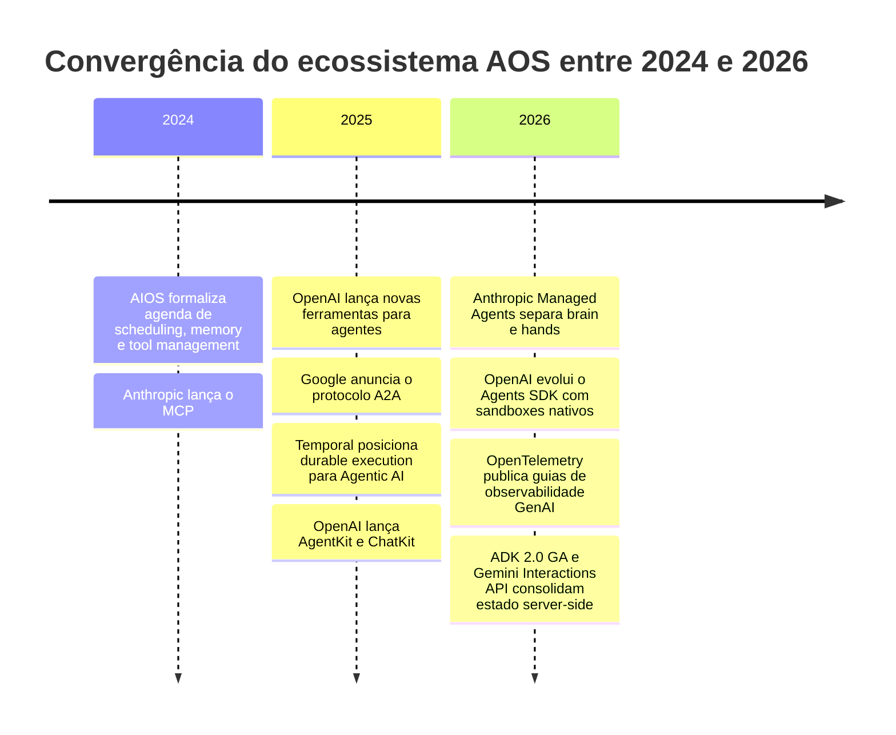
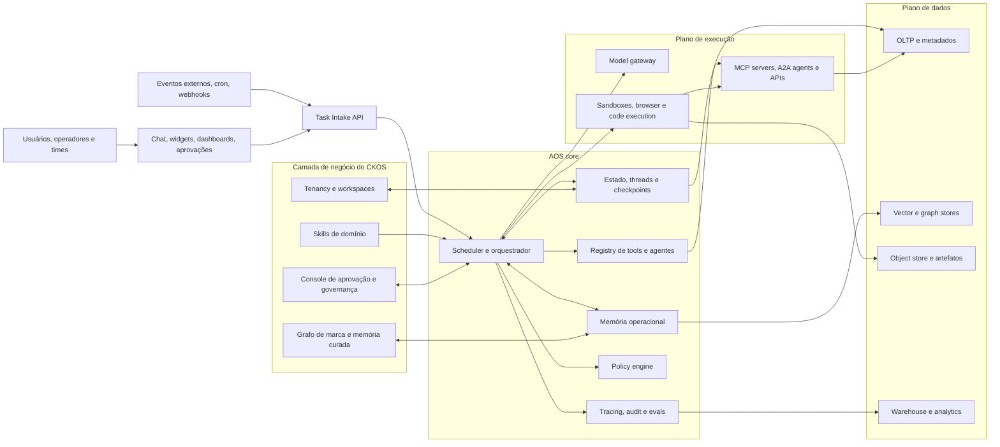
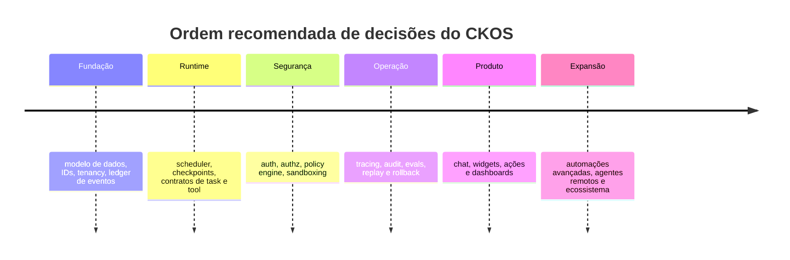

# Agent Operating Systems em 2026

## Resumo executivo

Em junho de 2026, **Agent Operating System** não é, na prática, “mais um framework de agentes”. O termo está convergindo para uma **camada operacional e de controle** que sustenta agentes long-lived: recebe tarefas, gerencia estado e memória, coordena execução multi-etapa, aplica políticas e aprovações, integra ferramentas e protocolos externos, e produz rastros auditáveis para operação em produção. Essa leitura aparece, por ângulos diferentes, em OpenAI, Anthropic, Google, LangGraph, Temporal, MCP e na literatura mais recente sobre memória e segurança de agentes. citeturn21view1turn12view0turn21view3turn12view2turn8search6turn18view3turn30view0

A distinção central é esta: **chatbots** respondem; **copilotos** assistem dentro de um produto; **workflow automation** executa fluxos previamente definidos; **AOS** opera agentes que podem planejar, escolher ferramentas, pausar, retomar, delegar, auditar e agir sob governança. Em termos arquiteturais, ele se parece mais com um **plano de controle para trabalho agêntico** do que com uma simples UI conversacional. citeturn22view0turn22view1turn21view5turn21view1turn32view0

Para o **CKOS**, a implicação é objetiva: **não faz sentido começar por widgets, chat embutido ou automações avançadas antes de fechar o núcleo de dados, estado, contratos, autenticação, sandboxing, observabilidade e migração**. A própria OpenAI hoje orienta novas integrações de ChatKit para **backend próprio** e já anunciou a descontinuação do Agent Builder para 30 de novembro de 2026; em paralelo, os padrões de observabilidade GenAI do OpenTelemetry ainda seguem em status de desenvolvimento, e o ecossistema MCP ainda está estabilizando contratos como registry v0.1 e autorização OAuth 2.1. Em outras palavras: **a superfície muda rápido; o núcleo precisa durar**. citeturn23view0turn23view2turn20search14turn29view0turn29view1turn18view4turn26view3

A melhor posição estratégica para o CKOS não está em reinventar scheduler, fila, vector store ou chat embed. Esses elementos estão se tornando **commodity**. Os diferenciais reais tendem a ser: **modelo de memória de marca**, **grafo de evidências e decisões**, **políticas de aprovação adaptadas ao risco da operação**, **skill packs específicos para branding/marketing/operações**, **evals de qualidade alinhados à identidade da marca** e **multi-tenancy com aprendizagem composta sem vazamento entre clientes**. citeturn12view0turn33view0turn36view0turn32view0

O principal risco técnico dos agentes long-lived é a combinação de **autonomia + memória + ferramentas + execução fora do modelo**. Isso amplia a superfície para prompt injection, vazamento de dados, envenenamento de memória, inconsistência entre estado e efeitos colaterais, loops de custo/latência, regressões silenciosas e falhas de explicabilidade/compliance. As defesas eficazes em 2026 combinam **least privilege**, **aprovação humana para operações sensíveis**, **sandboxing**, **memória curada em camadas**, **policy-as-code**, **event history/checkpoints**, **tracing estruturado** e **evals com replay**. citeturn24view0turn24view2turn30view3turn30view4turn26view4turn12view4turn12view3turn26view1

## O que define um AOS em 2026

Não existe, até agora, uma definição normativa única de AOS. O que existe é uma **convergência operacional**. O repositório/paper AIOS fala explicitamente em scheduling, context switching, gerenciamento de memória, storage, tools e SDK management. A OpenAI define agentes como aplicações que planejam, chamam ferramentas, colaboram e mantêm estado suficiente para completar trabalho multi-etapa. A Anthropic descreve o problema como a criação de interfaces estáveis para trabalho de longa duração, e o Google empurra a mesma direção com estado server-side, background tasks e workflows agênticos na Interactions API. LangGraph e Temporal, por sua vez, tratam o tema como **durabilidade, retomada, observabilidade e governança em execução longa**. citeturn18view0turn21view1turn12view0turn21view3turn12view2turn8search6

Em linguagem de arquitetura de software, um AOS em 2026 reúne pelo menos cinco capacidades persistentes: **orquestração**, **estado/memória**, **integração com ferramentas**, **governança/políticas** e **telemetria/auditoria**. Sem esses cinco pilares, o sistema ainda pode ser útil, mas tende a ser um chatbot avançado, um copilot contextual ou uma automação com IA — não um sistema operacional para agentes. citeturn21view1turn12view3turn12view4turn26view1turn26view3

Os marcos abaixo mostram como o ecossistema foi consolidando essa visão entre 2024 e 2026. citeturn18view0turn9search4turn20search7turn13search1turn4search14turn20search0turn12view0turn12view1turn29view2turn13search17turn21view3

Há também uma segunda mudança estrutural relevante: **a separação entre harness e compute**. OpenAI explicita a separação entre orquestração e sandbox; Anthropic fala em desacoplar “o cérebro das mãos”; Temporal descreve agentes como workflows long-running com timers, signals e queries; Google move parte do estado e da execução longa para o servidor. Isso significa que o AOS maduro deixa de ser apenas “um loop while com tool calls” e passa a ser um **runtime distribuído, resumível e governável**. citeturn12view1turn26view0turn12view0turn4search10turn21view3

Outro sinal de maturidade é a emergência de **protocolos de interoperabilidade**. Em 2026, **MCP** se consolidou como padrão aberto para conectar LLM applications a dados e ferramentas, com SDKs oficiais, authorization spec baseada em OAuth 2.1, registries e governança Linux Foundation. Em paralelo, **A2A** se estabeleceu como camada de interoperabilidade entre agentes independentes, com agent cards, bindings e colaboração entre múltiplos vendors. Isso muda o desenho do AOS: integração passa a ser menos “SDK por SDK” e mais “registry, policy, discovery e protocolo”. citeturn18view3turn9search1turn26view3turn35search2turn35search8turn35search14

## Atributos distintivos e comparação competitiva

A tabela abaixo resume a diferença prática entre **chatbot**, **copilot**, **workflow automation** e **AOS**, usando exatamente os atributos que mais importam para uma decisão de plataforma.

| Atributo | Chatbot | Copilot | Workflow automation | AOS |
|---|---|---|---|---|
| **Purpose** | Responder perguntas e dialogar | Assistir o usuário dentro de um produto/fluxo | Executar um fluxo predefinido | Operar trabalho agêntico multi-etapa, com ferramentas, estado e governança |
| **Lifecycle** | Turno ou sessão curta | Sessão contextual no app hospedeiro | Execução disparada por evento/cron | Execução durável, pausável, retomável, muitas vezes em background |
| **Autonomy** | Baixa | Baixa a média | Média, mas prescrita por regras | Média a alta, limitada por políticas e aprovações |
| **Statefulness** | Histórico conversacional limitado | Contexto do app e da sessão | Estado do run/processo | Estado operacional + memória curta + memória longa |
| **Tool integration** | Ocasional e superficial | Integrada à superfície do produto | Conectores/ações determinísticas | Registry/protocol-first, ferramentas versionadas e/ou remotas |
| **Policy enforcement** | Geralmente filtros de conteúdo e app logic | Herdado do produto/plataforma | Regras administrativas do fluxo | Guardrails, approvals, allowlists, authn/authz, policy-as-code |
| **Observability** | Logs/transcrição | Parcial, dependente do produto | Logs de etapas e falhas | Traces de modelo, tools, handoffs, guardrails, métricas e spans |
| **Auditability** | Conversa salva, replay fraco | Histórico contextual | Histórico de execução | Event history, checkpoints, replay, time travel, versionamento |
| **User control** | Prompt e correção conversacional | Usuário no loop o tempo todo | Admin define gatilhos e regras | Pause/cancel/resume/approve/reject, kill switch e escopo por usuário |
| **Latency** | Baixa | Baixa a média | Baixa a média e previsível | Variável; tende a subir com raciocínio, tools e execução longa |
| **Scalability** | Horizontal simples | Vinculada ao produto hospedeiro | Alta em cenários previsíveis | Alta com workers/queues duráveis, mas com mais complexidade operacional |
| **Developer UX** | Mais simples | Simples quando o host já existe | Excelente para fluxos determinísticos | Mais complexa, porém com mais controle e extensibilidade |

A fundamentação dessa comparação vem de quatro linhas oficiais. A Microsoft descreve copilots como assistentes contextuais integrados e distingue prompt-and-response agents de agentes especializados; a Zapier ancora workflow automation em trigger + action; a OpenAI reserva o Agents SDK para cenários em que a aplicação assume orquestração, tool execution, approvals e state; e LangGraph/Temporal/Google detalham o que significa execução durável, stateful e retomável em produção. citeturn22view0turn22view1turn21view5turn21view1turn12view2turn12view3turn12view4turn21view3

O teste mais útil, portanto, é simples: **se o sistema não possui modelo explícito de run, checkpoints/estado, controle de ferramentas, política de ação e tracing/auditoria, ele ainda não é um AOS**. Ele pode ser um ótimo chatbot, um excelente copilot ou uma automação robusta — mas ainda não é a base operacional que sustenta agentes long-lived. citeturn21view1turn12view3turn12view4turn26view1

## Responsabilidades nucleares de um AOS

É nessas responsabilidades — e não na UI — que um AOS realmente se diferencia. Em 2026, a melhor leitura não é “qual framework usar”, e sim “como cada responsabilidade será fechada, com quais invariantes e quais trade-offs”. citeturn21view0turn21view2turn36view0

| Responsabilidade | Opções de design | Trade-offs | Implementações comuns em 2026 | Melhor prática recomendada |
|---|---|---|---|---|
| **Scheduling** | Cron externo; fila/eventos; timers duráveis; workflows long-running | Simplicidade vs durabilidade; baixo custo vs recuperação confiável; cron resolve o disparo, não o estado | Temporal Schedules/Timers; fila durável de runtimes; agentes autônomos em agenda; background tasks server-side | Para qualquer tarefa que dure mais que segundos, envolva humanos ou gere artefatos, use **workflow durável + timer + fila**. Use cron apenas como gatilho de entrada, não como mecanismo de continuidade. citeturn28search11turn28search10turn4search10turn32view1turn21view3 |
| **Memory e state management** | Estado thread-scoped; checkpoints por etapa; server-side history; memória semântica/episódica; memória curada por decisão | Mais memória aumenta continuidade, mas também ruído, custo, latência e risco de poisoning/vazamento | LangGraph checkpoints/threads; Interactions API com `previous_interaction_id`; memórias agentic como A-Mem; surveys distinguindo working vs long-term memory | Separar **três camadas**: estado operacional do run, log/auditoria imutável e memória semântica curada. Gravar **conclusões, preferências e decisões**, não transcrições cruas como default. citeturn12view3turn21view3turn26view2turn30view0turn30view1turn32view0 |
| **Tools registry** | Ferramentas hardcoded; registry interno; MCP registry; A2A para agentes remotos; bundles por domínio | Muitas tools degradam seleção; poucas tools aumentam complexidade de cada contrato; flexibilidade vs confiança | MCP oficial; GitHub MCP Registry; GitHub MCP Server; ADK com MCP tools; A2A com agent cards | Expor **poucas tools de alto nível, fortemente tipadas, bem descritas e versionadas**. Preferir registry allowlisted. Usar MCP para ferramentas e A2A quando o “tool” na prática é outro agente remoto. citeturn18view3turn18view4turn18view5turn35search17turn35search5turn33view0 |
| **Policy enforcement** | Guardrails inline; approvals; allowlists; authn/authz por usuário; policy engine externo; policy-as-code | Mais segurança aumenta latência e fricção; policy ambígua gera falso positivo e shadow bypass | OpenAI approvals/guardrails; GitHub MCP allowlist; MCP auth com OAuth 2.1; OPA; Cedar | Tratar policy em **camadas**: autenticação, autorização, anotação de risco da tool, aprovação humana para efeitos colaterais e logging imutável. **Nunca** confiar só em tool annotations de MCP para segurança. citeturn12view5turn24view0turn11search11turn26view3turn6search3turn6search10turn34search8turn34search12 |
| **Observability** | Tracing proprietário; OpenTelemetry; logs ricos; métricas; export para data warehouse | Máxima visibilidade vs custo e exposição de dados sensíveis; padrões ainda mudando | OpenAI tracing; LangSmith; OTel GenAI semconv e agent spans; survey de mercado mostra observabilidade virando padrão de produção | Instrumentar workflow, model call, tool execution, approvals, retries e handoffs com IDs correlacionáveis. Capturar conteúdo sensível apenas por opt-in. Adotar OTel, mas **abstrair schema**, porque as convenções GenAI ainda estão em desenvolvimento. citeturn26view1turn25search7turn29view0turn29view1turn29view2turn36view0 |
| **Auditability** | Event sourcing; run ledger; checkpoints/time travel; versionamento de prompt/tool/policy | Armazenamento e complexidade sobem, mas replay e forense ficam viáveis | Temporal Event History; Time travel/checkpoints do LangGraph; trace grading da OpenAI | Manter um **ledger imutável** por run: quem pediu, qual versão de prompt/policy/tool/model executou, quais tools foram chamadas, quais artefatos foram gerados e quais aprovações ocorreram. Sem isso, não há governança séria. citeturn12view4turn12view3turn25search11turn7search24 |
| **User control** | Approvals, interrupts, signals/queries, widgets com actions, kill switch, escopo por usuário | Mais controle reduz autonomia “pura”, mas aumenta confiança operacional | OpenAI approvals; LangGraph interrupts; Temporal signals/queries; ChatKit widgets e actions | Expor ao usuário/operador **pause, cancel, resume, approve/reject e status do que está acontecendo**. Usuário deve controlar identidade, escopo e efeitos colaterais das ações. citeturn12view5turn10search1turn7search9turn23view3turn23view1turn23view0 |

Duas observações merecem destaque. A primeira: **melhor prática de scheduling em AOS não é “mais cron”**; é **durable execution**. Temporal documenta timers persistidos por dias ou meses, event history e schedules independentes do workflow; LangGraph recomenda checkpointers persistentes para retomar execuções e suportar human-in-the-loop; Google oferece background tasks; Anthropic e OpenAI movem o mercado para runtimes que sobrevivem a pausas, falhas e trabalho longo. citeturn28search10turn12view4turn12view3turn21view3turn12view0turn12view1

A segunda: **memória não é um bloco único**. A literatura mais recente separa claramente memória como requisito distintivo de agentes autônomos, e propostas como A-Mem criticam sistemas rígidos demais, presos a pontos fixos de escrita/leitura dentro do workflow. Em produção, a melhor abordagem em 2026 é híbrida: **checkpoint operacional para retomada; event log para replay; memória semântica curada para relevância futura**. citeturn30view0turn30view1turn12view3

## Mapa arquitetural e comparação com CKOS

Como você não forneceu uma especificação formal do **CKOS**, a comparação abaixo assume um CKOS como **plataforma multi-tenant para operação estratégica, criativa e analítica de marca**, com agentes para pesquisa, síntese, planejamento, produção de artefatos, aprovações e automações de backoffice. Essa parte é uma **inferência arquitetural**, não um fato externo.

A arquitetura recomendada para CKOS é tratar o AOS como **core runtime/control plane**, e não como “função da interface”. Isso é consistente com a direção tomada por OpenAI, Anthropic, Google, Temporal, LangGraph e os protocolos MCP/A2A. citeturn12view1turn12view0turn21view3turn12view2turn8search6turn18view3turn35search8

A decisão arquitetural mais importante para CKOS é **onde diferenciar**. O quadro abaixo separa aquilo que, em 2026, tende a ser commodity do que ainda pode ser defensável como IP e vantagem estratégica.

| Camada / componente | Commodity em 2026 | Potencial diferenciador para CKOS | Leitura analítica |
|---|---|---|---|
| Orquestração durável | **Sim** | Baixo | Temporal, LangGraph, Agents SDK e runtimes gerenciados já cobrem grande parte do problema de execução longa e retomada. citeturn8search6turn12view2turn21view1 |
| Scheduler, filas e workers | **Sim** | Baixo | Resolver isso “na unha” raramente gera vantagem; quase sempre vira dívida operacional. citeturn28search11turn28search10turn8search21 |
| Sandboxing e computer/browser use | **Tendendo a commodity** | Baixo a médio | Já há múltiplos providers/integration paths, inclusive no ecossistema OpenAI e runtimes externos. citeturn26view0turn24view2 |
| Registry de tools/protocolos | **Tendendo a commodity** | Médio | MCP e A2A estão padronizando descoberta, auth e interoperabilidade; o diferencial está na curadoria e governança, não no protocolo em si. citeturn18view3turn26view3turn35search8 |
| Observabilidade básica | **Sim** | Baixo | Tracing já é padrão em produção, e OTel puxa normalização. citeturn26view1turn29view0turn36view0 |
| Chat UI, widgets e ações | **Sim** | Baixo a médio | Há oferta suficiente para não acoplar o produto ao front como diferencial principal. Além disso, builders hospedados mudam rápido. citeturn23view0turn23view1turn23view2turn20search14 |
| Grafo de marca e memória curada | Não | **Alto** | Aqui CKOS pode embutir semântica própria: propósito, posicionamento, voice, precedentes, restrições e evidências por cliente. |
| Ledger de decisão e evidência | Não | **Alto** | A trilha “brief → pesquisa → decisão → artefato → resultado” é diferencial real para branding, governança e valor consultivo. |
| Policy packs de marca e aprovação | Não | **Alto** | Guardrails genéricos não substituem regras de reputação, compliance, tom e risco reputacional por cliente/mercado. |
| Evals e scorecards específicos de branding | Não | **Alto** | Qualidade é o principal bloqueio à produção; traduzir isso em rubricas próprias é IP operacional. citeturn36view0 |
| Aprendizagem composta entre clientes sem vazamento | Não | **Muito alto** | A capacidade de reaproveitar padrões, skills e heurísticas sem compartilhar dados brutos é um diferencial de plataforma. |

A melhor tese estratégica para CKOS, portanto, é: **comprar/absorver commodity e concentrar diferenciação em semântica de domínio, governança e evidência operacional**. Essa leitura também está alinhada à advertência da Anthropic de que harnesses e suposições envelhecem rápido com a evolução dos modelos; o que dura mais são **interfaces, ontologias, políticas e dados de qualidade**. citeturn12view0turn33view0

As oportunidades mais fortes para CKOS, à luz dessa arquitetura, são quatro. **Primeiro**, criar um **sistema nervoso da marca**, em que a memória não seja um simples vector store, mas um grafo curado de identidade, decisões, evidências, restrições e ativos. **Segundo**, transformar aprovação e governança em parte do produto, e não em correção manual depois do fato. **Terceiro**, acumular vantagem com um **motor de avaliações proprietário**, capaz de medir aderência à identidade, consistência de tom, utilidade estratégica e risco reputacional. **Quarto**, operar uma arquitetura multi-tenant em que skills e heurísticas compostas se propaguem entre clientes, mas os dados permaneçam rigidamente isolados. Essas oportunidades são análise minha, mas são favorecidas por três fatos do mercado: observabilidade virou mesa básica, qualidade é o principal gargalo de produção e o problema organizacional passou de “um agente” para “muitos agentes sob governança”. citeturn36view0turn32view0

## Riscos, oportunidades e checklist de decisão

Os riscos abaixo são os que mais importam para agentes long-lived com memória, ferramentas e autonomia. Eles não são teóricos: decorrem diretamente do aumento de superfície de ataque e de complexidade operacional quando o modelo deixa de apenas responder e passa a **ler, decidir, agir e persistir estado**. citeturn30view3turn30view4turn24view2

| Risco | Como aparece em agentes long-lived | Mitigações recomendadas |
|---|---|---|
| **Segurança e prompt injection** | Conteúdo externo, páginas, PDFs, e-mails, screenshots e resultados de tools podem induzir o agente a executar ações indevidas ou exfiltrar dados | Tratar todo conteúdo de terceiro como **não confiável**; aplicar structured extraction entre nós; usar approvals para operações sensíveis; isolar browser/code em sandbox; reduzir privilégios por tool e por usuário. citeturn24view2turn24view0turn30view3turn26view0 |
| **Vazamento de dados** | Memória longa e tool outputs podem misturar PII, segredo comercial, credenciais e contexto entre usuários/tenants | Separar memória operacional de memória semântica; usar minimização de dados; TTL/curadoria; segregação forte por tenant; tokens delegados por usuário; export de conteúdo sensível só por opt-in. citeturn26view4turn26view5turn29view2turn23view0 |
| **Drift e regressão comportamental** | Mudança de modelo, prompt, tool schema ou policy altera comportamento sem aviso, inclusive em tarefas que “já funcionavam” | Versionar prompt, tool, policy e model; executar evals offline/online e trace grading; usar canary e replay de traces reais antes de promoção. citeturn25search11turn24view0turn36view0 |
| **Exaustão de recursos** | Loops longos, tool spam, contexto inchado e retries elevam custo e latência | Definir deadlines, budgets de tokens/tools, limites por run/thread, backpressure e corte por fase; resumir estado ativamente; preferir tools de alto nível. citeturn36view0turn33view0turn32view0 |
| **Consistência e side effects duplicados** | Um run que recomeça após falha pode repetir escrita, mensagem, publicação ou atualização se o efeito colateral não for idempotente | Projetar side effects com **idempotency keys**, estado de compensação e separação clara entre decisão e commit; manter event history/checkpoints. citeturn12view4turn28search16turn34search8 |
| **Compliance e governança** | Dificuldade em demonstrar base legal, minimização, accountability, documentação e controles quando o agente age “sozinho” | Operar com documentação técnica, risk assessment, data minimization, audit trail, incident capture e vendor due diligence; para ecossistema UE, acompanhar obrigações já aplicáveis a GPAI desde 2 de agosto de 2025. citeturn26view4turn26view5turn17search3turn17search7turn17search13 |
| **Explainability e confiança** | Sem rastros e versões, o time não consegue explicar por que o agente tomou certa decisão ou chamou certa tool | Persistir run ledger, traces, razões operacionais, aprovações, versões e evidências; expor estados e pausas ao operador. citeturn26view1turn12view4turn12view3turn23view1 |

Antes de construir **UI, widgets e automações avançadas**, o PMO precisa fechar um conjunto de decisões de arquitetura. Isso não é burocracia; é o que impede retrabalho estrutural. A própria OpenAI, hoje, posiciona o ChatKit como camada conectável a “qualquer backend agêntico” e vem descontinuando componentes visuais hospedados mais acoplados, o que reforça a tese de que **frontend deve ser superfície substituível sobre um core próprio**. citeturn23view0turn23view2turn20search14

### Checklist PMO para o CKOS

| Domínio | Decisão que precisa estar fechada | Recomendação default em 2026 | Por que isso vem antes de UI/widgets |
|---|---|---|---|
| **Data model** | Quais são as entidades canônicas: tenant, workspace, user, agent, thread, run, event, artifact, approval, memory item, tool call, evidence? | Modelo **event-centric** com IDs imutáveis, tenancy de primeira classe e correlação entre thread/run/event/artifact | A UI só é estável se os objetos que ela representa tiverem identidade e ciclo de vida consistentes |
| **State persistence** | O que é checkpoint? O que é memória? O que é histórico auditável? | Separar **checkpoint operacional**, **run ledger** e **memória semântica curada** | Sem essa separação, widgets acabam lendo/escrevendo “estado” sem semântica clara, e o sistema fica impossível de evoluir |
| **API contracts** | Qual o contrato de entrada de tarefas, tool outputs, approvals e widget actions? Como versionar? | JSON Schema tipado, backward compatibility e versionamento explícito | MCP registries, widgets e actions dependem de contratos estáveis; o registry GitHub já pede especificação v0.1 e endpoints formais. citeturn18view4 |
| **Auth** | Ferramentas rodam com token do usuário, da workspace ou do sistema? Como propagar identidade? | Separar **credenciais delegadas do usuário** de **service principals**; propagar identidade e contexto ao backend | Sem isso, approvals e auditoria não respondem “quem fez o quê em nome de quem” |
| **Sandboxing** | Quais classes de ação exigem sandbox? Qual provider? Quando usar API direta? | Todo browser/code/file-system em sandbox; APIs diretas só para conectores confiáveis e tipados | O maior risco está justamente onde UI aciona efeitos colaterais fora do modelo. citeturn26view0turn24view2 |
| **Scaling** | Qual topologia de filas/workers? Quais SLAs, backlog limits e budgets? | Fila durável + pools de workers + deadlines + backpressure | Sem isso, a experiência de widgets vira apenas uma fachada para loops lentos e imprevisíveis |
| **Observability** | Qual schema de trace? O que capturar por padrão? Para onde exportar? | OTel-compatible IDs + traces por run/tool/policy + conteúdo sensível em opt-in | Sem telemetria, não há depuração confiável nem confiança operacional. citeturn29view0turn29view1turn26view1turn36view0 |
| **Upgrade e migration** | Como trocar modelo, prompt, schema de tool e policy sem quebrar runs antigos? | Versionar tudo; canary; replay test; rollback rápido | Builders e superfícies mudam rápido; contratos e migração precisam sobreviver à volatilidade do ecossistema. citeturn23view2turn20search14turn29view0 |
| **Testing** | Como medir qualidade, segurança, aderência e regressão? | Golden sets offline + evals online + adversarial testing + contract tests de tools + replay de traces | Sem isso, qualquer UI sofisticada mascara um backend frágil em vez de elevá-lo |
| **Tool governance** | Quem publica tools/agentes no registry? Como reviewed/desabilitar? | Curadoria central com allowlist, risk labels e owners por tool | Em 2026, registry virou parte do plano de controle; governança frouxa aqui compromete o sistema inteiro. citeturn18view4turn11search11turn34search8 |

Se eu condensar tudo em uma recomendação executiva para o CKOS, ela seria esta: **construir primeiro um backend event-driven, durável e governável; encaixar UI e automações por cima; diferenciar na semântica de marca, governança e evidência**. Em stack terms, isso normalmente significa: **workflow engine durável**, **agent runtime protegido por abstração própria**, **registry MCP allowlisted**, **A2A para agentes remotos quando fizer sentido**, **policy engine externo**, **tracing OTel-compatible**, **Postgres + object store + vector/graph layer**, e **uma superfície de chat/widgets desacoplada**. Essa composição é muito mais resiliente à volatilidade do mercado do que acoplar o produto a um vendor-specific builder. citeturn8search6turn21view1turn18view4turn35search8turn6search3turn6search10turn29view0turn23view0turn23view2

**Limitações em aberto.** Há três incertezas reais que CKOS deve assumir desde o início. A primeira é que “AOS” ainda não é taxonomia formal; é uma convergência prática. A segunda é que algumas peças de padrão ainda estão em movimento — notadamente observabilidade GenAI no OpenTelemetry e partes do ecossistema MCP/A2A. A terceira é que sem uma especificação formal do próprio CKOS, a comparação aqui é uma arquitetura de referência bem fundamentada, mas ainda assim inferida. Essas limitações, porém, não mudam a conclusão principal: **o núcleo do produto precisa ser um control plane durável e governável; a UI é uma superfície trocável**. citeturn29view0turn29view1turn18view4turn35search8turn12view0