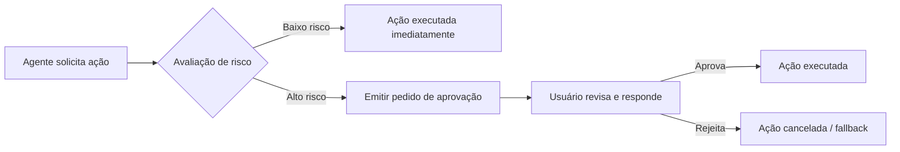

# Resumo Executivo

Sistemas baseados em agentes de IA (“agentic AI”) ampliam significativamente a superfície de ataque além dos modelos de linguagem. Ações automáticas (como consultas a bancos de dados, chamadas de API e escrita em memória) criam novos vetores de ameaça: injeções de prompt, usos indevidos de ferramentas, escalonamento de privilégios, comunicação insegura entre agentes, exfiltração de dados e falhas em cascata, entre outros. Esses riscos são bem documentados em frameworks de segurança emergentes (p. ex. OWASP Agentic Top 10). Este relatório analisa as principais ameaças categorizadas por vetor, impacto e probabilidade; detalha ataques típicos (prompt injection, tool injection, vazamento de credenciais, exfiltração, chamadas maliciosas); e propõe controles robustos (permissões restritas, sandboxing, credenciais com escopo, menor privilégio, delegação e revogação). Discute-se como auditar e monitorar plataformas multicompontes (MCP) de agentes: que logs coletar (ex. JSON estruturado com carimbo e contexto), como garantir integridade e revisão periódica. Explora-se a detecção de comportamentos anômalos por meio de bases de comportamento e correlação de cadeias de ação. Em “fluxos de aprovação”, descrevemos um modelo prático (Mermaid) para aprovação humana em ações de alto risco, incluindo exemplos de prompts permitidos/bloqueados e mensagens de confirmação. Propomos políticas mínimas antes de autorizar agentes: tratamento de todo dado externo como não confiável, RBAC dinâmico e zero trust, e monitoramento contínuo. Apresentamos uma matriz de risco (tabela) com ameaças, probabilidades e mitigação, além de recomendações arquiteturais (segmentação de rede, limites de confiança, gestão de credenciais, componentes isolados, monitoramento em tempo real). Por fim, sugerimos métricas/KPIs de segurança (por ex. taxas de detecção, tempo de resposta a incidentes). As recomendações consideram trade-offs de UX vs. segurança (p. ex. gates de aprovação somente em operações críticas) e estimativas de esforço (baixa/média/alta). As fontes incluem OWASP, NIST e publicações especializadas. 

## 1. Modelo de Ameaças {#threat-model}

Em sistemas baseados em agentes de IA, o modelo de ameaças deve considerar múltiplas camadas de interação: entrada do usuário, lógica de planejamento do agente, chamadas a ferramentas externas, armazenamento de contexto/memória e comunicação inter-agentes (veja diagrama abaixo). As principais categorias de ameaça incluem:

- **Injeção de Prompt (Goal Hijacking):** comandos maliciosos incluídos em prompts ou em dados recuperados (p. ex. e-mails, documentos) que alteram o objetivo do agente. Esse vetor pode causar vazamento de dados internos ou ações não autorizadas.  
- **Uso Indevido de Ferramentas (Tool Misuse):** o agente chama uma ferramenta legítima de forma inesperada (com parâmetros prejudiciais ou em sequência atípica), levando a modificações indesejadas no sistema. Por exemplo, um agente de análise de dados que normalmente lê de `tickets` pode ser induzido a ler e exportar uma tabela sensível (`customer_pii`) e, em seguida, enviar esses dados a um servidor externo.  
- **Escalonamento de Privilégio / Vazamento de Credenciais:** agentes podem herdar credenciais de usuário ou de sistema. Se essas credenciais forem excessivamente amplas ou persistirem por muito tempo, um invasor obtém acesso elevado (token de serviço em Kubernetes, credenciais IAM em cloud). Por exemplo, tokens montados em contêiner podem ser abusados para enumerar segredos ou consultar metadados da instância (IMDS).  
- **Exfiltração de Dados:** agentes têm acesso a dados sensíveis (contratos, logs, PII) e podem inadvertidamente ou maliciosamente expô-los via saídas, ferramentas ou APIs externas. Mesmo ações aparentemente inocentes podem vazar contexto confidencial se combinadas em sequência inadequada.  
- **Envenenamento de Memória:** dados maliciosos inseridos em sistemas de memória de longo prazo (vetores de embedding, bases RAG) persistem além de uma sessão. Isso pode condicionar o agente a comportamentos futuros indesejados.  
- **Comunicação Insegura (entre agentes):** em sistemas multiagentes, agentes trocam mensagens por MCP, RPC ou memória compartilhada. Falta de autenticação/validação nas mensagens pode permitir falsificação ou injeção de instruções entre agentes.  
- **Falhas em Cascata:** um erro em um agente (por exemplo, um plano malicioso ou dado corrompido) pode se propagar e causar impactos em outros agentes/sistemas{" "}.  
- **Agentes Maliciosos:** agentes comprometidos ou não confiáveis que agem intencionalmente de forma perniciosa, mas aparentam ser legítimos. Exemplo: um agente de aprovação que silenciosamente executa ações inseguras.  

```mermaid
flowchart LR
    subgraph Fatores de Ameaça
        U[Usuário / Data Externa]
        Web[Conteúdo Web / Documentos]
    end
    subgraph Plataforma
        Agent[Agente de IA]
        Tools[Contêiner de Ferramentas/Sandbox]
        Memory[Bancos de Memória Persistente]
        Other[Outros Agentes]
        Approval[Gate de Aprovação]
        Logs[Repositório de Logs]
    end
    subgraph Sistemas_Externos
        DB[Bases de Dados / APIs Externas]
        API[APIs/Serviços Externos]
    end
    U -->|Prompt de usuário| Agent
    Web -->|Dados recuperados| Agent
    Agent -->|Chama (request)| Tools
    Tools -->|Acessa/Modifica| DB
    Agent -->|Escreve/Lê| Memory
    Agent -->|Comunica| Other
    Agent -->|Solicita Aprovação| Approval
    Agent -->|Grava eventos| Logs
    Agent -->|Chama| API
    Other -->|Chama| API
```

*Figura 1: Modelo de ameaças básico para plataforma agentic. Setas indicam fluxos de dados/ações. Vetores de ataque incluem injeção via **Usuário/Data Externa** para o agente (Prompt Injection), uso inesperado de **Ferramentas** (tool misuse), leitura/gravação maliciosa em **DB/APIs** (exfiltração ou modificação), **Memória** persistente (memory poisoning) e **Comunicação** entre agentes sem validação. Cada passo exige controles como validação de entrada, permissões, isolamento e logs.*

## 2. Matriz de Risco

A matriz abaixo lista riscos típicos em sistemas agentic, classificados por probabilidade e impacto, com mitigações sugeridas. A priorização (baixa/média/alta) é baseada na combinação de alta probabilidade e alto impacto, conforme frameworks existentes.  

| **Risco/Ameaça**                           | **Probabilidade** | **Impacto**   | **Mitigações Principais**                                                                       | **Prioridade** |
|--------------------------------------------|-------------------|--------------|------------------------------------------------------------------------------------------------|----------------|
| **Prompt Injection (Sequestro de Objetivo)**  | Alta             | Alta         | Sanitizar e validar todos os inputs de usuários e dados externos; separar instruções de dados; usar filtros de conteúdo (detecção de padrões maliciosos); exigir aprovação humana para ações críticas. | Alta           |
| **Uso Indevido de Ferramentas**             | Média-Alta        | Alta         | Restringir catálogo de ferramentas por tarefa (whitelist); implementar políticas de permissão por ferramenta (e.g. somente leitura versus escrita); executar ferramentas em sandbox; validar parâmetros antes do uso. | Alta           |
| **Exfiltração de Dados/Sensíveis**          | Média             | Alta         | Controlar rigorosamente acessos a dados sensíveis; criptografar dados em trânsito e em repouso; monitorar volume e destinos de saída; usar detecção de anomalias em fluxos de dados. | Alta           |
| **Escalonamento de Privilégio / Vazamento de Credenciais** | Média             | Alta         | Aplicar princípio do menor privilégio com RBAC; credenciais de curta duração e escopo limitado à tarefa; revogar/rotacionar chaves regularmente; bloquear serviços de metadados desnecessários. | Alta           |
| **Envenenamento de Memória/Contexto**       | Baixa-Média       | Médio-Alto   | Segmentar camadas de memória por tipo e confiança; validar e sanitizar dados antes de persistir; usar TTL e expiração de entries suspeitas; auditar conteúdo de memória. | Média          |
| **Comunicação Insegura Entre Agentes**      | Baixa             | Médio-Alto   | Autenticar e criptografar toda comunicação inter-agentes; validar esquemas de mensagens; implementar proteções anti-replay e assinatura de payload. | Média          |
| **Falhas em Cascata (Cascading Failure)**   | Baixa             | Alto         | Isolar agentes e tarefas críticas (limites de quota); usar rate limits e *circuit breakers*; testar planos multi-agentes em ambiente controlado antes do deploy; ter kill switch para agentes individuais. | Média          |
| **Agentes Maliciosos/Comprometidos**       | Baixa             | Alto         | Checagem de integridade e assinaturas para dependências e agentes; controle de acesso rigoroso; monitoramento de comportamento (uso de ferramentas, padrões de acesso) e resposta rápida (revogar credenciais, isolar workload). | Alta           |

*Tabela 1: Matriz de risco categorizada. Probabilidade e impacto qualitativos baseados em documentos OWASP e relatórios de segurança. A mitigação combina validações técnicas, controles de acesso e supervisão humana. Prioridade reflete riscos críticos como Prompt Injection e Tool Misuse, que afetam diretamente a integridade do fluxo de trabalho.*  

## 3. Políticas de Segurança (text e checklist)

Para controlar os riscos acima, recomenda-se instituir políticas de segurança abrangentes. Destacam-se as seguintes diretrizes, alinhadas às melhores práticas (princípio *least privilege*, zero-trust) e frameworks relevantes (NIST AI RMF, OWASP):

- **Princípio do Menor Privilégio:** cada agente deve receber apenas as permissões necessárias para sua tarefa atual. Use **RBAC dinâmico** e credenciais efêmeras (tokens de curta duração). Por exemplo, em Kubernetes, atribua *ServiceAccounts* com permissões estritamente namespace-limited. Revise e revoque privilégios periodicamente.  
- **Escopo de Credenciais:** implemente *scoped credentials* para cada ferramenta/serviço (o token do agente não deve ser reutilizável fora de contexto). Renove automaticamente as chaves e tokens; bloqueie o acesso a metadados de instância (IMDS) para evitar elevação indesejada.  
- **Controle de Acesso a Ferramentas:** não exponha a lista completa de ferramentas ao agente — limite-a àquelas necessárias por tarefa. Cada chamada de ferramenta deve passar por verificação explícita (middleware de autorização) que confirme que o agente tem permissão para executar aquela função com aqueles parâmetros. Ferramentas perigosas (e.g. executar código, deletar dados) só podem ser usadas após contexto de segurança validado.  
- **Sandboxing e Isolamento:** execute códigos e transformações de documentos em contêineres ou ambientes isolados. Use mecanismos como *seccomp*, *AppArmor* ou VMs dedicadas para restringir sistema de chamadas. Não permita que um agente cometa *escape* do sandbox.  
- **Validação de Entradas (Input Sanitization):** trate toda linguagem natural recebida como *não confiável*. Antes de incluir conteúdo recuperado (RAG, emails, web, outros agentes) no contexto do agente, remova ou neutralize instruções escondidas. Separe claramente instruções de usuário de instruções de sistema, usando delimitadores e formatos estruturados. Aplique filtros semânticos (AI-based ou regex) para detectar tentativas de injeção.  
- **Validação de Contexto/Memória:** antes de escrever em memória persistente, saneie o conteúdo. Implemente limites de tamanho e TTL (tempo de vida) para entradas de memória. Use somas de verificação (checksums) ou encriptação nas entradas mais sensíveis. Mantenha memória de usuário/ sessão isolada. Proíba armazenar automaticamente contexto sensível só porque apareceu na interação.  
- **Logs Imutáveis e Auditoria:** registre em log todas as ações críticas do agente: comandos de ferramentas, parâmetros, credenciais usadas e recursos acessados. Os logs devem ser armazenados de forma imutável (append-only), protegidos (controle de acesso ao repositório) e com retenção mínima (p. ex. ≥ 90 dias, conforme SOC2/NIST). Realize revisões periódicas dos logs de segurança, preferencialmente automatizadas.  
- **Delegação e Revogação:** defina processos para delegação de ações quando aplicável (p. ex. workflow de aprovação). Tenha mecanismos claros para revogar autorizações: se um agente se comportar suspeitamente, encerre sua sessão e inutilize suas credenciais (kill switch). Use logs de auditoria como fonte de evidência para revogações e resposta a incidentes.  
- **Monitoramento Contínuo:** além de logs, monitore em tempo real padrões de uso (ver seção de detecção). Configure alertas para desvios comportamentais e padronizados (e.g. bursts de requisições). Mantenha uma **equipe ou sistema de SOC** responsável por analisar indicadores de risco específicos de agentes (baseado em MITRE ATLAS/OWASP).  

**Checklist de Políticas:**  

- [ ] Definir papéis e responsabilidades claras (quem gerencia agentes, quem aprova ações).  
- [ ] Aplicar RBAC e least-privilege para todos os componentes (agentes, ferramentas, memória).  
- [ ] Utilizar autenticação forte e tokens com escopo restrito (e.g. OAuth, JWT com claims de função).  
- [ ] Padronizar formato de interação: usar JSON Schema ou API definida para comunicações entre módulos (MCP), evitando interpretação livre de texto.  
- [ ] Gerenciar dependências: pin de versões em pipelines CI/CD, validação de origem de plugins e pacotes (signatures).  
- [ ] Documentar cada ferramenta exposta ao agente e revisão de parâmetros aceitáveis.  
- [ ] Impor políticas de privacidade/dados sensíveis: classificar dados e evitar exposição acidental.  

*Fontes: controles e políticas baseados em guias da OWASP e Snowflake, complementados por exemplos práticos (por exemplo, middleware de autorização de ferramentas).*  

## 4. Fluxos de Aprovação (Approval Gates)

A implementação de *approval gates* (portões de aprovação) introduz verificações humanas para ações de alto risco, equilibrando UX e segurança. Um fluxo típico é o seguinte:  

1. **Classificação de Risco:** ao planejar uma ação, o agente determina o nível de risco (p. ex. *baixo*, *médio*, *alto*, *crítico*) baseado na natureza da ação (leitura vs. escrita, externas vs. internas, irreversíveis vs. reversíveis). Ferramenta e parâmetros mapeiam para um risco predefinido.  
2. **Decisão Automática ou Pendência:** se o risco ≤ limiar pré-configurado (por ex. baixo), a ação é auto-aprovada e executa-se sem intervenção. Se o risco for maior, a ação fica *pendente de aprovação*. Nesse momento, a plataforma deve pausar o fluxo do agente e notificar um usuário ou administrador.  
3. **Notificação ao Usuário:** envia-se uma mensagem clara exibindo a ação proposta e o nível de risco. Exemplo de prompt:  
   - *“O agente propõe **‘Excluir todos os registros de clientes’** (Ação Crítica). Por favor, confirme para prosseguir.”*  
   O prompt deve detalhar recursos-alvo, parâmetros normalizados e prazo de expiração (ex: “Essa solicitação expirará em 15 minutos se não for respondida”).  
4. **Resposta do Usuário:** o usuário **aprova** (p. ex. respondendo “SIM” ou clicando em “Aprovar”) ou **rejeita** (“NÃO” ou “Cancelar”). Se aprovado, a ação é enviada de volta ao pipeline do agente com **autorização vinculada**. Caso contrário, o agente interrompe o fluxo ou executa um caminho alternativo de fallback.  
5. **Registro da Aprovação:** cada aprovação deve ser registrada com metadados (quem aprovou, quando, qual era a ação exata, parâmetros, cadeia de decisão) para auditoria futura. A aprovação deve ser vinculada irrevogavelmente ao ato (token de aprovação atrelado ao ID da ação).  

A seguir, um diagrama simplificado de aprovação de ação em alto risco:



*Figura 2: Fluxo de aprovação humana para ações críticas. O agente classifica o risco; ações altas geram uma solicitação de confirmação que o usuário deve responder. Em caso negativo, executa-se uma alternativa ou cancela-se a operação.*  

**Exemplos de prompts permitidos/bloqueados:**  

- **Permitido (baixo risco):** “Agente: *Listar arquivos no diretório atual.*” – operação de leitura de baixo impacto, auto-aprovada.  
- **Pendente (alto risco):** “Agente: *Excluir o arquivo `/dados/faturamento_2023.csv` do sistema.*” – ação destrutiva e irreversível, deve solicitar confirmação.  
- **Proposta de aprovação:** “**[AVISO DE SEGURANÇA]** O agente solicita permissão para **excluir** o arquivo `/dados/faturamento_2023.csv` (risk level: CRÍTICO). *Por favor, digite “SIM” para confirmar ou “NÃO” para cancelar.*”  

Ferramentas sensíveis (e.g. `database_delete`, `transfer_funds`) podem ser pré-categorizadas como alto risco, forçando sempre aprovação. Além disso, recomenda-se implementar um middleware de autorização de ferramentas (como ilustrado abaixo) que intercepta chamadas e gera mensagens de aprovação automáticas conforme a tabela de risco.  

```python
# Pseudocódigo ilustrativo de controle de aprovação
if tool_name in ['database_delete', 'transfer_funds']:
    req = {
        "tool": tool_name,
        "params": params,
        "risk": "CRITICAL",
        "message": f"Agente solicita {tool_name} em {params}. Confirma?"
    }
    # Envie req para o usuário; pause execução até resposta
```

A implementação prática exige gerenciamento de estados pendentes (por exemplo, identificadores de ação) e timeouts. Se nenhum usuário aprovar dentro do prazo, a ação deve ser automaticamente cancelada (fail-safe).  

## 5. Padrões de Log e Auditoria

A coleta de logs é essencial para rastrear atividades de agentes e permitir forense. Recomenda-se:

- **Campos Obrigatórios:** cada evento de agente deve ser registrado em formato estruturado (JSON). Campos típicos incluem: `timestamp` (ISO8601 UTC), `agent_id`, `user_id` (ou sistema que acionou o agente), `session_id`, `tool_name`, `action` (nome da operação), `parameters` (argumentos normalizados), `result` ou `status` (`success`/`error`), `duration_ms`, `request_id` (para correlacionar com sistemas externos). Por exemplo: 

```json
{
  "timestamp": "2026-06-04T12:00:00Z",
  "agent_id": "agent-123",
  "session_id": "sess-456",
  "user_id": "user.julia",
  "tool_name": "file_manager",
  "action": "delete_file",
  "parameters": { "path": "/dados/faturamento.csv" },
  "status": "success",
  "duration_ms": 85
}
```

Este modelo se baseia em guias de auditoria de agentes (cada entrada captura fonte do agente, grant usado, ID de requisição e resultado). Dados sensíveis (ex. chaves, conteúdo de arquivos) devem ser omitidos ou redigidos automaticamente.

- **Retenção e Integridade:** conforme NIST e SOC2, mantenha logs por pelo menos 90 dias, ou mais conforme regulamentação aplicável. Armazene logs em sistema WORM (write-once) ou S3 com versão imutável. Proteja logs contra alterações: somente sistemas de auditoria autorizados devem gravar. Considere assinaturas digitais (HMAC) em lotes de logs para detectar adulteração.

- **Monitoramento de Logs:** configure monitoramento contínuo sobre o repositório de logs. Ferramentas SIEM podem ingerir esses registros para correlação. Automatize alertas em casos críticos (ex. sequência de comandos não usual, falha repetida). Revise logs em periodicidade definida (p. ex. semanal/mensal) e após incidentes. Em investigações, siga a trilha completa: **entradas de comando do agente → parâmetros usados → ferramenta invocada → resultados**.  
- **Proteção de Logs:** segmente o acesso aos logs (apenas equipe de segurança terá permissão de leitura/auditoria). Crie cópias redundantes e verifique regularmente a integridade (checksums).  

## 6. Detecção de Ações Suspeitas

Sistemas de detecção devem identificar desvios comportamentais ou padrões maliciosos, usando técnicas combinadas: estatísticas, ML ou regras. As abordagens principais incluem:

- **Baseline Comportamental:** treine perfis de uso “normal” para cada agente (ferramentas usadas, sequência típica e taxa de uso). Em tempo de execução, sinalize desvios estatísticos (score de anomalia). Por exemplo: se historicamente um agente faz 10–15 consultas DB por minuto, um pico de 500 consultas em 30s é anômalo. Pseudocódigo ilustrativo:
  ```
  if event.rate(tool='db_query', window=60s) > baseline_rate * 5:
      alert("Possível exfiltração de dados")
  ```
  Modelos de ML (Isolation Forest, LSTM, K-means) podem identificar padrões incomuns de múltiplas dimensões.

- **Correlação de Cadeias de Ação (Intent Drift):** detecta quando sequências aparentemente normais produzem um novo objetivo malicioso. Exemplo: acessar uma tabela inédita **E** enviar POST para URL externa. Embora cada ação isolada possa estar dentro do esperado, a combinação indica desvio de intenção. Sistemas de correlação cruzam logs de processo, rede e aplicação para montar “histórias de ataque” completas.  

- **Detecção Baseada em Regras:** implemente regras específicas para ameaças conhecidas. Exemplo: disparo de alerta se ferramenta `file_delete` for chamada sem verificação de autorização, ou se sequências conhecidas de comandos forem detectadas (como `db_query("*")` seguido de `http_post(¨attacker.com¨)`).  

- **Detecção por Assinatura:** embora rara em workflows dinâmicos, pode-se bloquear URLs ou domínios maliciosos conhecidos, ou padrões de shell/SQL. Entretanto, agentes sofisticados geralmente contornam assinaturas simples.  

- **Métricas e Sinais de Alerta:** além de anomalias de taxa e sequência, observe sinais como:
  - *Tentativas falhas repetidas:* várias invocações negadas (e.g. devida a controle de permissão).
  - *Mudança súbita de contexto:* agente acessando recursos nunca consultados antes.
  - *Comportamento pós-implante:* agente que age divergindo dos históricos anteriores (pode indicar memory poisoning ou logon de conta comprometida).
  
Registre essas regras e mantenha-as em repositório versionado (por ex., *SIEM rules*). As ações suspeitas devem gerar alertas imediatos à equipe de segurança. O código abaixo ilustra uma regra simples:

```python
# Exemplo de pseudocódigo de detecção
if tool_call.sequence == ['db_query(secret_table)', 'http_post(external_url)']:
    raise Alert("Sequência de exfiltração detectada")
if tool_call.count('db_query') > 100 in 60s:
    raise Alert("Volume de consultas DB anômalo")
```

*Fontes: ARMO destaca detecção baseada em baseline para sequência e volume, e a necessidade de correlação de eventos para capturar intent drift.*  

## 7. Aplicação Prática no CKOS (Plataforma Interna)

Assume-se que **CKOS** é uma plataforma interna de agentes IA em ambiente corporativo (on-premises ou nuvem corporativa), de porte médio a grande. As estratégias a seguir são sugeridas para integrar controles sem degradar excessivamente a experiência do usuário:

- **Controle Granular por Workflow:** associe cada agente ou fluxo de trabalho a um contexto de segurança. Por exemplo, um agente de triagem de chamadas de suporte só vê ferramentas relacionadas a tickets, enquanto outro de gestão financeira só vê interfaces bancárias. Isso facilita aplicar *least privilege* sem afetar outras funções.  
- **Approval Gates Contextualizados:** configure *gates* nos momentos críticos do fluxo do agente. Por exemplo, somente após gerar um plano completo de alta influência (financeiro, infraestrutura) o agente deve pausar e solicitar aprovação, não em cada passo trivial. Utilize **fallbacks**: se a aprovação não for obtida, redirecione para uma rotina segura ou informe ao usuário final sobre o bloqueio.  
- **Estratégia de Escalonamento:** para manter UX suave, implemente níveis de autonomia. Ações de leitura simples são automatizadas; operações de gravação moderadas podem exigir revisão leve; ações críticas exigem aprovação completa. Ajuste esses limiares de acordo com o impacto – permitindo agilidade quando apropriado.  
- **Monitoramento Proativo:** considere incluir módulos de monitoramento que avaliem continuamente a “saúde” da sessão do agente. Se detectar que o agente está em comportamento de aprendizado (e.g. novo modelo implantado), então eleva-se sensibilidade de alerta (ver seção de detecção).  
- **Componentes de Fallback:** ao invés de permitir que o agente simplesmente aborta, defina fluxos alternativos automáticos. Exemplo: se um pedido de exclusão for negado, o agente pode sugerir um relatório para revisão manual. Isso evita paralisação total do processo.  
- **Mensagens de Aprovação Customizadas:** padronize templates de solicitação de aprovação. Por exemplo: “**[Confirmação Necessária]** O Agente propôs executar **{{ação}}** em **{{recurso}}**. **Risco:** {{nível}}. *Digite “CONFIRMAR” para autorizar ou “CANCELAR” para rejeitar.*” Use linguagem clara evitando termos vagos.  

Estas abordagens conciliam segurança e usabilidade. Em todos os casos, é crucial treinar usuários sobre o significado dos prompts de aprovação e os riscos associados, de forma que saibam interpretar corretamente uma solicitação de confirmação.  

## 8. Políticas Mínimas Antes de Liberar Agentes

Antes de permitir que agentes atuem livremente, implemente pelo menos as seguintes políticas-base:

- **Avaliação de Risco Ex-ante:** classifique cada agente e caso de uso (e.g. pela criticidade do domínio). Ações de um agente de infraestrutura crítica devem exigir mais controles que um assistente de help desk.  
- **Registro de Configurações (Policy Registry):** mantenha um repositório versionado das regras de segurança, mapas de permissões e definições de agentes (como o “MDM dos agentes”).  
- **Testes de Segurança:** inclua fase de validação/adversarial (pentest/Red Team) para agentes antes da liberação em produção. Simule injeções e uso indevido de ferramentas.  
- **Governança e Conformidade:** especifique quem revisa riscos (segurança, jurídico) e estabeleça SLAs para resposta a incidentes de agentes. Use frameworks como NIST AI RMF para guiar a documentação de controles.

## 9. Recomendações Arquiteturais

Para uma plataforma MCP de agentes (por ex. CKOS), sugerimos uma arquitetura de segurança em camadas:

- **Segmentação de Rede:** isole agentes em sua própria zona de rede (ex. VPC ou namespace dedicado). Use *network policies* (Kubernetes) ou firewalls para restringir egress: somente destinos explicitamente permitidos (APIs internas necessárias) e portas essenciais podem ser acessados. Bloqueie tráfego de saída a destinos desconhecidos (minimizando canais de exfiltração). No caso de agentes em nuvem pública, configure VPC Service Controls e desabilite acesso irrestrito a Metadados da instância.  
- **Múltiplos Boundaries de Confiança:** defina limites claros entre módulos do sistema. Por exemplo, separe fisicamente (ou logicamente) o motor de agentes (LLM + orquestração) dos repositórios de dados sensíveis. Banco de memória persistente deve residir em subsistema criptografado separado do contêiner do agente. Cada interface (API REST, banco de dados, cache) expõe apenas endpoints estritamente necessários.  
- **Gerenciamento de Credenciais:** use sistemas de secrets management (HashiCorp Vault, AWS KMS) para distribuir credenciais de forma segura. Nunca codifique tokens em texto ou providencie-os diretamente ao modelo. Em vez disso, agentes devem solicitar credenciais através de APIs seguras no momento da execução (credenciais dinâmicas). Utilize credenciais *scoped* (por sessão) sempre que possível.  
- **Monitoramento e Observabilidade:** invista em logging detalhado e monitoramento no nível do kernel/contêiner (e.g. eBPF, auditd) para rastrear chamadas de sistema, spawn de processos e leituras de arquivos de credenciais. Ferramentas de APM (Application Performance Monitoring) e SIEM devem correlacionar logs de aplicação (ferramentas executadas), de infraestrutura (Kubernetes, cloud trail) e de rede para visão completa. Mantenha dashboards de métricas de atividade de agentes (por ex. número de consultas executadas, tempo médio de execução de ferramentas).  
- **Zonas de Confiança (Trust Zones):** se agentes multi-tenant forem usados, segmente agentes críticos (que lidam com dados sensíveis) de agentes menos críticos em diferentes *trust zones*. Isso impede que comprometimento de um agente de baixa confiança contamine agentes de alta confiança. Use mecanismos de firewall interno para controlar a comunicação entre zonas.  
- **Componentes Independentes:** sempre que possível, execute o núcleo de agente (modelo + orquestrador) separado da execução de tarefas arriscadas. Por exemplo, um serviço dedicado para “executar comandos” em ambiente isolado. Isso limita o blast radius se o orquestrador for comprometido.  
- **Infraestrutura Imutável:** trate o ambiente de agentes como imutável. Use pipelines CI/CD seguros: verifique containers e códigos de agente (SAST/DAST) antes do deploy. Se agentes rodam em Kubernetes, aplique CIS Benchmarks para RBAC e segurança de pod.  

*Referências: guias de arquitetura de segurança de IA (Snowflake e ARMO) enfatizam zero-trust e controle em múltiplas camadas. A ideia central é “não confiar em nada, verificar tudo” a cada passo de operação.*  

## 10. Exemplos e Pseudocódigo

- **Regras de Detecção (pseudocódigo):**  

  ```python
  # Exemplo de regra de anomalia de sequência
  chain = [step.tool for step in session.invocations]
  if chain.endswith(['db_query', 'http_post']) and dest == 'atacante.com':
      alert("Exfiltração detectada", session_id=session.id)

  # Exemplo de regra de limite (rate-based)
  for tool in tools:
      rate = session.count_calls(tool, window='1m')
      if rate > baseline[agent.id][tool] * 3:
          alert("Uso excessivo de ferramenta", agent_id=agent.id, tool=tool)
  ```
  
- **Exemplo de Política de Least Privilege (JSON):**  

  ```json
  {
    "agent_role": "analyst",
    "tools": {
      "read_database": {
        "allowed_queries": ["SELECT * FROM tickets WHERE status='open'"],
        "allowed_table": "tickets"
      },
      "file_writer": {
        "allowed_paths": ["/output/reports/"],
        "operations": ["create", "append"]
      }
    }
  }
  ```

- **Template de Log (JSON):** Como mostrado na seção de logs, cada campo deve ser autoexplicativo. O exemplo do Nylas CLI é ilustrativo.  

- **Mensagem de Aprovação (template):**  
  > **[Confirmação Necessária]** Agente propõe ação **“{{ação}}”** no recurso **“{{recurso}}”**.  
  > *Risco:* {{nível}}. Responda **“CONFIRMAR”** para aprovar ou **“CANCELAR”** para rejeitar.  

- **Métricas e KPIs de Segurança:** Sugere-se acompanhar métricas como:  
  - *Taxa de detecção de anomalias*: % de eventos suspeitos corretamente sinalizados (vs. falsos positivos).  
  - *Tempo médio de resposta a incidentes (MTTR)*: tempo desde alerta até contenção.  
  - *% de ações bloqueadas*: proporção de comandos de agente que precisaram de intervenção humana.  
  - *Número de execuções abortadas*: quantos fluxos de agente foram interrompidos por controle de segurança.  
  - *Cobertura de log*: % de ações de agentes que geram registros completos.  
  - *Frequência de revisão*: número de auditorias de log realizadas no período.  

Esses indicadores auxiliam a medir eficácia do programa de segurança (ex. se muitos falsos positivos ocorrem, pode-se ajustar limiares) e a demonstrar compliance.

## Conclusão

A segurança em plataformas multicomponente de agentes de IA exige abordagens integradas de arquitetura, controle e monitoramento. As medidas acima – baseadas em guias de segurança de IA (OWASP GenAI, NIST, MITRE ATLAS) e exemplos práticos – visam construir confiança no comportamento dos agentes, sem inviabilizar sua usabilidade. É fundamental tratar o agente como um sistema distribuído: cada passo do loop (planejamento, acesso a dados, execução de ferramenta, escrita em memória e comunicação) deve ser mediado por controles de acesso, validação e auditoria. Em resumo, priorize **resiliência** (salvaguardar ações de alto impacto) e **visibilidade** (logs completos e monitoramento contínuo) no design do CKOS. 

**Fontes:** OWASP GenAI (LLM Top 10 e Agentic Top 10); guia de segurança a nível de sistema (Snowflake); estudos de detecção (ARMO); NIST AI RMF e Nylas CLI (audit logs). Ajustes aplicados conforme o contexto brasileiro e guidelines internas.