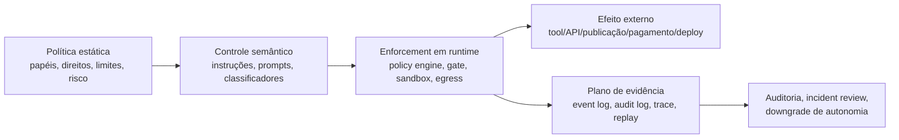
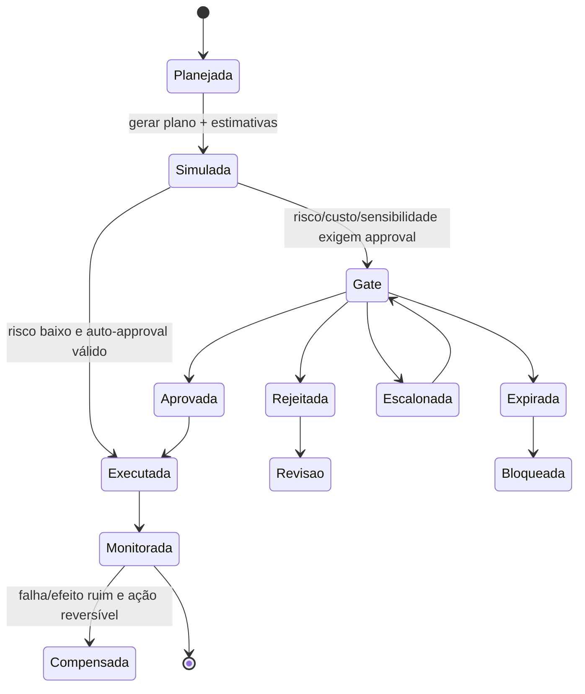

# Governança de runtime em sistemas de IA agêntica

## Resumo executivo

Governança de *runtime* em sistemas agênticos não é sinônimo de “segurança no prompt”. Em termos operacionais, ela é a camada que controla **o que um agente pode fazer, em que contexto, com quais ferramentas, sob quais condições de aprovação, com que evidência, e como a execução pode ser interrompida, revertida, auditada e atribuída**. A literatura e os documentos normativos mais sólidos convergem para uma arquitetura em camadas: **política estática** para definir papéis, direitos, limites e deveres; **guardrails semânticos/prompt-based** para orientar comportamento; e **enforcement em runtime** para impedir ações, impor gates, registrar evidência e conter falhas. O NIST AI RMF 1.0 estrutura isso em GOVERN, MAP, MEASURE e MANAGE; o perfil de GenAI do NIST adiciona quatro focos particularmente relevantes para agentes — **governança, proveniência de conteúdo, testes pré-implantação e divulgação de incidentes**; e o AI Act europeu exige *logging*, supervisão humana, robustez/cibersegurança e monitoramento pós-mercado para sistemas de maior risco. citeturn36view0turn5view0turn9view1turn9view0turn9view3turn9view4

A conclusão central deste relatório é direta: **prompts jamais devem ser a autoridade final sobre ações críticas**. Guardrails semânticos são úteis para classificação, explicação, recusa contextual e preparação de solicitações de aprovação, mas são probabilísticos e expostos a *prompt injection*, *system prompt leakage* e “excessive agency”. A camada decisiva precisa estar no runtime, em pontos de enforcement independentes do LLM: `policy_engine`, roteadores de ferramentas, *approval gates*, *sandboxes*, controles de egresso, limites de custo, *kill switch*, registros imutáveis e telemetria rastreável. Essa separação é consistente com OPA — que desacopla decisão de política de enforcement — e com OWASP, que trata *prompt injection* e *excessive agency* como riscos centrais de aplicações com LLMs. citeturn23view0turn27view0turn27view1turn26academia2

Para ações críticas, a prática recomendada é um fluxo de **duas fases**: primeiro, a ação é **planejada/simulada**; depois, um gate decide se ela pode ser **executada**; só então o sistema emite a chamada externa real. Isso reduz o risco de “approval theater” e alinha-se às exigências de supervisão humana efetiva, proporcional ao risco e ao nível de autonomia. Em contextos críticos, deve haver também capacidade explícita de **override, interrupção segura, reversão/compensação e quarentena**. O AI Act europeu exige que a supervisão humana permita compreender limitações, detectar anomalias, ignorar/reverter saídas e interromper o sistema em estado seguro; o NIST AI RMF e o perfil de GenAI reforçam revisão contínua, testes e monitoramento operacional. citeturn9view0turn9view3turn36view0turn5view0

No CKOS F1 Runtime, a boa notícia é que a base arquitetural já existe: os documentos fornecidos já descrevem **runtime event-sourced com CQRS**, *event log* append-only, `correlation_id`/`causation_id`, `ApprovalRequested/Granted/Denied`, `waiting_approval`, *tool router* deny-by-default, *Decision Rights Matrix*, *audit_logs*, *run replay*, *sandbox/simulation mode*, *cost guard* e *security observability* com severidades e SLAs. Em outras palavras: o CKOS já possui os blocos fundamentais de um runtime governável. O principal gap não é conceitual, mas de **consolidação normativa e endurecimento técnico**: falta unificar um **bundle mínimo de ação-evidência**, tornar explícito o protocolo de **efeito externo em duas fases**, adicionar **atestações criptográficas e recibos tamper-evident**, definir **política formal de egresso de rede**, e consolidar em Doc 10 / Doc 04 / Doc 13 os **invariantes não-bypassáveis** da governança. fileciteturn0file4 fileciteturn0file3 fileciteturn0file5 fileciteturn0file6 fileciteturn0file7

## Modelo analítico de governança em runtime

A arquitetura mais robusta para controle de agentes é **híbrida**: políticas e direitos são definidos centralmente, mas o enforcement ocorre em múltiplos pontos distribuídos no caminho da execução. Isso evita dois extremos ruins: de um lado, centralização excessiva com gargalo e ponto único de falha; de outro, agentes “autônomos” demais, sem autoridade verificável acima deles. OPA formaliza a ideia de separar decisão de política e enforcement; W3C Trace Context e OpenTelemetry formalizam correlação entre serviços; RATS formaliza papéis de evidência, *endorsement*, valores de referência e políticas de avaliação; e SCITT avança um padrão de transparência verificável e recibos de registro, útil para trilhas de evidência imutáveis. Em arquitetura agêntica, a implicação prática é: **políticas podem ser distribuídas em caches locais, mas nunca podem ser inventadas localmente**; e **cada hop de execução precisa carregar identidade, contexto causal e prova verificável do que foi autorizado**. citeturn23view0turn11view0turn12view0turn16view0turn22view1turn22view2

A consequência mais importante desse modelo é que **a autoridade final deve estar “fora” do modelo**. O modelo pode recomendar, resumir, classificar risco, explicar e preencher formulários de aprovação; o runtime decide se a ação sai do plano para o mundo. Isso é especialmente importante porque o OWASP identifica *prompt injection*, *improper output handling* e *excessive agency* como riscos de topo em aplicações com LLM, e porque estudos recentes mostram que defesas apenas semânticas contra *prompt injection* ainda apresentam fragilidade relevante sob avaliação mais rigorosa. citeturn27view0turn27view1turn26academia2

### Framework de governança

| Componente | Responsabilidade principal | Ponto de enforcement | Produto de evidência |
|---|---|---|---|
| **Autoridade de política** | Publicar regras versionadas de permissão, risco, custo, retenção e decisão | Antes da execução; mudanças de política | versão de política, autor, aprovação, assinatura citeturn23view0turn36view0turn30view0 |
| **Plano de controle de runtime** | Aplicar `authz`, *risk scoring*, *gates*, roteamento e *fail-safe* | `ingress`, `policy_engine`, *routers*, `approval_gate`, `egress` | decisão de política, motivo, `trace_id`, `policy_id` citeturn23view0turn9view1turn9view0 |
| **Enforcers locais** | Recusar ações sem *lease*, fora de escopo ou sem identidade válida | worker, conector, ferramenta, proxy de rede | recibo de recusa/execução, assinatura de serviço citeturn16view0turn22view1 |
| **HITL e aprovação** | Aprovar, rejeitar, alterar, expirar, escalonar e revogar ações | antes de efeitos externos relevantes | `approval_id`, justificativa, aprovador, carimbo temporal citeturn9view0turn9view3 |
| **Observabilidade e auditoria** | Coletar traces, logs, métricas, alertas, *replay* e post-mortem | contínuo | trilha causal completa e telemetria correlacionada citeturn11view0turn12view0turn36view0 |
| **Serviço de confiança** | Validar identidade de workload, atestação e integridade do ambiente | antes de runs sensíveis e periodicamente | atestado, evidência, *endorsement*, resultado de avaliação citeturn16view0turn22view1 |
| **Resposta a incidentes** | *kill switch*, quarentena, *autonomy downgrade*, correção e revisão | upon detection | incidente, replay, ação compensatória, revisão humana citeturn9view4turn5view0 |

### Política estática, segurança por prompt e enforcement em runtime

| Camada | Definição | Fortalezas | Fragilidades e superfícies de ataque | Latência e escala | Uso recomendado |
|---|---|---|---|---|---|
| **Política estática** | Regras organizacionais e técnicas fora do loop do LLM: papéis, direitos, risco, retenção, limites, segregação de deveres | Consistência, auditabilidade, alinhamento com gestão de risco e compliance | *Policy drift*, lacunas de escopo, configuração incorreta, baixa granularidade temporal | Quase sem custo por chamada; exige governança de versões | Base obrigatória para autonomia, direitos de decisão, retenção e risco citeturn36view0turn29view1turn30view0 |
| **Prompt-based safety** | Instruções, *system prompts*, classificadores e guardrails semânticos que orientam o modelo | Flexível, rápida de implementar, útil para classificação, recusa, explicação e preparação de pedidos de aprovação | Probabilística; vulnerável a *prompt injection*, *system prompt leakage* e manipulação contextual; não deve autorizar efeitos externos sozinha | Adiciona custo/token e latência inferencial; escala com o custo do modelo | Boa para camada semântica; inadequada como autoridade final citeturn27view0turn27view1turn26academia2 |
| **Enforcement em runtime** | Política executável fora do LLM: *policy engine*, *approval gates*, *tool router*, *sandbox*, *egress control*, *budget guard*, logs | Determinístico, auditável, compatível com least privilege, side-effects control e resposta a incidentes | Complexidade maior; risco de gargalo se a arquitetura for só centralizada; requer desenho de alta disponibilidade | Mais custo de engenharia; latência adicional controlável com arquitetura híbrida e caches | Obrigatório para ações críticas, acesso a dados, ferramentas, rede, custos e aprovação citeturn23view0turn9view1turn9view0turn11view0 |

O padrão que melhor equilibra segurança e escala é **centralização da autoridade + descentralização do enforcement**. Em outras palavras: a política nasce em um plano central, mas é aplicada localmente em vários pontos — `ingress`, `agent router`, `model router`, `tool router`, *sandbox*, egresso e gravação de evidência. É o desenho mais aderente tanto à separação proposta por OPA quanto à necessidade de correlação distribuída padronizada por Trace Context/OpenTelemetry. citeturn23view0turn11view1turn12view0

## Gates de aprovação e intervenção humana

A regra operacional mais importante para *approval gates* é esta: **o gate deve ficar imediatamente antes do ponto em que a ação deixa de ser segura para simulação**. Em sistemas agênticos, isso normalmente significa antes de: publicação externa, envio a cliente, assinatura, pagamento, compra de mídia, mutação destrutiva de dados, escrita em sistemas terceiros, `deploy` em produção, acionamento de ferramentas pagas, acesso a dados sensíveis, ou qualquer efeito irreversível. O AI Act exige supervisão humana proporcional ao risco e ao nível de autonomia; o NIST GenAI Profile reforça governança, proveniência, testes e incident disclosure; e o OWASP explicita o perigo da “excessive agency”. citeturn9view0turn9view3turn5view0turn27view1

### Tipos de gate e uso recomendado

| Tipo de gate | Quando usar | Quem decide | O que o pacote de aprovação deve conter | Padrão recomendado |
|---|---|---|---|---|
| **Manual** | Ações irreversíveis, externas, contratuais, financeiras, reputacionais, sensíveis a dados, produção | Humano com direito de decisão; em casos críticos, dois aprovadores | objetivo, ação, alvo, custo estimado, risco prévio, simulação, rollback, evidências-fontes, política aplicável, prazo de expiração | Padrão para efeitos externos relevantes citeturn9view0turn9view3 |
| **Semi-automatizado** | Risco médio, reversível, mas com incerteza, custo material ou impacto operacional | Sistema recomenda; humano confirma ou ajusta | tudo do manual, mais recomendação do sistema e leitura de confiança/incerteza | Bom equilíbrio entre escala e controle citeturn5view0turn36view0 |
| **Automatizado por limiar** | Baixo risco, reversível, baixo custo, alta cobertura de evidência, política explícita | Runtime aprova conforme regra | bundle mínimo + referência de política + resultado de avaliação | Só para interior do envelope seguro definido em política citeturn23view0turn27view1 |

A melhor prática não é “humano em toda ação”, mas **humano na borda de risco**. Excessos de aprovação geram fadiga, *rubber stamping* e atraso operacional; ausência de aprovação em ações críticas gera alucinação com efeito real, abuso de ferramentas e negação posterior de responsabilidade. O sistema deve, portanto, usar gates como instrumento de **seleção de supervisão**, não como decoração burocrática. citeturn36view0turn27view1turn25academia1

### Posicionamento, escalonamento, SLA e UX

Em desenho de gate, a ordem correta é:

1. resolver intenção e contexto;  
2. validar autorização e escopo de capacidade;  
3. estimar risco/custo/sensibilidade/reversibilidade;  
4. quando aplicável, **simular** a ação;  
5. montar o pacote de aprovação;  
6. obter decisão;  
7. só então liberar a chamada efetiva à ferramenta/sistema externo.  

Essa ordem é mais segura do que pedir aprovação “abstrata”, porque o aprovador vê **o que realmente será executado**, com custo, risco, contexto, provas e plano de compensação. Ela também evita que o agente “descubra” detalhes apenas depois da aprovação e mude o comportamento real sem nova decisão. citeturn5view0turn9view0turn23view0

Do ponto de vista de UX, o gate deve expor no mínimo: **resumo executivo da ação, impacto esperado, riscos, alternativas, consequência de não decidir, evidências clicáveis, diferença entre estado atual e estado proposto, custo estimado, reversibilidade e expiração**. Em decisões críticas, a interface deve exigir justificativa curta do aprovador e, idealmente, confirmar que ele abriu os elementos de evidência de maior peso. Isso reduz aprovações mecânicas e melhora atribuibilidade. A supervisão humana eficaz, tal como exigida pelo AI Act, não é apenas “existência de botão”; ela exige condições reais para interpretação, monitoramento, *override* e interrupção segura. citeturn9view0turn9view3

Como recomendação operacional, o CKOS deveria adotar quatro classes de SLA de aprovação: **emergencial** para contenção/bypass com revisão obrigatória em até 24h; **crítica** para ação irreversível externa; **alta** para risco médio com custo material; e **padrão** para aprovações internas reversíveis. O mais importante não é o número absoluto de minutos, mas o fato de a política definir: *quem decide*, *até quando decide*, *o que acontece se expirar*, *quem recebe o escalonamento* e *qual é a postura default de segurança*. Em governança séria, *expiry* sem regra explícita é dívida operacional. fileciteturn0file3 fileciteturn0file4 fileciteturn0file7

## Evidência, rastreabilidade e prevenção de ações não rastreáveis

A unidade correta de auditoria em runtime agêntico não é “a resposta do modelo”, mas **a ação executável**. Por isso, o sistema deve registrar um **bundle mínimo de ação-evidência** que una intenção, decisão, autorização, execução, custo, risco, input/output, identidade, contexto causal e prova de integridade. Essa ideia é coerente com PROV, que modela entidades, atividades e agentes; com Trace Context, que padroniza propagação de contexto causal; com OpenTelemetry, que organiza observabilidade por sinais e contexto; com SLSA/in-toto, que estruturam atestações verificáveis; e com RATS, que distingue evidência, *endorsements*, resultados de avaliação e políticas de apreciação. citeturn10view0turn11view0turn12view0turn19view0turn18view0turn16view0

### Bundle mínimo de ação-evidência

| Campo | Obrigatório | Finalidade |
|---|---|---|
| `action_id` | Sim | Identificador único da ação executável |
| `trace_id`, `correlation_id`, `causation_id` | Sim | Reconstrução causal e correlação distribuída citeturn11view1turn12view0 |
| `actor_type`, `actor_id`, `requested_by`, `effective_principal` | Sim | Atribuição da ação ao agente, usuário ou sistema |
| `intent_ref` ou `intent_text_hash` | Sim | Vincular ação à intenção que a originou |
| `action_type`, `target_type`, `target_id` | Sim | Descrever o que será feito e sobre qual recurso |
| `policy_ref` e `policy_version` | Sim | Mostrar qual política autorizou/bloqueou a ação |
| `decision_rights_ref` | Sim para ações críticas | Provar que o decisor tinha competência para decidir |
| `approval_ref` e `approval_status` | Sim quando houver gate | Ligar execução ao objeto de aprovação |
| `decision_rationale` | Sim | Explicar por que a ação foi aprovada, rejeitada ou autoaprovada |
| `risk_estimate_pre` e `risk_observed_post` | Sim | Comparar risco previsto com risco efetivo |
| `confidence` e `uncertainty` | Recomendado | Calibrar autonomia e revisão posterior |
| `cost_estimate_pre` e `cost_actual_post` | Sim | Controle econômico e auditoria de desvio |
| `tool_calls[]` com `tool_id`, versão, parâmetros com hash, resposta com hash | Sim se houver ferramenta | Tornar a cadeia de execução reconstituível |
| `model_router_decision` e `model_id` | Recomendado | Explicar seleção de modelo e implicações de privacidade/custo |
| `input_ref/hash` e `output_ref/hash` | Sim | Evitar armazenar tudo em claro sem perder verificabilidade |
| `simulation_ref` e `rollback_or_compensation_ref` | Sim para risco médio+ | Provar que o efeito foi ensaiado e tem contenção |
| `sandbox_id`, `network_policy_ref`, `secret_ref_class` | Recomendado/obrigatório em runs sensíveis | Demonstrar onde e sob que restrições a ação ocorreu |
| `environment_attestation_ref` | Recomendado para ações sensíveis | Provar integridade do ambiente de execução citeturn16view0 |
| `started_at`, `ended_at`, `approved_at`, `occurred_at` | Sim | Linha do tempo verificável |
| `result_state`, `error_code`, `side_effect_receipt` | Sim | Evidenciar resultado e efeitos externos |
| `service_signature` e, idealmente, `transparency_receipt` | Recomendado/obrigatório em classes críticas | Tornar adulteração detectável citeturn22view1turn22view2turn19view0 |
| `data_classification`, `redacted_fields`, `retention_class` | Sim | Privacidade, retenção e minimização |

O armazenamento ideal desse bundle é **bifurcado**: metadados e relações causais em *event log* e *audit log* append-only; objetos pesados — prompts, outputs extensos, anexos, artefatos — em *object storage* criptografado, referenciado por hash. Para detectar adulteração, o sistema deve assinar o bundle no momento da emissão e ancorar periodicamente os hashes em algum mecanismo de transparência verificável, como um log de recibos no estilo SCITT ou estrutura equivalente. SCITT é especialmente relevante porque trata de **verifiable data structures**, recibos de inclusão, políticas de registro transparentes e auditabilidade de registro; SLSA e in-toto reforçam a utilidade de metadados verificáveis de proveniência. citeturn22view1turn22view2turn19view0turn18view0

### Controles para impedir ações não rastreáveis

| Objetivo | Controle de runtime | Por que funciona |
|---|---|---|
| Impedir uso de ferramenta não autorizada | **Capability scoping** + *tool router* deny-by-default | Bloqueia a chamada antes do efeito externo; reduz “agency creep” citeturn23view0turn27view1 |
| Impedir execução opaca de código | **Sandbox** com isolamento forte | Garante fronteira técnica entre workload e host; exemplos viáveis incluem microVMs e sandboxes compatíveis com execução de código não confiável citeturn28view0turn28view1 |
| Impedir ambiente falso ou adulterado | **Attestation** criptográfica do workload/ambiente | Permite avaliar evidência, *endorsement* e estado pretendido antes de runs sensíveis citeturn16view0 |
| Impedir tráfego “fantasma” | **Egress control** por allowlist, identidade e política | Garante que o agente só fale com destinos e métodos explicitamente permitidos citeturn23view0 |
| Impedir efeito externo sem aprovação | **Protocolo em duas fases**: *stage/simulate* → gate → *commit* | Separa plano de execução de execução real; reduz autorização cega citeturn9view0turn9view3 |
| Impedir apagamento ou edição silenciosa do histórico | **Logs append-only** + recibos/hash chain | Torna adulteração detectável e preserva reconstrução causal citeturn22view1turn22view2 |
| Impedir vazamento de dados por observabilidade | **Redação, hashing e segregação de payloads** | Trace headers e logs não devem carregar PII/segredos em claro citeturn11view1turn11view0 |

Em retenção e privacidade, o princípio correto é **mínimo suficiente, máxima verificabilidade**. O AI Act europeu estabelece que logs de sistemas de maior risco devem ser mantidos por período adequado ao propósito — **no mínimo seis meses** quando aplicável — e o próprio texto conecta *logging* a monitoramento pós-mercado. Em paralelo, Trace Context deixa claro que cabeçalhos de rastreio **não devem** carregar PII nem informação sensível. Em termos de desenho, isso sugere: retenção mais longa para eventos de segurança, aprovação, decisão de política e efeitos externos; retenção curta e redatada para payloads brutos; e *legal hold* separado quando necessário. citeturn8view0turn8view4turn11view1

## Padrões emergentes e fontes normativas

O panorama atual ainda não oferece um “padrão único” de governança de runtime para agentes. Em vez disso, há um **mosaico de padrões complementares**: gestão de risco e governança organizacional, supervisão humana e logs regulatórios, modelo de proveniência, telemetria distribuída, atestação, transparência verificável e *supply-chain provenance*. A leitura prática é que governança de runtime madura exige **composição** dessas camadas, e não a adoção isolada de um único framework. citeturn36view0turn5view0turn29view1turn30view0turn9view1turn10view0turn16view0turn22view1

### Padrões e padrões de projeto mais relevantes

| Instrumento | Organismo/fonte | Relevância para runtime governável | Estado |
|---|---|---|---|
| **NIST AI RMF 1.0** | NIST | Estrutura GOVERN/MAP/MEASURE/MANAGE; confiança, responsabilização, transparência, risco contínuo citeturn36view0 | Publicado |
| **NIST AI 600-1 GenAI Profile** | NIST | GenAI: governança, proveniência de conteúdo, testes pré-implantação, incident disclosure citeturn5view0 | Publicado |
| **ISO/IEC 42001:2023** | ISO/IEC | Sistema de gestão para IA; ancora políticas, papéis, documentação e melhoria contínua citeturn29view1 | Publicado |
| **ISO/IEC 23894:2023** | ISO/IEC | Integra gestão de risco às atividades e funções relacionadas a IA citeturn30view0 | Publicado |
| **AI Act da UE** | EUR-Lex | *Logging*, supervisão humana, robustez/cibersegurança, monitoramento pós-mercado citeturn9view1turn9view0turn9view3turn9view4 | Em vigor, aplicação faseada |
| **W3C PROV** | W3C | Modelo interoperável de proveniência para entidades, atividades e agentes citeturn10view0 | Recommendation |
| **W3C Trace Context** | W3C | Correlação causal distribuída por `traceparent`/`tracestate` e restrições de privacidade citeturn11view0turn11view1 | Recommendation |
| **OpenTelemetry** | OpenTelemetry | Telemetria de traces, métricas e logs com propagação de contexto e coletor citeturn11view2turn12view0 | Especificação madura/de facto |
| **RFC 9334 RATS** | IETF | Evidência, *endorsements*, resultados de avaliação e políticas de apreciação para atestação remota citeturn16view0 | RFC publicado |
| **SCITT Architecture** | IETF | Transparência, recibos, append-only verificável, políticas de registro auditáveis citeturn21view0turn22view1turn22view2 | Rascunho avançado em pipeline de RFC |
| **in-toto + SLSA Provenance** | CNCF / SLSA | Proveniência assinada, *predicate* estruturado, `buildDefinition`, `runDetails`, dependências resolvidas citeturn18view0turn19view0turn19view2turn19view3 | Maduro na prática |
| **OWASP GenAI / LLM Top 10** | OWASP | Taxonomia operacional de riscos: *prompt injection*, *excessive agency*, *supply chain*, *output handling* etc. citeturn27view0turn27view1 | Comunidade / referência prática |

A literatura recente reforça três pontos que interessam diretamente a sistemas agênticos. Primeiro, arquiteturas como **AAGATE** defendem explicitamente um **plano de controle de governança** para agentes, com malha de confiança, *policy engine* explicável e *behavioral analytics*. Segundo, trabalhos recentes mostram que defesas contra *prompt injection* frequentemente performam pior sob avaliação rigorosa do que alegado inicialmente; isso reforça a tese de que **enforcement fora do LLM é indispensável**. Terceiro, propostas de perfis de risco para GPAI/foundation models mostram que o mercado está migrando de princípios abstratos para **controles operacionalizáveis**. citeturn3academia6turn26academia2turn3academia3

## Aplicação ao CKOS F1 Runtime

### Leitura do estado atual

Pelos documentos fornecidos, o CKOS F1 já parte de uma posição arquitetural forte: Documentos 10, 11, 12 e 13 descrevem um runtime **event-sourced + CQRS**, com `event log` append-only, `policy_engine`, *routers* de agente/modelo/ferramenta, `waiting_approval`, `audit_logs`, `run_replays`, *sandbox/simulation mode*, `Decision Rights Matrix`, `cost_guard`, *security observability* e múltiplos eventos de segurança. O Documento 04 já define níveis de autonomia, critérios objetivos para exigir aprovação, *approval object*, estados, escalonamento e memória longa de aprovações. Em conjunto, isso significa que o CKOS já possui o esqueleto certo: **controle, pausa, evidência e replay**. fileciteturn0file3 fileciteturn0file4 fileciteturn0file5 fileciteturn0file6 fileciteturn0file7

Onde o CKOS ainda precisa endurecer o desenho é nos pontos em que a governança atravessa documentos, mas ainda não aparece como **invariante unificado do sistema**. Em especial, faltam: um **bundle mínimo de ação-evidência** normativo e reutilizável; um protocolo formal de **efeito externo em duas fases**; **recibos/assinaturas/atestações** verificáveis para runs sensíveis; uma política explícita de **egresso de rede**; semântica formal de **quarentena/kill switch/autonomy downgrade**; e SLOs explícitos de completude de trilha, completude de aprovação e zero side-effect sem recibo. fileciteturn0file4 fileciteturn0file5 fileciteturn0file6 fileciteturn0file7

### Premissas para esta aplicação

Assumo, porque os docs não fecham todos esses pontos, que o CKOS F1 será um runtime **multi-tenant**, orientado a eventos, com *workers*, ferramentas externas por API, armazenamento relacional + filas, UI de supervisão humana, e sem dependência obrigatória de hardware de confiança específico. Também assumo que o objetivo é governar tanto ações internas quanto ações com efeito externo, inclusive conectores, *collectors*, publicações, artefatos e automações. Essas premissas são compatíveis com a arquitetura descrita e com o modelo de permissões e observabilidade já documentado. fileciteturn0file4 fileciteturn0file5 fileciteturn0file6

### Framework de governança para o CKOS F1 Runtime

| Componente CKOS | Responsabilidade | Responsável primário | Observação mandatória |
|---|---|---|---|
| **Policy authority** (`policyRegistry`, `approvalPolicyRegistry`, `decision_rights`) | Publicar políticas versionadas e aprovadas | Founder + Metacognik + QA Lead | políticas devem ser assinadas e não editáveis por agentes fileciteturn0file4 fileciteturn0file6 |
| **Runtime control plane** (`policy_engine`, workflow, routers, approval gate) | Enforce non-bypass antes de qualquer efeito real | Builder Lead / runtime | ordem de enforcement deve virar invariante formal do Doc 10 fileciteturn0file4 |
| **Approval service** | Roteamento, SLA, expiração, escalonamento, dual-control | PMO_CKOS + Founder + Cliente + QA Lead | pacote de aprovação deve apontar para evidência verificável, não apenas resumo fileciteturn0file3 fileciteturn0file5 |
| **Evidence service** | Materializar o bundle mínimo de ação-evidência | QA Lead + observability | precisa consolidar `events` + `audit_logs` + objetos assinados fileciteturn0file5 fileciteturn0file7 |
| **Trust service** | Identidade de serviço, chaves, atestação, recibos | Security/runtime | componente ainda implícito; precisa seção explícita |
| **Sandbox and execution safety** | Simulação, isolamento, contenção, compensação | Runtime / security | toda ação sensível precisa de *stage/simulate* antes de `executed` fileciteturn0file4 |
| **Observability and incident response** | Alertas, replay, downgrade de autonomia, bypass review | Metacognik + QA Lead | Doc 13 já tem base, mas precisa governança tamper-evident explícita fileciteturn0file7 |

### Políticas obrigatórias

| Política | Racional | Ponto de aplicação CKOS |
|---|---|---|
| **Nenhuma ação crítica sem trilha completa** | Sem trilha, não há reconstrução, atribuição nem defesa regulatória | `events` + `audit_logs` + `run_replays` fileciteturn0file5 fileciteturn0file7 |
| **Deny-by-default para tools, capabilities e egresso** | Reduz agência excessiva e abuso de superfície externa | `policy_engine`, `tool_router`, política de rede fileciteturn0file6 |
| **Efeito externo em duas fases** | Separa decisão de execução real | simulação → gate → commit no Doc 10 |
| **Aprovação obrigatória por risco, irreversibilidade, custo e sensibilidade** | Alinha autonomia à exposição real | Doc 04 + approval runtime fileciteturn0file3 fileciteturn0file4 |
| **Fail-closed em falha de policy, secrets, logs ou attestation** | Melhor indisponibilidade do que efeito opaco | Doc 12 já prevê *fail-closed* parcial; ampliar para trust/logging fileciteturn0file6 |
| **Bundle mínimo de ação-evidência em toda ação crítica** | Unifica governança dispersa em `events`, `audit_logs`, `approvals`, `tool_calls` | Doc 11 + Doc 13 |
| **Redação e minimização de PII em logs** | Observabilidade não pode virar vetor de vazamento | `audit_logs.metadata`, traces, payload storage fileciteturn0file5 citeturn11view1 |
| **Assinatura e versionamento de política** | Evita *policy drift* e negação posterior | trust service + registries |
| **Quarentena, kill switch e autonomy downgrade** | Resposta rápida a incidente ou desvio | Doc 10 + Doc 13 |
| **Revisão pós-incidente e pós-bypass obrigatória** | Mantém ciclo de aprendizagem e accountability | `run_replays`, incident review, learning loop fileciteturn0file7 |

### Eventos que devem ser logados no CKOS

| Evento / classe | Campos mínimos | Retenção mínima recomendada | Relevância |
|---|---|---|---|
| `IntentSubmitted`, `IntentResolved`, `ContextAssembled` | `trace_id`, ator, projeto, hash do input, contexto usado | 12 meses | reconstrução de origem e escopo fileciteturn0file4 |
| `PermissionGranted` / `PermissionDenied` | `policy_id`, alvo, ator, efeito, motivo | 24 meses | prova de autorização ou recusa fileciteturn0file5 fileciteturn0file6 |
| `WorkflowStarted`, `RunScheduled`, `RunStarted`, `RunCompleted`, `RunFailed`, `RunTimedOut` | estado, ids causais, `idempotency_key`, custo | 12 meses | replay e diagnóstico operacional fileciteturn0file4 |
| `ModelRouted`, `ToolCallRequested`, `ToolCallAllowed`, `ToolCallBlocked`, `ToolCallCompleted` | modelo/ferramenta, versão, parâmetros com hash, custo, latência | 12 meses; 24 meses se ação externa | explicabilidade do caminho de execução |
| `RiskDetected`, `ConfidenceChanged`, `MetacognikReviewed` | score, incerteza, recomendação, evidências | 24 meses | auditoria de avaliação e calibração |
| `ApprovalRequested`, `ApprovalGranted`, `ApprovalDenied`, `ApprovalExpired`, `ApprovalEscalated`, `AutoApproved`, `ApprovalRevoked` | `approval_id`, aprovador, SLA, justificativa, pacote de evidência | 24 meses | governança decisória e disputa posterior fileciteturn0file5 fileciteturn0file7 |
| `SimulationStarted`, `SimulationCompleted` | alvo, previsão de custo/efeito, divergências | 12 meses | prova de ensaio prévio |
| `ArtifactGenerated`, `ArtifactPublished`, `DecisionRecorded`, `MemoryUpdated` | objeto, versão, lineage, aprovações associadas | 24 meses | cadeia de output e memória institucional |
| `EgressAttempted`, `EgressBlocked`, `ExternalSideEffectCommitted` | destino, método, lease/gate, recibo de efeito | 24 meses | evitar e provar ausência de ação fantasma |
| `PolicyChanged`, `ApprovalPolicyChanged`, `DecisionRightsChanged` | antes/depois, autor, aprovação, assinatura | 24 meses | governança da própria governança |
| `AttestationVerified`, `AttestationFailed` | workload, claims, veredito, referência de política | 24 meses | integridade do ambiente |
| `EmergencyBypassActivated`, `KillSwitchActivated`, `AgentQuarantined`, `AutonomyDowngraded` | motivo, responsável, duração, revisão posterior | 24 meses | resposta a incidente e accountability fileciteturn0file7 |
| Payloads brutos sensíveis | referência criptografada, não em claro no log | 30–90 dias, salvo *legal hold* | minimização de exposição citeturn11view1turn8view0 |

### Riscos de não implementar

- **Ações externas opacas e não refutáveis** — severidade **crítica**, probabilidade **média-alta**. Sem bundle de evidência e recibo de efeito, o sistema pode agir “fora do radar”, e depois ninguém consegue provar quem autorizou, qual política liberou e qual input originou o ato. citeturn9view1turn22view1  
- **Bypass por prompt injection ou agência excessiva** — severidade **alta**, probabilidade **alta**. Se o controle real estiver no prompt ou no output do modelo, o risco de ação indevida cresce substancialmente. citeturn27view0turn27view1turn26academia2  
- **Cross-tenant leak e uso indevido de dados** — severidade **crítica**, probabilidade **média**. Em runtime multi-tenant, qualquer falha em RLS, escopo de capacidade, roteamento ou egresso pode se tornar incidente grave. fileciteturn0file6 fileciteturn0file5  
- **Approval theater** — severidade **alta**, probabilidade **alta**. Aprovações sem pacote claro de evidência, UX adequada e SLA explícito tendem a virar ritual vazio ou gargalo improdutivo. citeturn9view0turn25academia1  
- **Impossibilidade de post-mortem confiável** — severidade **crítica**, probabilidade **média-alta**. Sem correlação causal e logs imutáveis, o replay produz narrativa incompleta. citeturn11view0turn12view0turn22view2  
- **Estouro de custo e consumo não limitado** — severidade **média-alta**, probabilidade **alta**. Agentes sem cost guard e sem gate de custo tendem a gerar loops e consumo desproporcional. citeturn27view1 fileciteturn0file7  
- **Exposição regulatória e contratual** — severidade **alta**, probabilidade **média**. Sem logs, supervisão efetiva e monitoramento pós-implantação, a organização fica frágil diante de auditoria, incidente e contestação. citeturn9view1turn9view0turn9view4  

### Recomendações específicas para Doc 10, Doc 04 e Doc 13

| Documento | Edição concreta recomendada | Objetivo |
|---|---|---|
| **Doc 10 — System Runtime Architecture** | Adicionar seção **“Runtime Governance Invariants”** com regras duras: “nenhum side effect sem `approval_ref` ou `auto_approval_ref` válido”; “nenhuma tool call sem capability lease”; “nenhum evento crítico sem bundle mínimo”; “policy/logging/attestation outage = fail-closed”. fileciteturn0file4 | Transformar princípios em invariantes não-bypassáveis |
| **Doc 10 — System Runtime Architecture** | Adicionar seção **“Two-phase External Action Protocol”** com estados `planned → simulated → approved → committed → monitored`, exigindo `side_effect_receipt` e `compensating_action_ref` quando couber. fileciteturn0file4 | Impedir efeitos externos opacos |
| **Doc 10 — System Runtime Architecture** | Adicionar seção **“Trust and Attestation”**: identidade de serviço, assinatura de bundles, `environment_attestation_ref`, política de verificação antes de runs sensíveis. | Introduzir cadeia de confiança técnica |
| **Doc 10 — System Runtime Architecture** | Adicionar seção **“Runtime Intervention Semantics”** com eventos/estados formais: `KillSwitchActivated`, `AgentQuarantined`, `CapabilityRevoked`, `AutonomyDowngraded`, `BypassReviewRequired`. | Padronizar contenção e pós-incidente |
| **Doc 04 — Autonomy and Approvals** | Expandir o `approval object` para incluir `approval_mode`, `policy_ref`, `bundle_hash`, `simulation_ref`, `rollback_ref`, `sla_class`, `required_review_depth`, `signatures[]`, `expires_action`. fileciteturn0file3 | Tornar a aprovação tecnicamente auditável |
| **Doc 04 — Autonomy and Approvals** | Adicionar seção **“Gate Taxonomy and Placement”** com critérios explícitos para manual, semi-automático e automático por limiar; incluir também “dois aprovadores” para classes críticas selecionadas. | Escalar aprovação sem perder controle |
| **Doc 04 — Autonomy and Approvals** | Adicionar seção **“Approval UX Contract”** exigindo diff de estado, evidências clicáveis, impacto, custo, consequência da omissão, justificativa obligatória do aprovador e anti-rubber-stamp checks. | Melhorar qualidade humana da decisão |
| **Doc 13 — Evals, Observability and Cost Control** | Adicionar seção **“Governance SLOs”** com métricas mínimas: `% ações críticas com bundle completo`, `% side effects com receipt`, `% tool calls assinadas`, `% runs com `trace_id/correlation_id/causation_id` válidos`, `% approvações dentro do SLA`, `% logs críticos redatados corretamente`. fileciteturn0file7 | Medir governança, não só performance |
| **Doc 13 — Evals, Observability and Cost Control** | Adicionar seção **“Tamper-Evident Logging and Transparency Receipts”**: hash chain por lote, assinatura de serviço, armazenamento imutável e, idealmente, recibo estilo SCITT para eventos críticos. | Reduzir risco de adulteração silenciosa |
| **Doc 13 — Evals, Observability and Cost Control** | Adicionar dashboards/alertas para `missing_bundle`, `unsigned_action`, `opaque_tool_call`, `policy_drift`, `approval_without_evidence`, `runtime_without_attestation`, `egress_without_allowlist`. | Tornar falhas de governança operacionalmente visíveis |

### Questões abertas e limitações

Ainda permanecem algumas questões em aberto. Os documentos fornecidos não descrevem explicitamente um **serviço de identidade/PKI de runtime** nem uma implementação já escolhida para **attestation** ou **transparency receipts**; por isso, as recomendações nesta parte são arquiteturais, não prescritivas quanto a um fornecedor. Também não houve, no material analisado, detalhamento equivalente dos documentos de Agent Operating Model, Memory e Workflow Blueprints; assumi, portanto, que eles continuarão compatíveis com o modelo de governança proposto aqui. Essas limitações não invalidam o diagnóstico principal, mas afetam o nível de especificidade de implementação. fileciteturn0file4 fileciteturn0file5 fileciteturn0file6