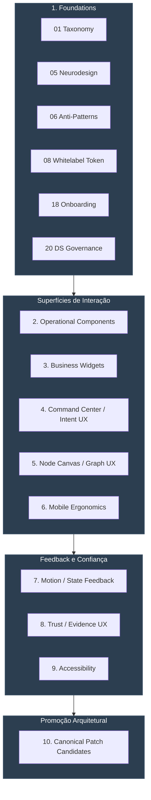

# 10 UI/UX Studies - Master Index

Este documento serve como o Índice Mestre para a pasta [10_UIUX_STUDIES](file:///c:/Users/Usuario/Documents/CKCompany/CKOS/Research/Arquitetura-System/CKOS_DOCUMENTATION_REVIEWED/000_STUDY_NOTES/10_UIUX_STUDIES). Ele consolida e organiza as 23 notas de estudo de UI/UX criadas em famílias conceituais e identifica os candidatos prontos para futura promoção ao núcleo canônico do CKOS.

> [!NOTE]
> Esta pasta e seus arquivos pertencem à **camada de estudos auxiliares** (auxiliary study folder) do CKOS. Nenhuma diretriz aqui contida autoriza desenvolvimento de front-end ou backend, criação de componentes físicos (React/HTML/CSS), alterações de banco de dados reais ou ativação de agentes em runtime.

---

## 1. Mapa de Notas por Família Conceitual

Abaixo, as 23 notas de estudo estão organizadas em exatamente 10 famílias conceituais:

### Família 1: Foundations (Fundamentos de Neurodesign e Visual)
Agrupa as diretrizes de taxonomia visual, neurodesign, limites cognitivos e regras base do sistema de design.
* [01_VISUAL_REFERENCE_TAXONOMY_CANVAS_OS.md](file:///c:/Users/Usuario/Documents/CKCompany/CKOS/Research/Arquitetura-System/CKOS_DOCUMENTATION_REVIEWED/000_STUDY_NOTES/10_UIUX_STUDIES/01_VISUAL_REFERENCE_TAXONOMY_CANVAS_OS.md)
  * *Descrição*: Taxonomia das referências de design visual que inspiram o Canvas OS (Glassmorphism, Backlight Semântico, etc.).
* [05_NEURODESIGN_AND_COGNITIVE_LOAD_RULES.md](file:///c:/Users/Usuario/Documents/CKCompany/CKOS/Research/Arquitetura-System/CKOS_DOCUMENTATION_REVIEWED/000_STUDY_NOTES/10_UIUX_STUDIES/05_NEURODESIGN_AND_COGNITIVE_LOAD_RULES.md)
  * *Descrição*: Consolidação de exatamente 10 princípios cognitivos pragmáticos para minimizar a fadiga vestibular e visual (Fitts, Gestalt, Miller, Hick, etc.).
* [06_UIUX_ANTI_PATTERNS_AND_GENERIC_AI_UI_RISKS.md](file:///c:/Users/Usuario/Documents/CKCompany/CKOS/Research/Arquitetura-System/CKOS_DOCUMENTATION_REVIEWED/000_STUDY_NOTES/10_UIUX_STUDIES/06_UIUX_ANTI_PATTERNS_AND_GENERIC_AI_UI_RISKS.md)
  * *Descrição*: Catálogo de exatamente 10 anti-padrões e desvios de interface comuns em aplicações de IA que devem ser evitados.
* [08_WHITELABEL_TOKEN_SYSTEM_UIUX_STUDY.md](file:///c:/Users/Usuario/Documents/CKCompany/CKOS/Research/Arquitetura-System/CKOS_DOCUMENTATION_REVIEWED/000_STUDY_NOTES/10_UIUX_STUDIES/08_WHITELABEL_TOKEN_SYSTEM_UIUX_STUDY.md)
  * *Descrição*: Diretrizes para o sistema whitelabel do CKOS, isolando tokens semânticos de estilizações cosméticas de marca.
* [18_ONBOARDING_PERSONALIZATION_UIUX_STUDY.md](file:///c:/Users/Usuario/Documents/CKCompany/CKOS/Research/Arquitetura-System/CKOS_DOCUMENTATION_REVIEWED/000_STUDY_NOTES/10_UIUX_STUDIES/18_ONBOARDING_PERSONALIZATION_UIUX_STUDY.md)
  * *Descrição*: Estudo de onboarding com calibração de perfis de densidade visual e estabelecimento de ROI de base do usuário.
* [20_DESIGN_SYSTEM_THEME_GOVERNANCE_UIUX_STUDY.md](file:///c:/Users/Usuario/Documents/CKCompany/CKOS/Research/Arquitetura-System/CKOS_DOCUMENTATION_REVIEWED/000_STUDY_NOTES/10_UIUX_STUDIES/20_DESIGN_SYSTEM_THEME_GOVERNANCE_UIUX_STUDY.md)
  * *Descrição*: Governança rígida do Design System, garantindo compatibilidade e verificação WCAG automática de contraste.

### Família 2: Operational Components (Componentes Operacionais Básicos)
Componentes estruturais para interação com fluxos e logs de execução.
* [03_WIDGET_STATE_MATRIX_AND_EXECUTION_FEEDBACK.md](file:///c:/Users/Usuario/Documents/CKCompany/CKOS/Research/Arquitetura-System/CKOS_DOCUMENTATION_REVIEWED/000_STUDY_NOTES/10_UIUX_STUDIES/03_WIDGET_STATE_MATRIX_AND_EXECUTION_FEEDBACK.md)
  * *Descrição*: Matriz de transição de estados visuais de execução da IA nos widgets, alinhada com as state machines de runtime.
* [07_AGENT_ACTIVITY_STREAM_UIUX_STUDY.md](file:///c:/Users/Usuario/Documents/CKCompany/CKOS/Research/Arquitetura-System/CKOS_DOCUMENTATION_REVIEWED/000_STUDY_NOTES/10_UIUX_STUDIES/07_AGENT_ACTIVITY_STREAM_UIUX_STUDY.md)
  * *Descrição*: Especificação da timeline 1D de atividades técnicas de agentes, focada em rastreabilidade e mutabilidade de arquivos.
* [17_CHAT_GROUPS_AGENT_THREADS_UIUX_STUDY.md](file:///c:/Users/Usuario/Documents/CKCompany/CKOS/Research/Arquitetura-System/CKOS_DOCUMENTATION_REVIEWED/000_STUDY_NOTES/10_UIUX_STUDIES/17_CHAT_GROUPS_AGENT_THREADS_UIUX_STUDY.md)
  * *Descrição*: Threads lineares técnicas de agentes, limites de escopo e avisos visuais preventivos contra loops infinitos de IA.

### Família 3: Business Widgets (Widgets de Negócio e Marketplace)
Estruturas de interface voltadas para dados financeiros, planos, dashboard geral e expansões.
* [09_EXECUTION_PLAN_WIDGET_UIUX_STUDY.md](file:///c:/Users/Usuario/Documents/CKCompany/CKOS/Research/Arquitetura-System/CKOS_DOCUMENTATION_REVIEWED/000_STUDY_NOTES/10_UIUX_STUDIES/09_EXECUTION_PLAN_WIDGET_UIUX_STUDY.md)
  * *Descrição*: Widget conceitual de Plano de Execução com estimativas de tempo, custos e limites de créditos.
* [11_COST_CREDITS_AND_ROI_AWARE_UX_STUDY.md](file:///c:/Users/Usuario/Documents/CKCompany/CKOS/Research/Arquitetura-System/CKOS_DOCUMENTATION_REVIEWED/000_STUDY_NOTES/10_UIUX_STUDIES/11_COST_CREDITS_AND_ROI_AWARE_UX_STUDY.md)
  * *Descrição*: UX consciente de custos, exibição de créditos pré-reservados e ROI de tarefas executadas por IA.
* [14_DASHBOARD_WIDGET_SYSTEM_UIUX_STUDY.md](file:///c:/Users/Usuario/Documents/CKCompany/CKOS/Research/Arquitetura-System/CKOS_DOCUMENTATION_REVIEWED/000_STUDY_NOTES/10_UIUX_STUDIES/14_DASHBOARD_WIDGET_SYSTEM_UIUX_STUDY.md)
  * *Descrição*: Sistema de grade de widgets do dashboard com arranjo dinâmico, monitoramento de créditos corporativos e ROI.
* [19_CKSTORE_CAPABILITY_MARKETPLACE_UIUX_STUDY.md](file:///c:/Users/Usuario/Documents/CKCompany/CKOS/Research/Arquitetura-System/CKOS_DOCUMENTATION_REVIEWED/000_STUDY_NOTES/10_UIUX_STUDIES/19_CKSTORE_CAPABILITY_MARKETPLACE_UIUX_STUDY.md)
  * *Descrição*: Interface do marketplace de habilidades de agentes, cotas, sandboxing e trial mode.

### Família 4: Command Center / Intent UX (Centro de Controle e Intenções)
Superfície de entrada de linguagem natural e barra de comandos do CKOS.
* [10_INTENT_CLARIFIER_AND_SMART_QUESTIONS_UIUX_STUDY.md](file:///c:/Users/Usuario/Documents/CKCompany/CKOS/Research/Arquitetura-System/CKOS_DOCUMENTATION_REVIEWED/000_STUDY_NOTES/10_UIUX_STUDIES/10_INTENT_CLARIFIER_AND_SMART_QUESTIONS_UIUX_STUDY.md)
  * *Descrição*: Componente inteligente de clarificação de intenção do usuário antes do disparo de execuções custosas.
* [15_COMMAND_CENTER_OPERATIONAL_UX_STUDY.md](file:///c:/Users/Usuario/Documents/CKCompany/CKOS/Research/Arquitetura-System/CKOS_DOCUMENTATION_REVIEWED/000_STUDY_NOTES/10_UIUX_STUDIES/15_COMMAND_CENTER_OPERATIONAL_UX_STUDY.md)
  * *Descrição*: Barra de comandos integrada do CKOS (Commandbar), atalhos `/` e `@` e autocomplete conceitual.

### Família 5: Node Canvas / Graph UX (Canvas de Grafos e Nós)
Visualização 2D de fluxos de decisão e pipelines.
* [16_NODE_CANVAS_GRAPH_UX_STUDY.md](file:///c:/Users/Usuario/Documents/CKCompany/CKOS/Research/Arquitetura-System/CKOS_DOCUMENTATION_REVIEWED/000_STUDY_NOTES/10_UIUX_STUDIES/16_NODE_CANVAS_GRAPH_UX_STUDY.md)
  * *Descrição*: Navegação de grafos, spring physics, controle de lineages de evidência e fallback hierárquico acessível.

### Família 6: Mobile Ergonomics (Ergonomia e Mobile)
Padrões ergonômicos específicos para telas menores.
* [04_MOBILE_COMMAND_FIRST_ERGONOMICS.md](file:///c:/Users/Usuario/Documents/CKCompany/CKOS/Research/Arquitetura-System/CKOS_DOCUMENTATION_REVIEWED/000_STUDY_NOTES/10_UIUX_STUDIES/04_MOBILE_COMMAND_FIRST_ERGONOMICS.md)
  * *Descrição*: Ergonomia orientada ao polegar (metade inferior), breakpoints, targets e zonas de segurança.

### Família 7: Motion / State Feedback (Cinética e Feedback de Transição)
Comportamento de movimento e tempo de transição da interface.
* [21_MOTION_STATE_FEEDBACK_UIUX_STUDY.md](file:///c:/Users/Usuario/Documents/CKCompany/CKOS/Research/Arquitetura-System/CKOS_DOCUMENTATION_REVIEWED/000_STUDY_NOTES/10_UIUX_STUDIES/21_MOTION_STATE_FEEDBACK_UIUX_STUDY.md)
  * *Descrição*: Micro-feedbacks cinéticos, restrição de tempos e mapeamento de estados de transição suaves.

### Família 8: Trust / Evidence / Decision UX (Confiança, Evidências e Decisão)
Regras de apresentação de dados probabilísticos da IA.
* [12_APPROVAL_GATE_AND_REVERSIBILITY_UX_STUDY.md](file:///c:/Users/Usuario/Documents/CKCompany/CKOS/Research/Arquitetura-System/CKOS_DOCUMENTATION_REVIEWED/000_STUDY_NOTES/10_UIUX_STUDIES/12_APPROVAL_GATE_AND_REVERSIBILITY_UX_STUDY.md)
  * *Descrição*: UX de portões de aprovação de segurança, exibindo consequências e provendo rollback.
* [13_EVIDENCE_TRUST_AND_DECISION_UIUX_STUDY.md](file:///c:/Users/Usuario/Documents/CKCompany/CKOS/Research/Arquitetura-System/CKOS_DOCUMENTATION_REVIEWED/000_STUDY_NOTES/10_UIUX_STUDIES/13_EVIDENCE_TRUST_AND_DECISION_UIUX_STUDY.md)
  * *Descrição*: Mapa de evidências interativo baseado nas pontuações de confiança do Metacognik e limitações de IA.

### Família 9: Accessibility / Reduced Motion (Acessibilidade)
Garantias de conformidade com acessibilidade digital.
* [22_ACCESSIBILITY_REDUCED_MOTION_UIUX_STUDY.md](file:///c:/Users/Usuario/Documents/CKCompany/CKOS/Research/Arquitetura-System/CKOS_DOCUMENTATION_REVIEWED/000_STUDY_NOTES/10_UIUX_STUDIES/22_ACCESSIBILITY_REDUCED_MOTION_UIUX_STUDY.md)
  * *Descrição*: Acessibilidade WCAG 2.1, navegação por teclado dupla e fallbacks em árvore sem animações para redução de movimento.

### Família 10: Canonical Patch Candidates (Candidatos Canônicos)
Gramática geral do CKOS e catálogo de propostas de promoção de regras de estudo para a arquitetura oficial.
* [02_OPERATIONAL_UIUX_GRAMMAR_CKOS.md](file:///c:/Users/Usuario/Documents/CKCompany/CKOS/Research/Arquitetura-System/CKOS_DOCUMENTATION_REVIEWED/000_STUDY_NOTES/10_UIUX_STUDIES/02_OPERATIONAL_UIUX_GRAMMAR_CKOS.md)
  * *Descrição*: Mapeamento das 11 perguntas estratégicas para componentes e superfícies da interface do CKOS.
* [23_UIUX_CANONICAL_PATCH_CANDIDATES.md](file:///c:/Users/Usuario/Documents/CKCompany/CKOS/Research/Arquitetura-System/CKOS_DOCUMENTATION_REVIEWED/000_STUDY_NOTES/10_UIUX_STUDIES/23_UIUX_CANONICAL_PATCH_CANDIDATES.md)
  * *Descrição*: Catálogo com exatamente 13 candidatos operacionais propostos para promoção canônica aos documentos oficiais (01–25).

---

## 2. Diagrama de Relacionamentos das Famílias

---

## 3. Próximos Passos Recomendados

1. **Homologação PMO**: Aprovação final deste índice e do respectivo [UIUX_STUDY_REVIEW_REPORT.md](file:///c:/Users/Usuario/Documents/CKCompany/CKOS/Research/Arquitetura-System/CKOS_DOCUMENTATION_REVIEWED/000_STUDY_NOTES/10_UIUX_STUDIES/UIUX_STUDY_REVIEW_REPORT.md).
2. **Homologação Metacognik**: Auditoria de consistência das 13 propostas canônicas detalhadas no arquivo 23.
3. **Founder Canonical Approval Gate**: Disparo de uma sessão oficial do tipo `canonical_patch` para aplicar os Diffs nos documentos canônicos 01–25.
